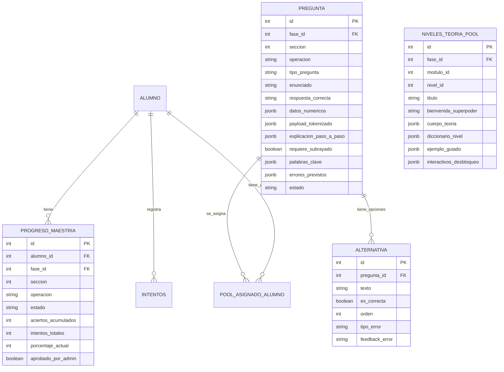
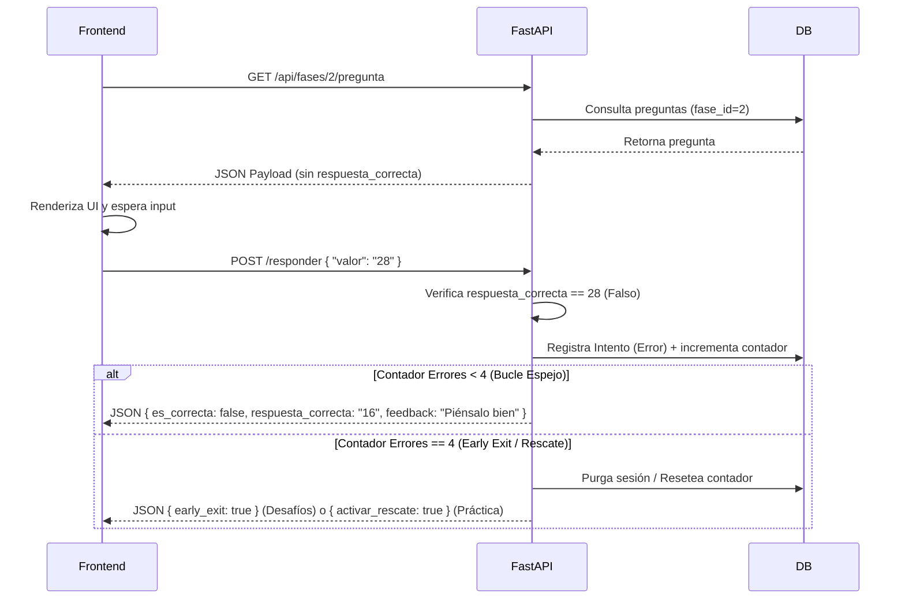
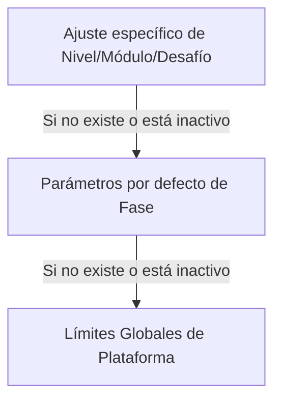

# Tomo 2: Arquitectura Backend y Admin — LogicaKids Pro

> **Versión:** 4.0 (Consolidada) | **Última actualización:** 2026-06-08 | **Prioridad documental:** 2
>
> **Dependencia:** Las reglas pedagógicas de aprobación, desbloqueo, Early Exit, Bucle Espejo y Overrides están definidas en el [Documento Rector](1_Documento_Rector_Pedagogico.md). Este tomo implementa y rige exclusivamente las lógicas de servidor, Base de Datos, Endpoints y el Panel de Administrador.

---

## 1. Propósito del Blueprint

Este documento sirve como guía maestra y plantilla técnica para la replicación y creación estandarizada de futuras fases en LogicaKids Pro. La arquitectura de aprendizaje sigue un patrón repetitivo, robusto y altamente parametrizado: cualquier nueva fase debe implementarse respetando la estructura descrita aquí.

> **Principios fundamentales (ver [Documento Rector](criterios%20conceptuales.md) §1):** El backend es **Server-Authoritative**; el frontend solo renderiza. La fuente de verdad del progreso es `ProgresoMaestria`; `user.settings["unlockedLevels"]` es solo un espejo de compatibilidad visual.

---

## 2. Arquitectura General de una Fase

Cada fase se divide en tres componentes pedagógicos principales:

1. **Teoría y Evocación:** Carrusel de aprendizaje, ejemplos guiados e interactivos obligatorios.
2. **Práctica Libre:** Entrenamiento con Bucle Espejo, Tutor Invisible y Bloque de Rescate.
3. **Zona de Desafíos:** Evaluación estricta con temporizador y Early Exit.

### 2.1. Práctica Libre (Entrenamiento sin Frustración)

La práctica libre está enfocada en el aprendizaje activo y paso a paso. No lleva temporizador (cronómetro) y no evalúa al alumno; busca que afiance el concepto microestructural. Utiliza la metodología de **Bucle Espejo** para corregir errores recurrentes de manera pedagógica y sin bloquear al estudiante:

* Si el alumno se equivoca en la pregunta original o variantes, el sistema **activa un Modal Emergente (Mirror Modal)** que pausa la interfaz de la batería de preguntas.
* En este modal se revela automáticamente la respuesta que era correcta de la pregunta fallida y se entrega la siguiente variante espejo para ser resuelta inmediatamente.
* El bucle tiene una tolerancia máxima de **3 variantes espejo consecutivas** dentro de este flujo emergente.
* Si se comete un error en la Variante Espejo 3 (4º error consecutivo de la familia), se activa la **Explicación Profunda** (Bloque de Rescate) dentro del mismo modal o un modal superior, y al cerrar, el alumno avanza a la siguiente familia de preguntas de forma fluida en la interfaz principal.
* Al cerrar el modal de preguntas espejo (ya sea por acierto o por agotamiento de variantes), la interfaz principal continúa con la secuencia normal de la batería de preguntas.

Cada nivel práctico debe tener:

* 120 familias de preguntas;
* cada familia con 1 pregunta original y 3 variantes espejo;
* explicación profunda obligatoria en el banco;
* mapeo heurístico de errores para el Tutor Invisible;
* completitud estándar de 100%;
* sin requisito de precisión mínima (la completitud al 100% de la batería asignada es el único requisito para avanzar y desbloquear la siguiente lección del mismo módulo; el desbloqueo del siguiente módulo requiere haber aprobado todos los niveles de práctica libre y todos los desafíos del módulo anterior).

### 2.2. Zona de Desafíos

La zona de desafíos corresponde a niveles virtuales `11`, `12` y `13`.

* Desafío 1: opción múltiple, 25 preguntas, 25 segundos por pregunta (30 segundos para Módulos 3 al 8), Early Exit al 3er error.
* Desafío 2: opción múltiple, 25 preguntas, 40 segundos por pregunta (45 segundos para Módulos 3 al 8), Early Exit al 3er error.
* Desafío Final: evocación pura, 10 preguntas, 50 segundos por pregunta (60 segundos para Módulos 3 al 8), Early Exit al 2do error.
* Desafío Mixto de la Fase (Módulo 99): evocación o múltiple, 20 preguntas, 60 segundos por pregunta (90 segundos para Módulos 3 al 8), Early Exit al 2do error.

> [!NOTE]
> **Naturaleza Dinámica:** Los tiempos límite, cantidades de preguntas y reglas de Early Exit listadas arriba son los **valores estándar de diseño**. Todos estos parámetros (incluyendo el umbral de aprobación del 90%) son almacenados en `configuraciones_progreso` y pueden ser **modificados libremente** desde el Panel de Administrador sin generar conflictos con el código fuente.

Cada desafío debe contar con un mínimo de 150 preguntas independientes precargadas.

### 2.3. Fase 1: Estandarización Modular y Retrocompatibilidad

Originalmente implementada bajo una estructura estática y rígida con un único código de sección (`seccion = 1`) para todas las operaciones, la **Fase 1 (Aritmética Básica)** ha sido completamente estandarizada y migrada a la arquitectura dinámica de niveles y módulos:
* **Módulos Académicos**: Las operaciones se dividen en 4 módulos independientes:
  - **Módulo 1: Suma** (secciones `101` a `105`, correspondientes a los Niveles 1 a 5 de dificultad progresiva).
  - **Módulo 2: Resta** (secciones `201` a `205`, correspondientes a los Niveles 1 a 5).
  - **Módulo 3: Multiplicación** (secciones `301` a `306`, correspondientes a los Niveles 1 a 6).
  - **Módulo 4: División** (secciones `401` a `405`, correspondientes a los Niveles 1 a 5).
* **Compatibilidad Retrospectiva y Fallbacks**:
  - **Consultas del Dashboard**: El endpoint `/pedagogia/dashboard` ahora acepta parámetros opcionales de query `seccion` y `operacion` para buscar o inicializar el progreso específico.
  - **Fallbacks de Configuración y Preguntas**: Si un estudiante solicita jugar en un nivel dinámico (ej. sección `101` de suma) que carece de una configuración específica o un banco de preguntas dedicados, el backend realiza un fallback automático hacia la configuración legacy de la sección `1` (o en su defecto, a la de la sección `0` de la fase) y selecciona preguntas correspondientes del pool general de la operación, garantizando la continuidad del juego sin errores offline en el cliente.
  - **Migración de Datos Semilla**: El script de semilla (`seed.py`) incorpora la rutina `migrar_datos_fase1_legacy` que duplica automáticamente la maestría y progreso de los alumnos que poseían aprobación en la sección legacy `1` de una operación hacia todas las nuevas secciones dinámicas (`101## 3. Paso 1: Definición del Modelo y Base de Datos (Arquitectura de Tablas Consolidadas)

Para optimizar la mantenibilidad del esquema, la consistencia de las consultas relacionales y simplificar la capa del ORM (SQLAlchemy), **el sistema descarta el uso de tablas físicas segmentadas por fase** (ej. `fase{X}_...`). En su lugar, toda la plataforma utiliza un conjunto centralizado y consolidado de tablas, donde la separación de contenidos para cada fase se realiza de manera lógica utilizando la columna `fase_id` como clave foránea.

### Diagrama Entidad-Relación (Arquitectura Consolidada)



> **Regla de identificación:** La separación lógica se realiza a través del campo `fase_id` (ForeignKey a `fases.id`) y los códigos de nivel/desafío asociados al campo `seccion` (ej. `101` para Módulo 1 Nivel 1, `1011` para Módulo 1 Desafío 1, etc.).

### 3.1. Modelo de Teoría y Evocación (`niveles_teoria_pool`)

Centraliza toda la carga teórica y los interactivos de evocación (Etapa 1) para todas las fases de la plataforma.

Campos:

* `id`: Integer Primary Key.
* `fase_id`: Integer. ForeignKey hacia `fases.id`.
* `modulo_id`: ID del módulo.
* `nivel_id`: ID del nivel.
* `titulo`: Nombre del concepto.
* `bienvenida_superpoder`: Párrafo introductorio.
* `cuerpo_teoria`: JSONB con términos clave y párrafos secuenciales.
* `trampa_advertencia`: Trampa común o tip pedagógico.
* `diccionario_nivel`: JSONB con traducción de términos narrativos a operadores matemáticos.
* `ejemplo_guiado`: JSONB de un mínimo de 5 ejemplos resueltos paso a paso, con palabras clave destacadas mediante la clase CSS `.keyword-highlight` (utilizando la etiqueta HTML `<span class="keyword-highlight">...</span>`).
* `interactivos_desbloqueo`: JSONB de minipreguntas interactivas para evocación obligatoria (retos sin tiempo).

### 3.2. Modelo de Banco de Preguntas (`preguntas`)

Almacena el pool completo de ejercicios (Práctica Libre y Desafíos) para todas las fases.

Campos:

* `id`: Integer Primary Key.
* `fase_id`: Integer. ForeignKey hacia `fases.id`.
* `seccion`: Código de nivel o sección calculada (ej. `modulo_id * 100 + nivel_id` para prácticas, o `modulo_id * 1000 + nivel_virtual` para desafíos).
* `operacion`: Tipo de operación matemática (`SUMA`, `RESTA`, `MULTIPLICACION`, `DIVISION`, `MIXTA`).
* `tipo_pregunta`: Enum de interfaz (`CALCULO_DIRECTO`, `MULTIPLE_OPCION`, `CONSTRUCTOR_SOLUCIONES`, `SUBRAYADO_TOKENS`, etc.).
* `enunciado`: Enunciado o fórmula de la pregunta (puede incluir etiquetas HTML/SVG).
* `respuesta_correcta`: Valor esperado almacenado como String.
* `datos_numericos`: JSONB que almacena variables de generación paramétrica, coordenadas de cuadrícula/vóxeles o configuraciones locales del temporizador.
* `payload_tokenizado`: JSONB que contiene los tokens para preguntas de subrayado.
* `explicacion_paso_a_paso`: JSONB con la resolución paso a paso para el Bloque de Rescate.
* `requiere_subrayado`: Booleano para indicar selección obligatoria de tokens en la interfaz.
* `palabras_clave`: JSONB con términos semánticos de la pregunta.
* `errores_previstos`: JSONB (GIN index) que asocia respuestas incorrectas previstas con un tipo de error y feedback personalizado del Tutor Invisible.
* `estado`: Estado del registro (`ACTIVO`, `INACTIVO`).

### 3.3. Tabla Auxiliar de Alternativas (`alternativas`)

Almacena las opciones para las preguntas de tipo `MULTIPLE_OPCION` de todas las fases.

Campos:

* `id`: Integer Primary Key.
* `pregunta_id`: ForeignKey hacia `preguntas.id`.
* `texto`: Texto mostrado de la opción.
* `es_correcta`: Booleano interno.
* `orden`: Orden visual de presentación.
* `tipo_error`: Tipo de error asociado (Enum) si el alumno selecciona esta alternativa.
* `feedback_error`: Texto descriptivo del error para el Tutor Invisible.

El frontend jamás debe recibir el campo `es_correcta` en el payload de carga de preguntas.

### 3.4. Modelo de Progreso Estudiantil (`progreso_maestria`)eto",
      "feedback": "Calculaste bien los gastos, pero falta restarlos del dinero inicial."
    }
  ]
}
```

### 3.6. Modelo de Progreso Estudiantil (`ProgresoMaestria`)

Esta tabla es la fuente única de verdad autoritativa para el avance y nivel de dominio del alumno en cada bloque (nivel de práctica o desafío virtual).

Campos obligatorios:

* `id`: Integer Primary Key (autoincremental).
* `alumno_id`: ForeignKey hacia `alumnos`.
* `fase_id`: ID de la fase.
* `modulo_id`: ID del módulo.
* `nivel_id`: ID del nivel (nullable si es progreso de un desafío).
* `desafio_id`: Identificador del desafío (nullable si es progreso de práctica libre).
* `completado`: Booleano. Indica si el alumno ha completado la batería mínima.
* `porcentaje_precision`: Float/Integer. Porcentaje real de precisión calculado sobre las respuestas correctas.
* `intentos_fallidos`: Integer. Contador de fallas acumuladas.
* `fallas_consecutivas_bucle`: Integer. Para control del Bucle Espejo (0 a 4).
* `desbloqueado`: Booleano. Indica si el bloque está accesible para el estudiante.
* **Campos de Override Administrativo Manual (Flexibilidad):**
  * `desbloqueado_por_admin`: Booleano. Por defecto `false`. Indica si fue liberado manualmente (`unlock`) por un tutor para permitir saltar prerrequisitos.
  * `aprobado_por_admin`: Booleano. Por defecto `false`. Indica si el bloque fue aprobado por decreto administrativo (`approve`).
  * `override_motivo`: String/Text nullable. Explicación/justificación pedagógica del override obligatoria para auditoría.
  * `override_fecha`: DateTime nullable. Fecha y hora UTC del registro del override.

---

## 4. Estándares Visuales y Motivacionales

Para reducir la carga cognitiva y aumentar la sensación de logro, toda transición, finalización y salida de flujos debe incorporar componentes visuales dinámicos de alta fidelidad.

### 4.1. Animaciones de Transición (Ready Screen)

Al finalizar el carrusel de teoría (Paso 3), antes de que el alumno inicie la práctica libre, la interfaz debe presentar una **Pantalla de Lanzamiento** que incluya:

* **Emoji Vectorial Animado:** Un icono representativo del avance (ej: 🚀 para Fase 2) con movimiento de flotación (y-axis) y rotación aleatoria suave.
* **Efecto de Celebración:** Partículas o destellos (✨) pulsantes para reforzar el éxito del aprendizaje teórico.
* **Botón de Acción Pulsante:** El botón final ("¡Entendido, empezar!") debe tener una animación de pulso (glow) y efectos de escala al pasar el mouse para incentivar el clic de inicio.

### 4.1.B. Interfaz Splash Premium de Desafíos (Challenge Splash Screen)

> **Especificación completa:** Ver [Documento Rector](criterios%20conceptuales.md) §6.1.B para las reglas detalladas de duración (8 segundos), contenido informativo, animación de cuenta regresiva SVG y mecanismo de skip.

### 4.2. Modal de Salida Temprana (Early Exit Modal) y Live Errors HUD

> **Especificación completa:** Ver [Documento Rector](criterios%20conceptuales.md) §6.3 para las reglas de implementación del Live Errors HUD y el Modal de Salida Temprana.


### 4.3. Modales de Celebración de Logros

> **Especificación completa:** Ver [Documento Rector](criterios%20conceptuales.md) §7.5 para las reglas del Completion Achievements Modal y §7.5.B para la Pantalla Completa de Módulo Completado.

### 4.4. Botones de Confirmación Inline Obligatorios
Todo tipo de interacción y pregunta (numérica, opción múltiple o pasos encadenados) debe contar con su botón de acción inline (`Confirmar` / `Continuar`) directamente integrado en la tarjeta de juego para consistencia táctil en móviles y tabletas:
* **Especificaciones del Botón:** Clase `.f2-submit-btn` con `display: flex; align-items: center; justify-content: center; width: 100%; border: none; cursor: pointer; transition: all 0.2s ease;`.
* **Micro-interacciones CSS:** Al pasar el cursor (`:hover`), el botón debe escalar suavemente (`transform: translateY(-2px)`), brillar (`filter: brightness(1.15)`) y proyectar una sombra suave (`box-shadow: 0 6px 20px rgba(0,0,0,0.3)`). Al presionarse (`:active`), debe retornar a su posición original (`transform: translateY(0)`). Si está deshabilitado (`:disabled`), se reduce su opacidad a `0.5` y cambia el cursor a `not-allowed`.

### 4.5. Pantalla Monumental de Graduación de Fase (Phase Graduation Modal)

> **Especificación completa:** Ver [Documento Rector](criterios%20conceptuales.md) §7.6 para las reglas de la interfaz conmemorativa de Graduación de Fase.
* **Mapeo de Endpoints y Lógica de Graduación de Fases:** Para garantizar que el alumno avance de fase en la base de datos de manera consistente, cada fase de la plataforma debe contar con su propio endpoint de graduación en el backend (ej: `/pedagogia/graduate-to-fase1`, `/pedagogia/graduate-to-fase2`, `/fase2/graduate`, etc.) y su respectivo servicio en el frontend. La lógica del cliente en `handleEndGame` debe evaluar condicionalmente la fase actual del alumno (`currentUser.fase_actual_id`) para invocar el endpoint de graduación correspondiente a esa fase específica, garantizando que el usuario no sea redirigido de forma inconsistente o quede atascado.

### 4.6. Dinámica del Banner del Dashboard General (Bottom Banner State Integration)
El banner inferior de seguimiento en la selección de niveles del frontend (`WelcomeScreen.tsx`) debe mapear tres estados visuales e interactivos específicos en función de las variables de progreso:
1. **Estado de Progreso en Prácticas (`remainingLevels > 0`):**
   - Renderiza el progreso global acumulado en porcentaje, mostrando la barra de carga general y los niveles restantes para desbloquear el examen.
2. **Estado Desafío Disponible (`remainingLevels === 0` y `isChallengeCompleted === false`):**
   - Renderiza un gradiente azul-indigo con la llamada interactiva "Tu Camino a la Fase X" y el botón **"Iniciar Prueba Final"** habilitado para gatillar el desafío mixto.
3. **Estado de Fase Aprobada (`isChallengeCompleted === true`):**
   - Renderiza un gradiente verde esmeralda y verde azulado neón con animación en el ícono del trofeo (`Trophy`) mediante un efecto continuo de vaivén y cambio de escala (`rotate: [0, -15, 15, -15, 15, 0]`, `scale: [1, 1.15, 1]`).
   - El título pasa a ser **`¡Felicidades! 🎉`** con la descripción **`Has superado esta fase. Puedes avanzar a la próxima.`**
   - Muestra el botón de acción **"Volver al Mapa"** en lugar de "Iniciar Prueba Final", redirigiendo limpiamente a la selección global y previniendo bucles de reintento.

---

## 5. Paso 2: Plantilla de Seeder (`seed.py`) y Estrategias de Robustez

El archivo `seed.py` de la fase debe crearse en `app/fase{X}/seed.py` y estructurarse en secciones deterministas. Cualquier error durante la inserción no debe silenciarse. Los bloques `try/except` deben imprimir el traceback completo y relanzar la excepción para que el contenedor falle explícitamente.

### 5.0. Estrategias de Robustez de Datos y Ejecución

Al construir y sembrar pools de base de datos, se deben aplicar las siguientes directrices obligatorias:

1. **Estrategia de Purga Segura (Clean Purge & Replace):**
   * El seeder debe incluir una función de limpieza dedicada (`clear_fase{X}_data(session: AsyncSession)`) que se ejecute al inicio del proceso.
   * Para evitar errores de violación de clave foránea (`ForeignKeyViolationError`), esta función debe eliminar los registros de forma ordenada en cascada inversa: primero las alternativas de desafíos (`Alternativa`), luego los intentos de paso (`IntentoPaso`) e intentos de pregunta (`IntentoPregunta`), luego los intentos generales (`Intento`) y pooles asignados (`PoolAsignadoAlumno`), y finalmente las preguntas principales (`Pregunta`), configuraciones de progreso y niveles de teoría de la fase respectiva.
2. **De-duplicación por Ampliación de Rango Combinatorio (Widened Parametric Spaces):**
   * Se prohíbe generar pools de preguntas donde múltiples registros compartan enunciados de pregunta textuales idénticos.
   * Los generadores de preguntas deben tener un espacio combinatorio significativamente más ancho que el número total de familias requeridas. Para problemas numéricos, amplíe los rangos numéricos de los aleatorios. Para problemas de dinero, amplíe las combinaciones de precios con céntimos variados y billetes. Esto garantiza que cada una de las 120+ familias del pool sea 100% única y activa, eliminando la necesidad de desactivar registros redundantes.
3. **Protección contra Bloqueos de CPU por Bucles Primos Infinitos (Prime Loop CPU Hang Fix):**
   * En generadores que involucren múltiplos, Máximo Común Divisor (MCD) o Mínimo Común Múltiplo (MCM), **se prohíbe el uso de bucles de descarte indefinidos** como `while math.gcd(a, b) < 2: b = random...`. Si el número `a` es un primo grande o no existen múltiplos válidos dentro del rango aleatorio establecido, el bucle correrá indefinidamente bloqueando el CPU al 100% y colgando el contenedor.
   * En su lugar, utilice generación paramétrica basada en factores deterministas:
     ```python
     # Generar primero el divisor común y luego multiplicadores aleatorios
     g = rng.randint(2, 6)
     a_mult = rng.randint(2, 10)
     b_mult = rng.choice([x for x in range(2, 10) if math.gcd(x, a_mult) == 1])
     a = g * a_mult
     b = g * b_mult
     # Esto garantiza matemáticamente que gcd(a, b) = g sin ningún bucle
     ```
4. **Seguimiento por Pasos de Constructores Encadenados (Step-by-Step Chained Tracking):**
   * En preguntas de tipo `constructor_soluciones_chained` (Módulo 4), el backend debe aislar el progreso de cada paso del problema en lugar de evaluar únicamente la respuesta final de forma plana.
   * Utilice las entidades `IntentoPregunta` (que asocia el progreso general del alumno con la pregunta) e `IntentoPaso` (que registra el desempeño por paso individual `paso_numero` y si este paso es espejo `es_espejo`).
   * La respuesta al intento general en la tabla `Intento` solo se marcará como `es_correcta = True` cuando el *último paso* del constructor encadenado sea respondido correctamente. Para garantizar una experiencia de usuario fluida, cuando el alumno responde correctamente a un paso intermedio (ej. Paso 1), el API retorna `es_correcta = True` en la carga útil JSON (junto con `paso_aprobado` y `valor_paso1_congelado`) para que el frontend valide visualmente el paso con éxito. Sin embargo, el backend utiliza internamente una variable de aislamiento (`es_correcta_intento`) para registrar ese intento en la base de datos como `es_correcta = False`. Esto evita avances prematuros en la maestría y el progreso de completitud del nivel, reservando el `True` general únicamente para cuando se resuelve el paso final de la cadena.
5. **Auditoría Automatizada Offline (analyze_database.py):**
   * Cada fase debe acompañarse de un script de auditoría read-only (`analyze_database.py`) para certificar de forma estricta la calidad de los datos antes de desplegarlos en producción, comprobando:
     - Que no existan secciones vacías o incompletas.
     - Que no existan preguntas duplicadas (`0 active duplicates`).
     - Que todas las opciones múltiples tengan exactamente 4 alternativas y solo 1 de ellas sea la correcta.
     - Que no existan preguntas en estado `INACTIVO`.
     - Que la coherencia matemática de todas las preguntas de la base de datos sea del 100% mediante un motor de resolución autónomo.

### 5.1. Parte A: Textos de Teoría y Validación Estricta

Para asegurar que el formato de datos coincide al 100% con las columnas relacionales, el seeder debe validar cada elemento mediante Pydantic.

```python
import traceback
from pydantic import BaseModel
from typing import List, Dict, Any

class NivelTeoriaSeederSchema(BaseModel):
    fase_id: int
    modulo_id: int
    nivel_id: int
    titulo: str
    bienvenida_superpoder: str
    cuerpo_teoria: Dict[str, str]
    trampa_advertencia: str
    diccionario_nivel: Dict[str, str]
    ejemplo_guiado: List[Dict[str, Any]]
    interactivos_desbloqueo: List[Dict[str, Any]]

niveles_teoria = [
    {
        "fase_id": FASE_ID,
        "modulo_id": 1,
        "nivel_id": 1,
        "titulo": "Título de Aprendizaje",
        "bienvenida_superpoder": "Explicación introductoria del concepto...",
        "cuerpo_teoria": {
            "Concepto Clave": "Definición exacta del término matemático."
        },
        "trampa_advertencia": "Cuidado con esta trampa común.",
        "diccionario_nivel": {
            "El doble": "× 2",
            "El triple": "× 3"
        },
        "ejemplo_guiado": [
            {
                "enunciado": "Hallar el <span class=\"keyword-highlight\">triple</span> de <span class=\"keyword-highlight\">6</span>.",
                "pasos_resolucion": [
                    "Paso uno: Traducimos '<span class=\"keyword-highlight\">el triple</span>' como multiplicar por 3 (× 3).",
                    "Paso dos: Realizamos la operación: <span class=\"keyword-highlight\">6 × 3 = 18</span>."
                ]
            },
            {
                "enunciado": "Hallar la <span class=\"keyword-highlight\">mitad</span> de <span class=\"keyword-highlight\">10</span>.",
                "pasos_resolucion": [
                    "Paso uno: Traducimos '<span class=\"keyword-highlight\">la mitad</span>' como dividir entre 2 (÷ 2).",
                    "Paso dos: Realizamos la operación: <span class=\"keyword-highlight\">10 ÷ 2 = 5</span>."
                ]
            },
            {
                "enunciado": "Hallar el <span class=\"keyword-highlight\">doble</span> de <span class=\"keyword-highlight\">8</span>.",
                "pasos_resolucion": [
                    "Paso uno: Traducimos '<span class=\"keyword-highlight\">el doble</span>' como multiplicar por 2 (× 2).",
                    "Paso dos: Realizamos la operación: <span class=\"keyword-highlight\">8 × 2 = 16</span>."
                ]
            },
            {
                "enunciado": "Hallar el <span class=\"keyword-highlight\">cuádruple</span> de <span class=\"keyword-highlight\">5</span>.",
                "pasos_resolucion": [
                    "Paso uno: Traducimos '<span class=\"keyword-highlight\">el cuádruple</span>' como multiplicar por 4 (× 4).",
                    "Paso dos: Realizamos la operación: <span class=\"keyword-highlight\">5 × 4 = 20</span>."
                ]
            },
            {
                "enunciado": "Hallar la <span class=\"keyword-highlight\">mitad</span> de <span class=\"keyword-highlight\">24</span>.",
                "pasos_resolucion": [
                    "Paso uno: Traducimos '<span class=\"keyword-highlight\">la mitad</span>' como dividir entre 2 (÷ 2).",
                    "Paso dos: Realizamos la operación: <span class=\"keyword-highlight\">24 ÷ 2 = 12</span>."
                ]
            }
        ],
        "interactivos_desbloqueo": [
            {
                "pregunta_id": "interactivo_fX_m1_l1_01",
                "enunciado": "¿Qué operación se resuelve primero en: 5 + 4 × 2?",
                "respuesta_correcta": "multiplicacion",
                "feedback_acierto": "¡Excelente!",
                "feedback_error": "Piénsalo mejor."
            }
        ]
    }
]

try:
    for data in niveles_teoria:
        objeto_validado = NivelTeoriaSeederSchema(**data)
        registro = NivelTeoriaPool(**objeto_validado.model_dump())
        session.add(registro)
    await session.commit()
except Exception as e:
    print(f"Error crítico durante el sembrado de Teoría en Fase {FASE_ID}: {str(e)}")
    traceback.print_exc()
    raise
```

### 5.2. Parte B: Configuración de Progreso

Crear registros en `configuraciones_progreso` para cada nivel práctico y desafío virtual.

```python
configs = []

# Prácticas libres
configs.append({
    "fase_id": FASE_ID,
    "modulo_id": modulo,
    "nivel_id": nivel,
    "desafio_id": None,
    "seccion": modulo * 100 + nivel,
    "operacion": "mixta",
    "cantidad_requerida": 15,
    "completitud_requerida": 100,
    "porcentaje_aprobacion": 90,
    "usa_cronometro": False,
    "tiempo_default_segundos": 0,
    "tipo_feedback": "detallado",
    "modo_tutoria": "bucle_espejo",
    "activo": True
})

# Desafío 1
configs.append({
    "fase_id": FASE_ID,
    "modulo_id": modulo,
    "nivel_id": None,
    "desafio_id": 1,
    "seccion": modulo * 1000 + 11,
    "operacion": "mixta",
    "cantidad_requerida": 25,
    "completitud_requerida": 100,
    "porcentaje_aprobacion": 90,
    "usa_cronometro": True,
    "tiempo_default_segundos": 25,
    "tipo_feedback": "simple",
    "modo_tutoria": "normal",
    "activo": True
})

# ... configs adicionales para Desafío 2 y Final ...
```

> Nota de Calibración de Datos: Las volumetrías (`cantidad_requerida`), estados de temporizador (`usa_cronometro`) y tiempos por pregunta (`tiempo_default_segundos`) inicializados en el seeder representan baselines de referencia estándar. La arquitectura del backend está diseñada de forma modular para consultar dinámicamente estos parámetros en cada inicio de sesión, permitiendo al superusuario calibrar los valores de forma transparente y asíncrona.

> Nota de implementación: Aunque los valores del seeder se inicializan con estándares pedagógicos, toda la lógica del backend debe consumir estos parámetros dinámicamente desde la base de datos y no de forma hardcoded.

### 5.3. Parte C: Generación de Pool de Práctica y Rescate

Cada nivel debe poseer 120 familias. Cada familia contiene 1 pregunta original y 3 variantes espejo.

```python
import random

for fam in range(1, 121):
    padre_id = f"f{FASE_ID}_m{modulo}_l{nivel}_fam_{fam:03d}"

    explicacion_html = (
        "Recuerda: primero resolvemos la operación prioritaria y luego continuamos.<br><br>"
        "<b>Ejemplo 1:</b> 5 + <span style='color:#FF4D4D'>4 × 2</span> = 13<br>"
        "<b>Ejemplo 2:</b> 3 + <span style='color:#FF4D4D'>2 × 3</span> = 9<br>"
        "<b>Ejemplo 3:</b> 6 + <span style='color:#FF4D4D'>3 × 2</span> = 12"
    )

    for var in range(4):
        es_espejo = var > 0
        seed = FASE_ID * 100000 + modulo * 1000 + nivel * 100 + fam * 10 + var
        rng = random.Random(seed)
        q_data = generator(rng, fam, es_espejo, var)

        pregunta = PracticaLibrePool(
            fase_id=FASE_ID,
            modulo_id=modulo,
            nivel_id=nivel,
            seccion=modulo * 100 + nivel,
            estructura_padre_id=padre_id,
            operacion=op,
            enunciado_visual=q_data["enunciado"],
            respuesta_correcta=str(q_data["respuesta_correcta"]),
            datos_numericos={
                "es_espejo": es_espejo,
                "variante": var,
                **q_data["valores"]
            },
            explicacion_profunda=explicacion_html,
            modo_interaccion="INPUT_NUMERICO",
            requiere_subrayado=False,
            tokens_texto=None,
            tokens_correctos=None,
            estado=StatusEnum.ACTIVO
        )
        session.add(pregunta)

        registro_errores = RespuestasErroneas(
            pregunta_id=pregunta.id,
            mapeo_errores={
                "respuestas_erroneas": [
                    {
                        "valor": str(int(q_data["respuesta_correcta"]) + 2),
                        "tipo_error": "calculo",
                        "feedback": "Revisa el orden de las operaciones antes de responder."
                    }
                ]
            }
        )
        session.add(registro_errores)
```

### 5.4. Parte D: Generación de Pool de Desafíos

Cada desafío debe tener mínimo 150 preguntas independientes.

```python
desafio = DesafiosPool(
    fase_id=FASE_ID,
    modulo_id=modulo,
    desafio_id=1,
    seccion=modulo * 1000 + 11,
    operacion="mixta",
    tipo_segmento="desafio_1",
    tipo_pregunta=TipoPreguntaEnum.MULTIPLE_OPCION,
    enunciado_visual=enunciado,
    respuesta_correcta=str(valor_correcto),
    datos_numericos={
        "es_desafio": True,
        "usa_cronometro": True,
        "tiempo_default_segundos": 25
    },
    modo_interaccion="MULTIPLE_OPCION",
    requiere_subrayado=False,
    tokens_texto=None,
    tokens_correctos=None,
    estado=StatusEnum.ACTIVO
)

for idx, opt in enumerate(shuffled_options):
    alt = AlternativasDesafiosPool(
        texto=opt["texto"],
        texto_opcion=opt["texto"],
        es_correcta=opt["es_correcta"],
        orden=idx + 1,
        tipo_error=TipoErrorEnum.CALCULO if not opt["es_correcta"] else None
    )
    desafio.alternativas.append(alt)

session.add(desafio)
```

---

## 6. Paso 3: Router del Backend (`router.py`)

Crear `app/fase{X}/router.py` heredando los endpoints estándar de FastAPI.

### 6.1. Endpoints Canónicos de Juego

Los endpoints de juego deben seguir esta convención:

```text
GET  /api/fases/{fase_id}/dashboard
GET  /api/fases/{fase_id}/pregunta
POST /api/fases/{fase_id}/responder
POST /api/fases/{fase_id}/cerrar-rescate
```

#### Diagrama de Secuencia: Flujo Server-Authoritative



No usar endpoints sueltos como `/pregunta` o `/responder` sin prefijo de fase.

#### Ejemplos de Payloads JSON Estrictos

**Payload de Respuesta Exitosa (Práctica/Desafío):**
```json
{
  "es_correcta": true,
  "aciertos_acumulados": 5,
  "porcentaje_actual": 20.0,
  "bloque_completado": false,
  "feedback": "¡Excelente deducción!"
}
```

**Payload de Early Exit (Desafíos):**
```json
{
  "es_correcta": false,
  "respuesta_correcta": "45",
  "early_exit": true,
  "errores_sesion": 3,
  "max_errores_tolerados": 3,
  "aciertos_acumulados": 0,
  "porcentaje_actual": 0,
  "bloque_completado": false,
  "feedback_error": "Límite de errores alcanzado."
}
```

**Payload de Activación de Rescate (Práctica Libre):**
```json
{
  "es_correcta": false,
  "respuesta_correcta": "12",
  "activar_rescate": true,
  "explicacion_profunda": "<p>Paso 1: Multiplica...</p>",
  "bypass_avance": true
}
```

No usar endpoints sueltos como `/pregunta` o `/responder` sin prefijo de fase.

### 6.2. Optimización de Consultas de Base de Datos

Para evitar sobrecarga de consultas frecuentes, implementar sesión compartida:

* `get_current_user` debe realizar una única consulta que traiga `User` y `Alumno` usando `outerjoin(Alumno)`.
* La instancia de `Alumno` debe almacenarse en el contexto bajo la clave `"alumno_obj"`.
* Los métodos del router deben buscar primero esa propiedad antes de realizar nuevas consultas.

```python
async def _get_alumno(db: AsyncSession, current_user: dict) -> Alumno:
    alumno = current_user.get("alumno_obj")
    if alumno:
        return alumno
    # fallback query solo si no existe en contexto
```

### 6.3. `GET /api/fases/{fase_id}/dashboard`

Construye el árbol de progresión de la fase. Para determinar la disponibilidad y estado de cada bloque, el backend debe priorizar los campos de **Override Administrativo**:

1. **Lógica de Aprobación por Override (`aprobado_por_admin == true`):**
   * El backend omite el cálculo estándar de respuestas correctas e intentos.
   * Considera automáticamente el nivel/módulo como `APROBADO` con 100% de completitud y 90% de precisión simulada.
   * **Regla de Aprobación Retrógada (Retro-Approval):** Al estar este bloque aprobado, la base de datos ya habrá ejecutado la cascada hacia atrás, de modo que todos los bloques anteriores correspondientes a esta fase también se resuelven y retornan automáticamente con el estado `APROBADO`.
   * Retorna información adicional: `intervenido: true`, `override_motivo`, `override_fecha` y la firma del administrador.
   * Habilita automáticamente el desbloqueo del bloque siguiente en la cascada de progresión.
2. **Lógica de Desbloqueo por Override (`desbloqueado_por_admin == true`):**
   * El backend fuerza el estado del bloque a `EN_PROGRESO` (desbloqueado y activo), permitiendo al alumno consumirlo de inmediato. (Nota: Al desbloquearse de forma aislada, el administrador no forzó la aprobación retrospectiva, por lo que el alumno puede cursar este bloque saltando los precedentes bloqueados).
3. **Lógica de Avance Automático Estándar (si no hay override activo):**
   * El backend evalúa si el alumno cumple con las condiciones basadas en su desempeño según la etapa pedagógica:
     * **En Práctica Libre (Entrenamiento Antifrustración):**
       * El *único* requisito para habilitar el acceso al siguiente nivel/bloque *del mismo módulo* es alcanzar la completitud requerida (`completitud_actual >= completitud_requerida`, es decir, 100%).
       * No se requiere alcanzar ningún umbral de precisión (`porcentaje_aprobacion`); la precisión real (`porcentaje_actual`) se registra en la base de datos de manera estadística y de diagnóstico para el Tutor IA, sin actuar jamás como un bloqueo de avance.
     * **En la Zona de Desafíos (Evaluación Estricta):**
       * El backend exige estrictamente el cumplimiento de ambas condiciones basadas en su desempeño:
         1. `completitud_requerida`: el alumno completó el 100% de la batería asignada del desafío.
         2. `precision_minima`: el alumno alcanzó el `porcentaje_aprobacion` (por defecto 90%).
       * Solo cuando ambas condiciones se cumplen sin haber provocado un `early_exit`, el backend habilita el acceso al siguiente desafío en cascada.
     * **Lógica de Desbloqueo de Módulos (Transición entre Módulos):**
       * Para desbloquear el primer nivel del siguiente módulo (Módulo N+1), el alumno debe haber aprobado y dominado la totalidad de los bloques del módulo anterior (Módulo N). Esto significa que tanto todos los niveles de práctica libre como los 3 desafíos (Desafíos 1, 2 y Final) del Módulo N deben estar en estado `APROBADO` en `ProgresoMaestria`.

### 6.4. `GET /api/fases/{fase_id}/pregunta`

Reglas:

* **Control de Hidratación y Recarga en Práctica:** Si es una batería de Práctica Libre (Etapa 2) y el backend detecta una recarga de página o reinicio de sesión activa, **reinicia el progreso de la práctica a 0**. El alumno debe contestar desde el inicio toda la batería de `cantidad_requerida` preguntas.
* Si no existe sesión activa, crea una sesión en blanco desde la base de datos.
* Si el último intento fue incorrecto, localiza el `estructura_padre_id`.
* Si `fallas_consecutivas_bucle < 4`, entrega la variante espejo correspondiente.
* Si no hay falla activa, entrega una nueva pregunta original.
* Nunca expone `respuesta_correcta` al frontend.
* **Integración del Cronómetro Dinámico:** El payload de retorno de la pregunta debe incluir obligatoriamente los campos de calibración `usa_cronometro` (bool) y `tiempo_limite_segundos` (int), resueltos dinámicamente a través de la cascada de configuración del servidor. Esto le da al cliente la instrucción exacta del valor de inicio del temporizador reactivo.

```python
if fallas_consecutivas_bucle < 4:
    # Entregar la variante espejo correspondiente
else:
    # El rescate debe haber sido activado desde /responder
```

### 6.5. `POST /api/fases/{fase_id}/responder`

Reglas de práctica libre:

* Evalúa la respuesta del alumno.
* Si es correcta, actualiza progreso, resetea `fallas_consecutivas_bucle = 0` y solicita una nueva familia de preguntas independiente.
* Si es incorrecta:
  * Incrementa `fallas_consecutivas_bucle`.
  * **Revelación Inmediata de Respuesta Correcta:** Si el contador es menor que 4, el backend retorna en su payload `es_correcta = false` junto con la clave `respuesta_correcta` (el valor esperado sanitizado) y el `feedback` del Tutor Invisible para que la UI los muestre inmediatamente.
  * Si el contador llega a 4 (Variante Espejo 3 errada), el backend retorna:
    ```json
    {
      "activar_rescate": true,
      "explicacion_profunda": "<html o markdown explicativo paso a paso y el porqué>",
      "requiere_transcripcion": false,
      "bypass_avance": true
    }
    ```
    (Nota: El cliente no forzará transcripción anti-spam. Al hacer clic en continuar, llamará a `/cerrar-rescate` el cual limpia el contador `fallas_consecutivas_bucle = 0` y avanza a la siguiente familia de preguntas).

Reglas de desafío:

* Evalúa la respuesta sin Bucle Espejo.
* Si expira el tiempo, computa error automáticamente y avanza a la siguiente pregunta tras un breve feedback visual.
* Ante una respuesta incorrecta, el sistema muestra feedback (rojo) por 1.5 segundos y realiza un **auto-avance fluido** a la siguiente pregunta para mantener el ritmo de evaluación.
* Si `errores_sesion >= max_errores`, se ejecuta la **Salida Temprana (Early Exit)**:
  * El backend realiza un reset absoluto de la sesión de progreso (`aciertos_acumulados = 0`, `porcentaje_actual = 0`, `intentos_totales = 0`).
  * Elimina todos los intentos guardados para ese desafío (`Intento` e `IntentoPregunta` si aplica) para evitar colisiones y permitir que el alumno reinicie la sesión desde cero de forma limpia en el siguiente intento.
  * Retorna el esquema de respuesta `Fase2ResultadoRespuesta` con:
    ```json
    {
      "es_correcta": false,
      "respuesta_correcta": "...",
      "early_exit": true,
      "errores_sesion": 3,
      "max_errores_tolerados": 3,
      "aciertos_acumulados": 0,
      "porcentaje_actual": 0,
      "bloque_completado": false,
      "feedback_error": "..."
    }
    ```
* **Contador de Errores Robustos:** Para evitar que el contador de errores de sesión quede atascado en `1` cuando el alumno tiene `0` aciertos acumulados (lo que causaría que el bucle de validación omitiera los errores previos), el backend evalúa incondicionalmente todos los intentos anteriores de la sesión actual (después del último reset/limpieza). De esta manera, el Early Exit se activa de forma determinista y consistente al cometer el número límite de fallas (por ejemplo, 3er error en Desafíos 1 y 2, y 2do error en Desafío Final).

#### Regla Crítica de Sincronización Legacy y Segmentación Multicapa:
Ante cualquier evento que modifique el estado de progreso en `ProgresoMaestria` (ya sea por desempeño del alumno, override manual o por la cascada de aprobación retrógrada), el backend **debe sincronizar de forma inmediata** el estado en `user.settings["unlockedLevels"]`. 
* Para evitar colisiones visuales de progreso entre fases, la clave se almacena de forma segmentada namespaced por Phase ID (ej. `user.settings["unlockedLevels"]["fase1"] = 6`, `user.settings["unlockedLevels"]["fase2"] = 1`).
* En caso de **Aprobación Retrógada**, la sincronización debe actualizar en reversa todas las claves de las sub-fases anteriores en `user.settings["unlockedLevels"]` asignándoles el valor `6`.

#### Regla de Aprobación Retrógada (Retro-Approval Action):
Cuando el router procesa un override `approve` en la base de datos, inicia una transacción de base de datos que:
1. Pone el bloque solicitado en estado `APROBADO`, `aprobado_por_admin = true`.
2. Actualiza en reversa (`UPDATE progreso_maestria SET estado = 'APROBADO', completado = true, porcentaje_precision = 90 WHERE alumno_id = :alumno_id AND fase_id = :fase_id AND seccion < :seccion_actual`).
3. Sincroniza en reversa el objeto `user.settings["unlockedLevels"]` para todos los niveles correspondientes.

### 6.6. `POST /api/fases/{fase_id}/cerrar-rescate`

Endpoint invocado cuando el frontend confirma que el alumno leyó y asimiló la explicación del Bloque de Rescate para avanzar de forma fluida.

Reglas:

* **Sin Bloqueo de Transcripción:** Al haberse eliminado la transcripción anti-spam de la Práctica Libre, el frontend no envía ningún valor de texto transcrito en el payload; solo envía una confirmación de lectura y asimilación conceptual.
* Al recibir este cierre, el backend:
  * Registra en la bitácora de intentos que la familia de preguntas actual se completó a través de la vía de `"Bypass de Explicación"` (marcando este metadato en la base de datos para no distorsionar las analíticas cognitivas del Tutor IA).
  * Incrementa la barra de completitud de la práctica libre de manera ordinaria (100% de completitud para esta familia) para no frustrar al alumno.
  * Resetea el contador de fallas consecutivas a cero (`fallas_consecutivas_bucle = 0`).
  * Libera la siguiente familia de preguntas original de forma inmediata en el flujo de la sesión.

---

## 7. Paso 4: Integración del Frontend

### 7.1. Deduplicación de Peticiones Concurrentes

Para mitigar llamadas duplicadas por re-renderizados, implementar un despachador en servicios API.

```typescript
const activeRequests = new Map<string, Promise<any>>();

async function fetchDeduplicated<T>(
  key: string,
  fetchFn: () => Promise<T>
): Promise<T> {
  const existing = activeRequests.get(key);
  if (existing) return existing;

  const promise = fetchFn().finally(() => {
    activeRequests.delete(key);
  });

  activeRequests.set(key, promise);
  return promise;
}
```

### 7.2. Consistencia de Tipos y Seguridad del Cliente

* El frontend debe determinar su layout exclusivamente a partir de `tipo_pregunta` y `modo_interaccion`.
* El frontend debe ignorar flags frágiles o redundantes en JSONB.
* El backend no debe enviar `es_correcta` en payloads de preguntas activas.
* El backend no debe enviar `respuesta_correcta` en la evaluación estándar de desafíos, pero en Práctica Libre **sí debe enviarla obligatoriamente** cuando el alumno cometa un error para permitir la revelación inmediata contiguous en pantalla.
* En preguntas tokenizadas, el frontend envía `tokens_seleccionados`, no texto crudo.

### 6.3. Componentes Obligatorios

* **Controlador del Cronómetro:** Si `usa_cronometro` es true, inicializa cuenta regresiva por pregunta.
* **Modal de Mirror (Preguntas Espejo):** Al recibir una pregunta con el flag `es_espejo: true` en la Práctica Libre, debe abrirse un modal que contenga la interfaz de respuesta, pausando la batería principal.
* **Modal de Early Exit:** Al recibir `early_exit = true`, interrumpe el flujo, muestra expulsión y redirige al dashboard (exclusivo de la Zona de Desafíos).
* **Modal de Rescate:** Al recibir `activar_rescate = true`, bloquea la pantalla y muestra `explicacion_profunda` junto con el botón prioritario de bypass `"¡Entendido, continuar!"` (exclusivo de Práctica Libre).
* **Sin Entrada de Texto Anti-Spam:** El modal de rescate **no debe renderizar campos de entrada de texto** ni exigir transcripciones para desbloquear el botón de continuación, asegurando un avance rápido y fluido.
* **Subrayado por Tokens:** En interacciones textuales, el frontend selecciona IDs de tokens.

---

## 7. Configuración de Servidor e Infraestructura

Para asegurar el ruteo correcto en una Single Page Application y evitar falsos fallbacks con estado 200 en recursos inexistentes:

```nginx
location ~ \.[a-zA-Z0-9]+$ {
    try_files $uri =404;
}
```

---

## 8. Checklist de Implementación

* [ ] Definir módulos, niveles y desafíos de la nueva fase.
* [ ] Crear migración SQL o Alembic.
* [ ] Crear `app/fase{X}/seed.py`.
* [ ] Validar teoría con Pydantic.
* [ ] Insertar `diccionario_nivel`.
* [ ] Crear configuraciones con `completitud_requerida`.
* [ ] Usar `tipo_feedback = "detallado"` y `modo_tutoria = "bucle_espejo"` para práctica.
* [ ] Generar exactamente 120 familias por nivel.
* [ ] Garantizar 1 original + 3 variantes espejo por familia.
* [ ] Insertar `explicacion_profunda`.
* [ ] Insertar mapeo de errores en `respuestas_erroneas`.
* [ ] Inyectar `modulo_id`, `nivel_id` y `desafio_id`.
* [ ] Generar mínimo 150 preguntas por desafío.
* [ ] Eliminar redundancias de interfaz en JSONB.
* [ ] Usar `tipo_pregunta` y `modo_interaccion` como fuente de verdad visual.
* [ ] Implementar `/api/fases/{fase_id}/dashboard`.
* [ ] Implementar `/api/fases/{fase_id}/pregunta`.
* [ ] Implementar `/api/fases/{fase_id}/responder`.
* [ ] Implementar `/api/fases/{fase_id}/cerrar-rescate`.
* [ ] Validar el flujo completo de 4 errores y rescate.
* [ ] Validar Early Exit por desafío.
* [ ] Validar que el frontend no recibe `es_correcta`.
* [ ] Validar que el frontend no calcula progreso.
* [ ] Validar preguntas tokenizadas con `tokens_texto` y `tokens_correctos`.
* [ ] Probar backend con `python -m py_compile`.
* [ ] Probar frontend con `npx tsc --noEmit`.
* [ ] Validar que ningún componente de pantalla de fase usa datos mock (`MOCK_DASHBOARD`, `MOCK_DATA`, etc.) como fallback ante errores del backend (el bloque `catch` solo debe llamar `setError()` y mostrar la pantalla de error con botón "Reintentar").
# Manual Técnico y de Arquitectura: Panel de Administrador (Superusuario)

> **Versión:** 3.0 | **Última actualización:** 2026-06-08 | **Prioridad documental:** 3
>
> **Dependencia:** Las reglas pedagógicas (Server-Authoritative, ProgresoMaestria, aprobación, Bucle Espejo, Early Exit, Overrides) están definidas en el [Documento Rector](criterios%20conceptuales.md). Los modelos de datos técnicos están en el [Blueprint](blueprint.md). Este manual se enfoca exclusivamente en la interfaz y lógica del Panel de Administrador.

> Nota de autoridad documental: Este documento define la implementación del Panel de Administrador. En caso de conflicto, prevalece primero el Documento Rector Conceptual, luego el Blueprint Técnico, luego este Manual del Administrador y finalmente la Guía UX/UI.

---

## 1. Propósito del Documento

Este documento detalla el diseño, configuración, modelo de datos relacionales, lógica de resolución en cascada e implementación de la interfaz del **Panel de Administrador** en la plataforma **LogicaKids Pro**.

El Panel de Administrador permite:

* gestionar usuarios;
* revisar desempeño estudiantil;
* intervenir manualmente el progreso;
* configurar reglas pedagógicas;
* editar teoría;
* administrar práctica libre;
* administrar desafíos;
* revisar analíticas de intentos;
* mantener coherencia entre contenido, progreso y reglas didácticas.

> **Principios fundamentales:** El backend es Server-Authoritative. La fuente de verdad del progreso académico es `ProgresoMaestria`. Ver [Documento Rector](criterios%20conceptuales.md) §1 para más detalles.

---

## 2. Stack Tecnológico, Estética y Ajustes del Panel

### 2.1. Stack Tecnológico de UI

* **React (TypeScript):** Componentes modularizados con tipado estricto.
* **Tailwind CSS:** Base de diseño responsivo y maquetación.
* **Framer Motion:** Micro-animaciones, hovers, sliders, transiciones y modales.
* **Lucide React:** Iconografía moderna y limpia.
* **Zustand:** Estado global de sesión, configuración y datos cargados.
* **FastAPI + PostgreSQL + Redis:** Backend autoritativo, persistencia relacional y almacenamiento de caché rápido (inicializado en la carga a través de `fastapi-cache2` con el prefijo `fastapi-cache` y URI configurable mediante `REDIS_URL` en variables de entorno o archivo compose).

### 2.2. Estética High-End & Glassmorphism

El panel implementa una estética premium, gamificada y responsiva compatible con modos claro y oscuro:

* **Soporte de Temas (Claro / Oscuro):** Integración del componente `ThemeToggle` en el panel administrativo. La interfaz se adapta dinámicamente (`bg-slate-50 dark:bg-[#070b14]` y bordes `border-slate-200 dark:border-slate-800`) para ofrecer coherencia visual con transiciones suaves (`transition-colors duration-300`).
* fondos profundos con gradientes radiales;
* resplandores ambientales semitransparentes;
* paneles esmerilados con `backdrop-blur`;
* bordes sutiles;
* micro-animaciones para acciones críticas;
* jerarquía visual clara para reducir carga cognitiva del administrador.

### 2.3. Ajustes de Interfaz Persistidos

El panel cuenta con un apartado de **Ajustes Visuales** controlado por el administrador y persistido en `localStorage`.

* **Escala de Interfaz (`adminScale`):** Rango de 80% a 150%.
* **Tipo de Fuente (`adminFontFamily`):** Outfit, Comic Sans, Monospace, Arial, Serif y Alta Legibilidad.
* **Persistencia Local:** Los cambios se aplican al documento mediante `document.documentElement.style.fontSize` y variables de fuente.

### 2.4. Sistema de Diálogos, Alertas y Confirmaciones Customizadas

Para evitar congelar el hilo principal del navegador mediante llamadas síncronas a `window.confirm()` o `window.alert()`, el Panel de Administrador utiliza un **Gestor de Diálogos Personalizado (`dialogState`)**:
* **Aislamiento y Estilo:** Los modales de confirmación y advertencia se renderizan en una capa esmerilada (`glassmorphism`) coherente con la paleta de colores del panel principal.
* **Manejo Asíncrono:** Emplea callbacks estructurados para ejecutar acciones destructivas (como eliminar registros de base de datos o aplicar overrides) de forma fluida y segura.

---

## 3. Estructura y Navegación del Panel de Administración

La interfaz se divide en un sidebar responsivo y plegable con 4 pestañas principales:

```text
TabType = 'general' | 'pedagogy' | 'performance' | 'content'
```

```text
┌────────────────────────────────────────────────────────────────────────┐
│                              ADMIN PRO                                 │
├───────────────┬────────────────────────────────────────────────────────┤
│ 📊 Vista      │  KPI, usuarios, cuentas, historial global               │
│    General    │                                                        │
├───────────────┼────────────────────────────────────────────────────────┤
│ ⚙️ Config.    │  Reglas pedagógicas, fases, módulos, cascada            │
│    Pedagógica │                                                        │
├───────────────┼────────────────────────────────────────────────────────┤
│ 🛡️ Rendimiento│  Progreso del alumno, liberar, aprobar, reset           │
│    Estudiantil│                                                        │
├───────────────┼────────────────────────────────────────────────────────┤
│ 📖 Banco      │  Teoría, práctica libre, desafíos, tokens, feedbacks    │
│    Preguntas  │                                                        │
└───────────────┴────────────────────────────────────────────────────────┘
```

---

## 4. Vista General (`GeneralTab.tsx`)

Punto de control inicial que ofrece análisis rápidos y gestión completa de usuarios.

### 4.1. KPI Cards

* **Usuarios:** Conteo total de registrados.
* **Partidas:** Total de juegos o bloques completados.
* **Activos:** Estudiantes no bloqueados (`ACTIVE`).
* **Storage:** Estado del almacenamiento.

### 4.2. Gestión de Usuarios

* Buscador por nombre y correo.
* Crear usuarios con rol `ADMIN` o `USER`.
* Editar datos básicos.
* Banear o desbanear.
* **Cambiar contraseñas mediante modal seguro:** El modal incluye un interruptor visual (icono de ojo interactivo que alterna entre `Eye` y `EyeOff`) que permite visualizar o enmascarar la nueva contraseña de forma dinámica.
* Ver historial detallado de rendimiento.

### 4.3. Historial de Rendimiento

El modal de rendimiento debe mostrar:

* fecha;
* fase;
* módulo;
* nivel o desafío;
* operación;
* porcentaje;
* intentos;
* aciertos;
* errores;
* tipos de error;
* tiempo promedio de respuesta.

Reglas de desafío:

* Evalúa la respuesta sin Bucle Espejo.
* Si expira el tiempo, computa error.
* Si `errores_sesion >= max_errores`, retorna:

```json
{
  "early_exit": true
}
```

* Si `errores_sesion < max_errores`, actualiza `aciertos_acumulados`, calcula `porcentaje_actual` como `aciertos / cantidad_req * 100` (no familias), verifica si supera 90% de aprobación para `bloque_completado`, y retorna `Fase2ResultadoRespuesta` completo.

> **Regla crítica de completitud de `return`:** El endpoint `responder` debe garantizar que **los tres caminos de ejecución** retornen siempre un objeto de respuesta válido:
> 1. **Desafío + Early Exit:** retorna con `early_exit=True` y reseteo de progreso.
> 2. **Desafío + No Early Exit:** retorna con aciertos, porcentaje y bloque_completado.
> 3. **Práctica Libre:** retorna con porcentaje por familias intentadas y `es_espejo`.
>
> Si cualquier path termina sin `return`, FastAPI devuelve `None` y genera un `ResponseValidationError 500` antes de llegar al cliente. El frontend degradará silenciosamente al mock estático, causando contadores hardcodeados y Bucle Espejo inactivo.

---

## 5. Gestión Pedagógica Avanzada (`PedagogyTab.tsx`)

Esta pestaña permite definir el ritmo, volumen y comportamiento didáctico del alumno de forma dinámica. Utiliza un árbol de jerarquía y un sistema de herencia de configuración.

### 5.1. Niveles de Configuración

1. **Global:** Fallback general de la plataforma.
2. **Fase:** Parámetros por defecto de una fase.
3. **Módulo/Nivel/Desafío:** Override específico.

### 5.2. Principio de Cascada

La configuración más específica prevalece sobre la general. Si un override está inactivo, se hereda el nivel superior.



### 5.3. Calibración en Caliente de Tiempos y Volúmenes

Para facilitar las pruebas de campo, la investigación pedagógica y la calibración empírica durante el desarrollo, la interfaz de `PedagogyTab.tsx` expone controles deslizantes (sliders) y selectores numéricos para editar en caliente el estrés de tiempo y el volumen de trabajo del alumno:

* **Editor de Preguntas Requeridas (`cantidad_requerida`):**
  * **Control:** Campo de entrada numérico incremental (con límites lógicos de validación de 5 a 50 preguntas).
  * **Propósito:** Permite aumentar o disminuir el tamaño de la batería en base a la fatiga del alumno observada en pruebas grupales.
* **Habilitación de Cronómetro (`usa_cronometro`):**
  * **Control:** Switch Toggle interactivo.
  * **Propósito:** Permite desactivar por completo la presión del temporizador en fases iniciales de pruebas y activarla progresivamente para la preparación formal.
* **Límite de Tiempo por Pregunta (`tiempo_default_segundos`):**
  * **Control:** Deslizador (slider) con rango de 10 a 120 segundos.
  * **Estilo Térmico (`isThermal`):** Para facilitar la evaluación de la carga cognitiva y el nivel de estrés temporal impuesto al alumno, el slider implementa una gradación térmica de color interactiva según el porcentaje configurado:
    * **Menor a 25%:** Color rosa (`bg-rose-500`) y resplandor neón (`rgba(244,63,94,0.5)`), indicando estrés temporal/carga cognitiva extrema.
    * **Entre 25% y 49%:** Color naranja (`bg-orange-500`) y resplandor (`rgba(249,115,22,0.5)`), indicando estrés alto.
    * **Entre 50% y 74%:** Color amarillo (`bg-amber-400`) y resplandor (`rgba(251,191,36,0.5)`), indicando estrés moderado.
    * **Mayor o igual a 75%:** Color verde (`bg-emerald-500`) y resplandor (`rgba(16,185,129,0.5)`), indicando un ritmo relajado o tiempo holgado.
  * **Propósito:** Calibración fina y visual del estrés temporal por pregunta en práctica libre global, desafíos de módulo (desafíos 1.1, 1.2, 1.3), por defecto de fase y por módulo específico.

Cualquier cambio guardado en la interfaz se asocia al nivel de jerarquía seleccionado (Fase, Módulo, o Nivel específico), actualiza la base de datos de manera inmediata y se propaga en cascada en las siguientes sesiones que inicien los alumnos.
**Manejo de Transiciones (Regla de Derecho Adquirido):** Al modificar un parámetro en caliente (ej. de 15 a 20 preguntas), la base de datos dispara un recálculo masivo del progreso. Los alumnos que ya habían alcanzado el estado `APROBADO` mantendrán su estado intacto y su porcentaje se reajustará forzadamente a `100%`, aplicando las nuevas métricas únicamente a los estudiantes nuevos o en estado `EN_PROGRESO` o `BLOQUEADO`.

---

## 6. Rendimiento Estudiantil Avanzado (`PerformanceTab.tsx`)

Herramienta de tutoría y control para intervenir el progreso académico de un estudiante. Dado que cada estudiante ingresa con una realidad cognitiva y de partida diferente, esta sección permite flexibilizar la ruta lineal del juego mediante intervenciones directas de un superusuario.

### 6.1. Funciones de Tutoría

* Buscar alumnos por nombre o email de forma responsiva.
* Visualizar la fase y módulo activo del estudiante.
* Inspeccionar de forma granular el progreso de cada nivel de práctica libre y cada bloque de desafío.
* Revisar el porcentaje de acierto real (`porcentaje_precision`), intentos acumulados y el estado actual (`BLOQUEADO`, `EN_PROGRESO`, `APROBADO`).
* **Visualización de Errores Frecuentes por Bloque:** Para cada bloque académico del listado de progreso, si existen intentos incorrectos registrados, se muestran insignias rojas (`bg-red-500/10 border-red-500/20 text-red-400`) con el tipo de error y su conteo (hasta los 3 más recurrentes de la sección, ej. `ERROR_CALCULO (2)`), calculados del cruce con los últimos 100 intentos fallidos del alumno en el backend.
* **Integración del Tutor IA en Administración (Consultar IA):**
  * **Interfaz:** Un botón interactivo con degradado de púrpura a índigo (`bg-gradient-to-r from-purple-500 to-indigo-600`) y efectos de hover/escala (`hover:scale-105`) etiquetado como "Consultar IA" junto a la cabecera del alumno.
  * **Comportamiento:** Al pulsarse, abre un modal con capa de fondo esmerilada y efecto blur (`backdrop-blur-sm bg-slate-900/60`).
  * **Estados de Carga:** Muestra un indicador circular giratorio (`Loader2`) y un mensaje interactivo: *"El Tutor IA está analizando los registros de [Nombre]..."* mientras obtiene el reporte desde el endpoint `/api/ai/admin/alumnos/{alumno_id}/insights`.
  * **Renderizado de Informe:** Una vez recibido, formatea y muestra en pantalla de forma interactiva (en markdown/HTML fluido con scroll y espaciado adecuado) la retroalimentación pedagógica, fortalezas, debilidades y plan de acción recomendado a partir de los últimos 20 intentos en base de datos.
* **Normalización de Estados de Progreso (`normalizeState`):** Al consumir la API de progreso estudiantil, el componente `PerformanceTab` normaliza de manera segura el estatus retornado para evitar páginas en blanco o errores catastróficos en caso de inconsistencias de datos o cadenas indefinidas en la base de datos.
* Identificar claramente si el estado de maestría actual fue obtenido automáticamente por desempeño del alumno o mediante una intervención administrativa previa (mostrando el logo o indicador visual correspondiente).

### 6.2. Panel de Intervención (Acciones de Override)

La interfaz expone para cada bloque tres controles críticos de anulación pedagógica, agrupados en un submódulo de seguridad:

> **Acciones de Override (Unlock, Approve, Reset):** Ver [Documento Rector](criterios%20conceptuales.md) §7.4 para la definición exacta de los efectos en base de datos, regla de aprobación retrógada y sincronización con el espejo legacy. El panel admin expone estos 3 controles.

### 6.2.b Acciones en Lote (Bulk Overrides por Módulo/Fase)
Para facilitar la gestión administrativa, la plataforma soporta acciones en lote a nivel de Módulo o Fase completa:
* **Endpoint Específico:** El backend dispone de `POST /api/admin/alumnos/{alumno_id}/progress/override-bulk`.
* **Interfaz Inteligente:** En las cabeceras de cada Fase o Módulo se despliegan botones de "Aprobar", "Liberar" y "Restablecer". 
* **Lógica Recursiva:** El endpoint busca todos los niveles que pertenecen a esa fase o módulo (incluyendo desafíos) y aplica la acción (`approve`, `unlock` o `reset`) en una sola transacción unificada de base de datos, recalculando al final el objeto agregado `user.settings["unlockedLevels"]`.

### 6.3. Protocolo de Auditoría y Flujo de Trabajo del Administrador

Para evitar intervenciones accidentales y mantener un registro riguroso de las decisiones de tutoría, se define el siguiente flujo de usuario obligatorio en la UI de Overrides:

1. **Selección del Bloque e Intervención:** El administrador hace clic en el botón de la acción deseada (`unlock`, `approve`, o `reset`).
2. **Modal de Confirmación e Ingreso de Motivo:**
   * La UI despliega un modal esmerilado (`glassmorphic`) con advertencias sobre el impacto pedagógico y la cascada de desbloqueos.
   * **Advertencia de Aprobación Retrógada:** Si la acción es `approve`, el modal debe advertir de forma explícita y resaltada: *"¡IMPORTANTE! Esta acción declarará como aprobados automáticamente todos los niveles y módulos anteriores de esta fase para mantener la consistencia lineal"*.
   * **Registro Obligatorio de Motivo:** El modal contiene un área de texto obligatoria donde el administrador debe detallar el motivo didáctico (ej. *"Estudiante avanzado de 5º grado, demuestra dominio inicial"*, *"Nivelación acelerada por retraso en currículo"*). El botón "Confirmar" permanece deshabilitado hasta que se ingrese un texto descriptivo de mínimo 10 caracteres.
3. **Petición Segura a la API (`POST /api/admin/alumnos/{alumno_id}/progress/override`):**
   * El cliente envía la solicitud estructurada al backend con los siguientes parámetros:
     ```json
     {
       "fase_id": 2,
       "modulo_id": 1,
       "nivel_id": 3,
       "desafio_id": null,
       "accion": "approve",
       "motivo": "Estudiante avanzado de 5º grado, demuestra dominio inicial"
     }
     ```
   * El backend procesa la petición de forma server-authoritative: valida los permisos del superusuario, altera las tablas correspondientes, genera la marca de tiempo UTC automática para `override_fecha`, ejecuta la cascada para el siguiente nivel, actualiza el espejo `user.settings` y registra la transacción.
4. **Respuesta y Refresco Visual:** El servidor retorna el árbol de progreso actualizado. La UI se refresca suavemente (utilizando Framer Motion) y muestra un indicador de estado con brillo cian distintivo en el nivel intervenido, permitiendo al administrador auditar visualmente los overrides activos.

---

## 7. Banco de Preguntas y Teoría (`ContentTab.tsx`)

Consola de administración de contenidos pedagógicos dividida en subpestañas. Para mantener una organización limpia y escalable de la base de datos, el panel del administrador gestiona este contenido mediante filtros dinámicos. Al seleccionar la Fase activa en la UI, el backend filtra dinámicamente las consultas de las tablas consolidadas (`preguntas`, `niveles_teoria_pool`, etc.) utilizando el parámetro `fase_id`. Esto permite que la consola de administración mantenga una interfaz uniforme, fluida y unificada.

### 7.1. Contenido Teórico (`theory`)

Editor para:

* título;
* bienvenida y superpoder;
* cuerpo teórico;
* tips pedagógicos;
* glosario o diccionario del nivel;
* ejemplos guiados;
* interactivos de desbloqueo;
* feedbacks de acierto y error.

### 7.2. Banco de Preguntas (`questions`)

Editor para:

* práctica libre;
* familias del Bucle Espejo (1 original + 3 variantes espejo);
* desafíos (evaluación formal sin asistencia espejo);
* alternativas;
* feedback del Tutor Invisible;
* explicación profunda (recurso educativo explicativo de la resolución y el porqué, mostrado al fallar la Variante Espejo 3 para habilitar el bypass fluido del alumno);
* modo de interacción;
* tokenización de textos.

### 7.3. Campos de Subrayado y Tokenización

El toggle de requerimiento de subrayado debe estar asociado a:

* `modo_interaccion` (debe ser `SUBRAYADO_TOKENS` o configurado para tal fin);
* `requiere_subrayado` (booleano);
* `tokens_texto` (representa los tokens del enunciado);
* `tokens_correctos` (tokens que son la respuesta esperada).

**Componente de Selección Visual WYSIWYG (`TokenHighlighter`):**
Cuando se edita una pregunta y se habilita el toggle `requiere_subrayado`, el panel administrativo despliega de manera reactiva el editor de tokens:
* **Generación de Tokens:** Toma el texto ingresado en el enunciado y lo divide automáticamente en palabras individuales mediante espacios, excluyendo vacíos.
* **Interacción Directa:** Renderiza cada palabra como un elemento interactivo que el administrador puede seleccionar haciendo clic. Los tokens seleccionados se iluminan con fondo púrpura y sombra neón (`bg-purple-500 text-white shadow-purple-500/30`).
* **Sincronización Automática:** Al seleccionar/deseleccionar tokens, el componente actualiza inmediatamente:
  - `tokens_correctos_indices`: Los índices de los tokens en el orden de la frase.
  - `tokens_correctos`: La lista de palabras/cadenas correspondientes.
  - `respuesta_correcta`: Se autocompleta concatenando los tokens seleccionados separados por un espacio (ej: `"Lucas manzanas rojas"`).
  
El frontend del juego debe recibir y enviar `tokens_seleccionados` (o índices de tokens correctos) en base a este mapeo para validar la exactitud de la interacción en el backend, sin enviar cadenas de texto libre.

---

## 8. Modelo de Datos de Configuración y Progreso

La base de datos relacional se implementa en PostgreSQL y se mapea con SQLAlchemy.

### 8.1. Tabla `configuraciones_progreso`

Almacena reglas pedagógicas personalizadas por el administrador.

Campos:

* `id`: Identificador.
* `fase_id`: ID de la fase. El mapa global está planificado con Fases 1 a 9.
* `modulo_id`: Identifica el módulo pedagógico dentro de la fase.
* `nivel_id`: Identifica el nivel de práctica libre. Nullable en desafíos o defaults de fase.
* `desafio_id`: Identifica el desafío virtual (`1`, `2`, `3`). Nullable en práctica.
* `seccion`: Código derivado para compatibilidad y consultas rápidas.
  * En práctica libre (incluyendo Fase 1 y fases superiores): `modulo_id * 100 + nivel_id`.
  * En desafíos (fases 2 a 9): `modulo_id * 1000 + nivel_virtual`, donde `nivel_virtual` es `11`, `12` o `13`.
  * En defaults de fase se utiliza `0`.
  * En configuraciones de soporte legacy de Fase 1 se utiliza `1`.
* `operacion`: Enum (`suma`, `resta`, `multiplicacion`, `division`, `mixta`).
* `cantidad_requerida`: Número de preguntas que componen el bloque.
* `completitud_requerida`: Porcentaje de avance requerido para terminar el bloque. Valor estándar: `100`.
* `porcentaje_aprobacion`: Precisión mínima de aprobación. Valor estándar: `90`.
  * **Comportamiento en Práctica Libre:** Funciona exclusivamente como un umbral estadístico y de diagnóstico pedagógico sugerido para reportes y recomendaciones del Tutor IA. **No actúa como un bloqueo de software**, permitiendo que el alumno apruebe de forma fluida el bloque con solo alcanzar el 100% de completitud.
  * **Comportamiento en Desafíos:** Es una regla estricta de base de datos. El alumno debe alcanzar este porcentaje real de precisión en sus aciertos para superar y aprobar el desafío.
* `orden_desbloqueo`: Secuencia de desbloqueo.
* `tipo_feedback`: `"simple"` o `"detallado"`.
* `modo_tutoria`: `"normal"`, `"bucle_espejo"` o `"rescate"`.
* `usa_cronometro`: Habilita/deshabilita tiempo.
* `tiempo_default_segundos`: Tiempo límite por pregunta o bloque.
* `activo`: Estado del override.

### 8.2. Tabla `progreso_maestria`

Registra el progreso académico individual por bloque.

Campos:

* `alumno_id`;
* `fase_id`;
* `modulo_id`;
* `nivel_id`;
* `desafio_id`;
* `seccion`;
* `operacion`;
* `estado`: `BLOQUEADO`, `EN_PROGRESO` o `APROBADO`;
* `aciertos_acumulados`;
* `intentos_totales`;
* `porcentaje_actual`;
* `completitud_actual`;
* `aprobado_por_admin`;
* **Derecho Adquirido (Grandfathering):** Ver [Documento Rector](criterios%20conceptuales.md) §7.3.

### 8.3. Tabla `pool_asignado_alumno`

Permite generar una experiencia personalizada para el estudiante a partir de `practica_libre_pool` y `desafios_pool`.

Campos:

* `alumno_id`;
* `pregunta_id`;
* `tipo_pool`: `practica` o `desafio`;
* `respondida_correctamente`;
* `respondida_alguna_vez`;
* `numero_intentos`;
* `estructura_padre_id`;
* `fallas_consecutivas_bucle`.

### 8.4. Tabla `intentos`

Bitácora de analítica de tutoría invisible.

Campos:

* `alumno_id`;
* `fase_id`;
* `modulo_id`;
* `nivel_id`;
* `desafio_id`;
* `pregunta_id`;
* `respuesta_dada`;
* `es_correcta`;
* `tiempo_respuesta_segundos`;
* `tipo_error`;
* `feedback_mostrado`;
* `explicacion_mostrada`.

---

## 9. Modelo de Datos de Contenido Pedagógico

> **Especificación completa:** El esquema de las tablas consolidadas (`preguntas`, `alternativas`, `niveles_teoria_pool`, etc.) está definido en el [Blueprint Técnico](blueprint.md) §3. El backend y panel administrador consultan y filtran estas tablas lógicamente mediante la columna `fase_id` según la fase seleccionada.

---

## 10. Mapeo del Árbol de Jerarquía Actual

### 10.1. Fase 1: Aritmética Básica

* **Estructura Modular Estándar**: Fase 1 se encuentra completamente estandarizada y dividida en 4 operaciones matemáticas fundamentales. Cada una de ellas actúa como un módulo con sus respectivos niveles y secciones dinámicas calculadas como `modulo_id * 100 + level_id`:
  * **Módulo 1: Suma** (secciones `101` a `105`, correspondientes a los Niveles 1 a 5).
  * **Módulo 2: Resta** (secciones `201` a `205`, correspondientes a los Niveles 1 a 5).
  * **Módulo 3: Multiplicación** (secciones `301` a `306`, correspondientes a los Niveles 1 a 6).
  * **Módulo 4: División** (secciones `401` a `405`, correspondientes a los Niveles 1 a 5).
* **Métricas de Configuración Pedagógica**: Al igual que en las fases superiores, el administrador puede modificar para cada uno de estos niveles:
  * El **tiempo límite** (`usa_cronometro` y `tiempo_default_segundos`).
  * El **porcentaje de aprobación** (`porcentaje_aprobacion`).
  * La **cantidad de preguntas** por bloque (`cantidad_requerida`).
* **Soporte y Compatibilidad Legacy**:
  * Para garantizar que los alumnos que iniciaron su progreso bajo el esquema antiguo (donde toda la Fase 1 se agrupaba bajo la sección estática `seccion = 1`) no pierdan sus avances, se implementó una **migración automática de base de datos** que duplica y propaga la aprobación de la sección legacy `1` a todas las nuevas secciones dinámicas de la misma operación.
  * Adicionalmente, el backend cuenta con una lógica de **fallback de lectura**: si se solicita una configuración para una sección dinámica y no existe, se intentará cargar el registro heredado (`seccion = 1`) antes de usar la configuración general de la fase (`seccion = 0`).

### 10.2. Fase 2: Desarrollo Numérico

* **Módulo 1:** Gimnasio Numérico Mental.
* **Módulo 2:** Tablas en Acción.
* **Módulo 3:** Tienda Matemática.
* **Módulo 4:** Constructor de Soluciones.

### 10.3. Fase 3: Problemas de Texto

* **Módulo 1:** El Escáner de la Verdad.
* **Módulo 2:** La Máquina del Tiempo.
* **Módulo 3:** El Ojo del Comerciante.
* **Módulo 4:** El Maestro del Empaque.

### 10.4. Fases 4 a 9

El mapa global del alumno está planificado con 9 fases. En la versión actual, las Fases 1 a 3 son las áreas completamente construidas y configurables a nivel relacional. Las Fases 4 a 9 pueden aparecer como bloqueadas, futuras o parcialmente visibles hasta que su contenido esté implementado.

---

## 11. Implementación Técnica de la Cascada de Resolución

Cuando un estudiante inicia una partida, el backend debe resolver dinámicamente los parámetros didácticos mediante cascada:

1. Configuración específica de nivel, módulo o desafío.
2. Configuración por defecto de fase.
3. Configuración global de plataforma.

Ejemplo conceptual:

> **Nota Técnica:** El siguiente bloque de código está escrito en sintaxis TypeScript para fácil comprensión de la estructura lógica, pero **esta cascada de resolución se ejecuta estrictamente en el Backend (Python/FastAPI)** antes de enviar la configuración al cliente, para asegurar la autoridad del servidor (Server-Authoritative).

```typescript
const resolveActiveParams = () => {
  let resolvedQuestions = adminConfig?.questionsPerPhase || FALLBACK_TOTAL_QUESTIONS;
  let resolvedCompletion = adminConfig?.completionRequired || 100;
  let resolvedPassing = adminConfig?.passingScore || 90;
  let resolvedUseTimer = adminConfig?.useTimer !== false;
  let resolvedTimer = adminConfig?.defaultTimerSeconds || 25;
  let resolvedFeedback = 'simple';
  let resolvedTutoringMode = 'normal';

  const phaseDefault = modularConfigs.find(
    c => c.fase_id === faseId && c.seccion === 0 && c.activo !== false
  );

  if (phaseDefault) {
    resolvedQuestions = phaseDefault.cantidad_requerida;
    resolvedCompletion = phaseDefault.completitud_requerida;
    resolvedPassing = phaseDefault.porcentaje_aprobacion;
    resolvedUseTimer = phaseDefault.usa_cronometro;
    resolvedTimer = phaseDefault.tiempo_default_segundos || resolvedTimer;
    resolvedFeedback = phaseDefault.tipo_feedback;
    resolvedTutoringMode = phaseDefault.modo_tutoria;
  }

  const specificConfig = modularConfigs.find(
    c =>
      c.fase_id === faseId &&
      c.seccion === seccion &&
      c.operacion === operacion &&
      c.activo !== false
  );

  if (specificConfig) {
    resolvedQuestions = specificConfig.cantidad_requerida;
    resolvedCompletion = specificConfig.completitud_requerida;
    resolvedPassing = specificConfig.porcentaje_aprobacion;
    resolvedUseTimer = specificConfig.usa_cronometro;
    resolvedTimer = specificConfig.tiempo_default_segundos || resolvedTimer;
    resolvedFeedback = specificConfig.tipo_feedback;
    resolvedTutoringMode = specificConfig.modo_tutoria;
  }

  if (!resolvedUseTimer) {
    resolvedTimer = 0;
  }

  return {
    questionsCount: resolvedQuestions,
    completionRequired: resolvedCompletion,
    passingScore: resolvedPassing,
    useTimer: resolvedUseTimer,
    timeLimitSeconds: resolvedTimer,
    feedbackType: resolvedFeedback,
    tutoringMode: resolvedTutoringMode
  };
};
```

---

## 12. Endpoints de API en Backend

Todos los endpoints administrativos deben estar normalizados con prefijo `/api/admin`.

### 12.1. Configuración Pedagógica

```text
GET   /api/admin/settings
PUT   /api/admin/settings
GET   /api/admin/configuracion
GET   /api/admin/configuracion?fase_id={fase_id}
POST  /api/admin/configuracion
PATCH /api/admin/configuracion/{id}
```

### 12.2. Gestión Académica de Alumnos

```text
GET  /api/admin/alumnos/search?query={texto}
GET  /api/admin/alumnos/{alumno_id}/progress
POST /api/admin/alumnos/{alumno_id}/progress/override
POST /api/admin/alumnos/{alumno_id}/progress/override-bulk
```

### 12.3. Práctica Libre

```text
GET    /api/admin/practica?fase_id={fase_id}&seccion={seccion}
POST   /api/admin/practica
PATCH  /api/admin/practica/{id}
DELETE /api/admin/practica/{id}
```

### 12.4. Desafíos

```text
GET    /api/admin/desafios?fase_id={fase_id}&seccion={seccion}
POST   /api/admin/desafios
PATCH  /api/admin/desafios/{id}
DELETE /api/admin/desafios/{id}
```

### 12.5. Teoría

```text
GET /api/admin/teoria?fase_id={fase_id}&modulo_id={modulo_id}&nivel_id={nivel_id}
PUT /api/admin/teoria
```

### 12.6. Tutoría e Insights de IA (Admin)

```text
GET /api/ai/admin/alumnos/{alumno_id}/insights
```


---

## 13. Reglas de Seguridad y Coherencia

* El panel puede mostrar respuestas correctas porque es una herramienta de administrador.
* El frontend del alumno jamás debe recibir `es_correcta`.
* El frontend del alumno jamás debe calcular aprobación.
* Los overrides manuales siempre deben registrarse.
* Toda intervención de administrador debe impactar `ProgresoMaestria`.
* Las configuraciones deben consumirse desde base de datos en cada sesión.
* El campo `seccion` debe calcularse de forma determinística.
* **Dinero y Sanitización en Base de Datos:** Las preguntas con dinero deben usar centavos, no float. Cualquier entrada decimal de moneda ingresada por el administrador en la consola de edición (ej. `"2.50"`, `"5,00"`) se convertirá y guardará automáticamente como enteros en centavos (`250`, `500`) en la base de datos para preservar la precisión matemática exacta en el motor de juego.
* **Explicación Sin Bloqueo:** La explicación profunda en Práctica Libre se concibe como un recurso pedagógico de desbloqueo, no de evaluación; por lo tanto, no debe condicionarse a un campo anti-spam de transcripción forzada en el cliente, asegurando la fluidez y continuidad del aprendizaje.
* **UX de Feedback de Respuestas (Práctica Libre):**
  * Respuesta **correcta** → checkmark verde inline + auto-advance automático en **500ms**.
  * Respuesta **incorrecta** → cruz roja + `Era: X` inline indefinidamente. El alumno debe pulsar **Enter / botón `→`** para avanzar. Esto garantiza que analice el error antes de continuar al Bucle Espejo.
  * El botón `→` del teclado numérico y `Enter` están mapeados como `handleSubmit → handleFeedbackClose → loadPregunta` cuando `feedback.visible = true`.

---

## 14. Guía de Estrategia de Pruebas (Testing)

Para garantizar la estabilidad del motor *Server-Authoritative*, todo módulo debe contar con pruebas unitarias y de integración exhaustivas en Pytest.

### 14.1. Pruebas de Early Exit
Se debe simular una sesión de *Desafío 1* y verificar que el sistema aborte matemáticamente la sesión al alcanzar el límite dinámico.
* **Escenario:** `max_errores = 3`.
* **Pasos:** Enviar 3 requests POST consecutivos con respuestas incorrectas.
* **Aserción:** El tercer response HTTP debe contener obligatoriamente `"early_exit": true` y `"aciertos_acumulados": 0`.
* **Aserción de DB:** Verificar que los registros en `intentos` para la sesión actual fueron purgados.

### 14.2. Pruebas de Bucle Espejo (Práctica Libre)
Se debe simular una sesión de *Práctica Libre* para comprobar la escalada de la variante espejo.
* **Escenario:** Alumno falla 4 veces consecutivas la misma familia.
* **Pasos:**
  1. Fallo 1: Verificar que se recibe `"respuesta_correcta"` y `"activar_rescate": false`.
  2. Fallo 2 y 3: Verificar que se incrementa `fallas_consecutivas`.
  3. Fallo 4: Verificar que se recibe `"activar_rescate": true` y `"bypass_avance": true`.

### 14.3. Pruebas de Aprobación Retrógada (Retro-Approval)
Para el panel administrativo, verificar el mecanismo en cascada inversa.
* **Escenario:** Override `approve` del Nivel 5.
* **Aserción de DB:** Comprobar que en `ProgresoMaestria` los niveles 1, 2, 3 y 4 pasaron de `BLOQUEADO` a `APROBADO`.
* **Aserción Cache:** Verificar que la entrada `user.settings["unlockedLevels"]["faseX"]` cambió al valor esperado (ej. 6).
