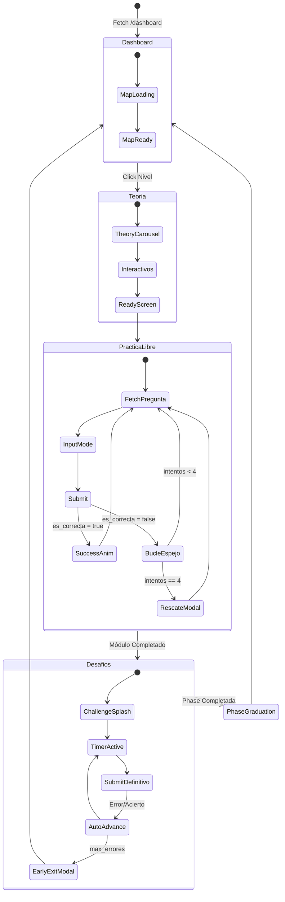
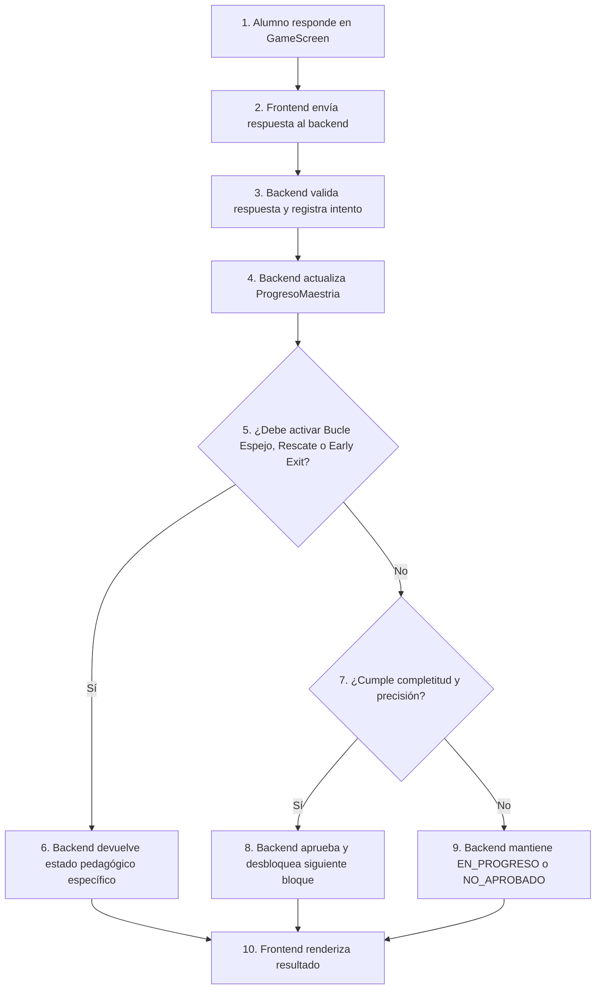

# Tomo 3: Guía Frontend UX — LogicaKids Pro

> **Versión:** 4.0 (Consolidada) | **Última actualización:** 2026-06-08 | **Prioridad documental:** 4
>
> **Dependencia:** Las reglas pedagógicas y de progresión están definidas en el [Documento Rector](1_Documento_Rector_Pedagogico.md). Los modelos de datos y endpoints están en el [Tomo 2](2_Arquitectura_Backend_y_Admin.md). Esta guía se enfoca exclusivamente en experiencia visual, navegación y comportamiento de interfaz.

> Nota de autoridad documental: Este documento define la experiencia visual, navegación y comportamiento de interfaz. En caso de conflicto, prevalece primero el Documento Rector Conceptual, luego el Blueprint Técnico, luego el Manual del Administrador y finalmente esta Guía UX/UI.

---

## 1. Propósito del Documento

Este documento unifica la planificación técnica de interfaz con la guía oficial UX/UI de **LogicaKids Pro**. El objetivo es garantizar que la plataforma sea robusta, coherente, gamificada y adaptada para niños de alrededor de 10 años.

La plataforma debe sentirse como un videojuego educativo espacial, sin perder rigor pedagógico ni control server-authoritative.

---

## 2. Filosofía del Sistema

La plataforma se construye sobre dos pilares complementarios.

### 2.1. Filosofía Sistema-Céntrica

> **Principio Server-Authoritative:** Ver [Documento Rector](criterios%20conceptuales.md) §1 para las reglas sobre cómo el backend controla la progresión, validación y rescate, mientras que el frontend obedece y renderiza.

### 2.2. Filosofía Usuario-Céntrica

La percepción lo es todo. La interfaz debe:

* reducir carga cognitiva;
* evitar frustración;
* usar chunking;
* mostrar retroalimentación visual inmediata;
* evitar pantallas densas;
* usar micro-animaciones;
* mantener una experiencia gamificada y motivadora.

---

## 3. Arquitectura de Navegación y Estado Global

### 3.1. Enrutamiento Declarativo

El sistema utiliza React Router para historial, deep linking y carga perezosa.

Rutas principales:

```text
/login
/map
/profile
/progress
/admin/*
```

Ruta de fase:

```text
/fase/:faseId/:moduloId/:nivelId
```

Los nombres `faseId`, `moduloId` y `nivelId` deben usarse de forma consistente para evitar ambigüedad con `id`.

### 3.2. API Canónica de Juego y Enrutamiento de Pools Segmentados

> **Especificación completa:** Ver [Blueprint Técnico](blueprint.md) §6.1 para la definición de los endpoints canónicos (`/api/fases/{fase_id}/...`) y la transparencia de pools segmentados.

### 3.3. Estado Global y Máquina de Estados Reactiva

Toda la lógica de sesión, progreso de fase, parámetros de juego e hidratación debe manejarse en un store centralizado (Zustand).

El frontend no calcula estado académico. Solo refleja el JSON entregado por backend.

#### Diagrama de Estados (Frontend State Machine)



> **Fuente de Verdad:** Ver [Documento Rector](1_Documento_Rector_Pedagogico.md) §1 para las reglas sobre `ProgresoMaestria` vs `user.settings["unlockedLevels"]`.

---

## 4. Estructura de Componentes

La jerarquía de archivos debe seguir un patrón atómico y modular:

```text
src/
 ├── components/
 │   ├── admin/       # Panel Admin
 │   ├── map/         # Mapa General Zig-zag Fases 1-9
 │   ├── fase/        # Welcome, Levels, Game, Results
 │   ├── common/      # Keyboard, Buttons, Modals
 │   └── theory/      # Carruseles, flashcards, interactivos
 ├── store/           # Auth, Progress, GameSession
 ├── services/        # API clients, deduplicación, hidratación
 └── types/           # Tipos compartidos
```

---

## 5. Guía de Interacción y Comportamiento UX

### 5.1. Bucle Espejo (Exclusivo de Práctica Libre)

Para garantizar la asimilación activa de conceptos sin atascar al estudiante, el sistema implementa una lógica de Bucle Espejo en la Práctica Libre:

1. **Error (Pregunta Original o Variantes):** El sistema **activa un Modal Emergente (Mirror Modal)** que se superpone a la batería principal de preguntas.
2. **Revelación y Variante:** En este modal, el frontend tiñe el borde de rojo, emite el sonido de error y **revela de inmediato la respuesta que era correcta** de la pregunta fallida. Acto seguido, entrega la siguiente Variante Espejo (misma estructura, diferentes números) para ser resuelta dentro del mismo modal.
3. **Persistencia del Bucle:** El modal permanece activo hasta que el alumno responda correctamente o agote las 3 variantes permitidas.
4. **Variante Espejo 3 Errada (4º Falla Consecutiva):** Dentro del mismo flujo emergente, el backend activa el **Bloque de Rescate Explicativo** (Explicación Profunda).
5. **Avance y Cierre:** El alumno lee la explicación, presiona el botón `"¡Entendido, ir al siguiente reto!"`, el modal se cierra y la interfaz principal lo mueve inmediatamente a la siguiente familia de preguntas original.

Este flujo garantiza que la batería principal se "pause" mientras el alumno resuelve su laguna cognitiva en un espacio dedicado y enfocado (el modal).

#### 5.1.1. UX ante Cierre o Recarga de Página (Reload Reset)

El comportamiento de la interfaz ante un cierre de pestaña o recarga accidental/intencional (`F5`) se divide estrictamente según la etapa pedagógica:

* **En Práctica Libre (Entrenamiento):**
  * **Reinicio Visual de Progreso:** Al recargar o reingresar al nivel, la barra de progreso circular se reinicia explícitamente a `0%` y el contador de preguntas vuelve a comenzar desde `0` de `cantidad_requerida`.
  * **Mensaje de Orientación:** Se despliega un banner superior flotante motivador que recuerda al estudiante: *"¡Entrenamiento reiniciado! Completa la batería sin interrupciones para consolidar tu superpoder"* para mitigar la frustración.
* **En Desafíos (Evaluación):**
  * **Restauración del Estado:** Se reanuda la evaluación en la pregunta exacta y tiempo restante en que se encontraba, sin penalizar el progreso pero manteniendo inalterados los errores acumulados (hidratación desde API).
  * **Auto-avance en Errores/Timeout:** Para mantener el ritmo de evaluación, ante un error o expiración del tiempo, el sistema muestra feedback visual (rojo) por 1.5 segundos y avanza automáticamente a la siguiente pregunta.

### 5.2. Feedback Visual de Error

En una respuesta incorrecta:

* borde rojo en input;
* fondo rojo suave;
* badge de error;
* resplandor ambiental rojo;
* **Revelación de Respuesta Correcta (Práctica Libre):** Un panel informativo contiguo muestra de forma inmediata: *"La respuesta correcta era: [Respuesta]"*;
* feedback textual del Tutor Invisible;
* bloqueo de avance hasta que el alumno presiona el botón `"Siguiente Variante Espejo"`.

El sistema revela la respuesta correcta de inmediato tras cada error en Práctica Libre para guiar el aprendizaje activo. En la Zona de Desafíos, no se revela la respuesta correcta y se avanza directamente descontando vidas/tiempo.

*Regla de Score:* Las fallas cometidas en **Variantes Espejo** no se contabilizan en el marcador visual de "Errores" ni afectan la precisión estadística del alumno, reforzando el concepto de entrenamiento sin miedo.

### 5.3. Bloque de Rescate Explicativo

El Bloque de Rescate debe:

* abrirse como Modal Overlay prioritario o sección prioritario esmerilada (`glassmorphism`);
* bloquear la interacción con el fondo de la pantalla;
* mostrar la explicación teórica, la resolución detallada paso a paso y el *porqué* conceptual de la respuesta;
* renderizar énfasis visual en HTML/Markdown controlado;
* **no incluir ningún input de transcripción forzada ni bloqueos anti-spam**;
* habilitar un botón prioritario reactivo de color cian *"¡Entendido, ir al siguiente reto!"*;
* al hacer clic, llamar a `/api/fases/{fase_id}/cerrar-rescate` y avanzar fluidamente a la siguiente familia de preguntas independiente.

### 5.4. Early Exit

Cuando el backend retorna:

```json
{
  "early_exit": true
}
```

El frontend debe:

* detener el flujo actual;
* mostrar modal de expulsión pedagógica;
* explicar que se superó el límite de errores;
* resetear visualmente la sesión del desafío;
* redirigir al dashboard de fase.

---

## 6. Dashboard de Fase

El dashboard de la fase organiza el progreso del alumno mapeando los niveles y desafíos virtuales como un trayecto espacial de **nodos estelares interactivos**.

### 6.1. Estados Visuales y Retroalimentación Cromática de los Nodos

Cada nodo del mapa estelar refleja visualmente su estado calculado en el backend mediante un sistema cromático premium con micro-animaciones en CSS y Framer Motion:

* **Bloqueado:**
  * **Estética:** Nodo gris semiopaco con un candado esmerilado de cristal (`glassmorphism`).
  * **Comportamiento:** Hover inactivo, escala neutra.
* **Disponible (Desbloqueado Linealmente):**
  * **Estética:** Nodo con color principal de la fase y un brillo exterior (`drop-shadow`) suave y estático.
  * **Comportamiento:** Al pasar el cursor (`hover`), escala suavemente (+5%) y activa un sonido sutil de sistema.
* **En Progreso / Siguiente Recomendado:**
  * **Estética:** Nodo rodeado por una órbita animada pulsante con gradiente dinámico.
  * **Comportamiento:** Invita activamente al alumno a hacer clic mediante micro-rebotes y pulsos de luz cíclicos.
* **Aprobado (Progresión Automática Ordinaria):**
  * **Estética:** Resplandor de aureola **dorada premium** (`gold glow`), indicando que el bloque ha sido superado con éxito por el desempeño del alumno:
    * **En Práctica Libre:** El alumno completó el 100% de la batería asignada (independientemente del porcentaje de errores o bypasses). Su perseverancia es recompensada.
    * **En Zona de Desafíos:** El alumno completó el 100% y alcanzó un porcentaje real de precisión ≥90%.
  * **Comportamiento:** Despliega estrellas doradas en una animación explosiva de partículas al momento de aprobarse.
* **Aprobado por Decreto Administrativo (Override Manual de Aprobación):**
  * **Estética:** Resplandor de aureola **cian/azul neón distintivo** (`cyan/neon glow`) en lugar de dorado. Esto diferencia inmediatamente un bloque aprobado de manera ordinaria de uno intervenido.
  * **Insignia de Intervención:** Se renderiza una pequeña insignia o icono de "Súper-Tutor" (icono de rayo o escudo cian esmerilado) en la esquina superior derecha del nodo.
  * **Tooltip de Retroalimentación:** Al hacer hover o clic, se muestra una tarjeta esmerilada explicativa que indica de forma transparente y motivadora: *"¡Liberado por tu tutor! Motivo: [Motivo de Override] - [Fecha de Override]"*.
* **Liberado por Administración (Override Manual de Desbloqueo):**
  * **Estética:** Nodo con órbita pulsante en **brillo cian/neón** (en lugar de color de fase estándar), indicando que está activo por bypass del administrador.
  * **Tooltip de Retroalimentación:** Muestra el mensaje: *"¡Habilitado por tu tutor para tu práctica especial!"*.

Los niveles y desafíos se desbloquean según la respuesta de `/api/fases/{fase_id}/dashboard`.

---

## 7. Módulos Teóricos

La teoría debe dividirse en carruseles de flashcards.

Reglas:

* no usar scrollbars largos;
* máximo 2 elementos principales por pantalla;
* usar lenguaje breve;
* usar ejemplos visuales;
* exigir interactivos para desbloquear práctica;
* no permitir avanzar si los interactivos obligatorios no fueron respondidos correctamente.

### 7.1. Seguridad y Proporciones en Ilustraciones SVG

Para garantizar que todas las ilustraciones vectoriales SVG explicativas o interactivas (como desarrollos planos, cuerpos 3D o esquemas) se rendericen correctamente sin recortarse:
* **Límites de Canvas Seguros (viewBox):** Todo elemento `<svg>` debe definir un atributo `viewBox` que encapsule con suficiente holgura las coordenadas máximas y mínimas de sus elementos secundarios (`<rect>`, `<path>`, `<text>`, etc.).
* **Márgenes y Holgura de Texto:** Se debe incluir un margen mínimo de seguridad de `20px` a `30px` alrededor de los bordes del dibujo y en el posicionamiento de textos/etiquetas descriptivas, previniendo recortes visuales en distintos tamaños de pantalla.
* **Escala y Dimensionamiento de Elementos:** Al dibujar figuras complejas o redes de poliedros que superen el alto estándar de los modales pedagógicos, es mandatorio reducir proporcionalmente la escala de los componentes (por ejemplo, reducir el lado de las caras cuadradas de una red a `24px`) para evitar desbordamientos verticales.

---

## 8. Interfaz de Práctica y Juego

### 8.1. Input Personalizado

La práctica debe usar un input numérico grande y claro.

### 8.2. Custom Keyboard

El teclado numérico personalizado evita distracciones del teclado nativo del dispositivo y garantiza un comportamiento controlado para el público infantil.

Debe incluir:

* números;
* borrar;
* confirmar;
* separador decimal si el módulo lo requiere;
* compatibilidad con dinero cuando aplique;

#### Reglas de Layout y Comportamiento del Teclado:
* **Diseño de Grilla Simétrica (3x4):** Para asegurar coherencia visual y facilidad táctil, las teclas se organizan en una cuadrícula simétrica de 3 columnas por 4 filas. La fila final debe ubicarse en la disposición exacta `[.]` `[0]` `[Borrar]` (separador decimal, cero, retroceso).
* **Ubicación de Teclas de Control:** La tecla de retroceso (`Backspace`) se ubica dentro de la cuadrícula numérica principal (esquina inferior derecha) para mantener un diseño compacto. El botón principal de "Confirmar" debe ubicarse debajo de la cuadrícula, ocupando todo el ancho disponible (`w-full`), para facilitar su pulsación.
* **Manejo de Signos Negativos:** El teclado numérico en pantalla **no** incluye botón de signo negativo (`-`). Si el módulo requiere ingresos negativos, el diseño base asume ingreso por teclado físico o adaptaciones futuras, priorizando la simplicidad del layout estándar de 3x4.

### 8.3. Subrayado por Tokens

En preguntas textuales, el frontend debe renderizar tokens seleccionables. Cada token tiene ID estable.

El frontend envía:

```json
{
  "tokens_seleccionados": [2, 5]
}
```

No debe enviar texto crudo para validación.

### 8.4. Seguridad Visual

El frontend no debe recibir ni renderizar:

* `es_correcta`;
* respuesta correcta oculta;
* distractores marcados internamente;
* reglas de validación completas.

### 8.5. Cronómetro Reactivo Dinámico

Para evitar discrepancias entre la calibración pedagógica y el comportamiento visual del juego, **se prohíbe hardcodear límites de tiempo en el frontend**:
* El componente del temporizador (`TimerController.tsx`) debe ser enteramente reactivo. Al recibir el payload de `/api/fases/{fase_id}/pregunta`, lee las variables de configuración de inicio:
  * Si `usa_cronometro` es `false`, oculta el elemento visual del reloj por completo y elimina toda lógica de expiración de tiempo.
  * Si `usa_cronometro` es `true`, renderiza la barra circular de progreso temporal e inicializa la cuenta regresiva con base en los segundos devueltos por `tiempo_limite_segundos`.
* Esta reactividad garantiza que cualquier calibración del superusuario en caliente impacte inmediatamente la experiencia del estudiante de forma fluida y sin redespliegue.

### 8.6. Cabecera Premium y Temporizador Visual Estandarizado (Header & Timer Standard)

Para asegurar una alta consistencia de UI/UX a lo largo de todas las fases del juego:
* **Píldora Informativa Estandarizada (`badge-pill`):**
  * La fuente interna de la píldora informativa principal del cabecera debe tener un tamaño mínimo de `0.95rem` a `1rem` para garantizar legibilidad.
  * La información del nivel debe incluir la ubicación didáctica completa en el formato: `FASE {fase_id} | MÓDULO {modulo_id} | NIVEL {nivel_id}` en lugar de mostrar únicamente `"NIVEL X"`.
* **Barra de Tiempo Fluida de la Pregunta:**
  * En todas las fases, cuando una pregunta requiera tiempo límite (`timer !== null`), el frontend debe renderizar una barra de progreso de tiempo horizontal delgada en el borde inferior del cabecera.
  * Esta barra se calculará dinámicamente con la proporción `(timer / maxTimer) * 100` y cambiará a color rojo vibrante con una animación pulsante de advertencia cuando resten menos de 5 segundos.

### 8.7. Preguntas de Pasos Encadenados (Constructor de Soluciones)

Para las preguntas de tipo `constructor_soluciones_chained` (dos pasos encadenados), la experiencia de usuario debe seguir estas reglas estrictas en todas las fases:
* **Enunciado Limpio:** El texto principal (enunciado general) de la pregunta NO debe contener interrogaciones o preguntas redundantes al final. Solo debe plantear el contexto y los datos. La pregunta específica corresponde a la descripción del Paso 1.
  > [!IMPORTANT]
  > **Ámbito de Aplicación:** La limpieza del enunciado principal (eliminar la pregunta redundante) se aplica **exclusivamente** a las preguntas de pasos encadenados (dos pasos). Si se aplicase a todas las preguntas ordinarias de la plataforma se quebraría la lógica conceptual, ya que las preguntas de un solo paso necesitan su pregunta dentro del enunciado principal.
  > 
  > **Ubicuidad de las Preguntas de Dos Pasos:** Esta lógica de enunciado limpio y ocultamiento condicional debe aplicarse rigurosamente **cada vez que aparezca una pregunta de dos pasos** en la plataforma, incluyendo el **Desafío Final de Módulo** y el **Desafío de la Fase 2** (donde también se instancian estas preguntas).
* **Ocultamiento Condicional del Paso 2:** El Paso 2 de la pregunta (o paso subsiguiente) NO debe renderizarse, ni siquiera con opacidad baja, mientras el alumno esté resolviendo el Paso 1. El Paso 2 solo debe aparecer en pantalla una vez que el Paso 1 haya sido respondido correctamente, focalizando la atención del estudiante.
* **Calificación Aislada por Pasos:** Para asegurar que el avance de completitud visual del alumno en la interfaz refleje correctamente su progreso didáctico real, la API y el frontend se sincronizan de forma aislada. Cuando el alumno responde correctamente al Paso 1, el backend retorna `es_correcta = True` en el JSON para que el frontend marque visualmente el Paso 1 como resuelto con éxito y libere de forma interactiva el Paso 2 (ocultando el resto para mantener la focalización cognitiva). Sin embargo, el progreso real del nivel y la maestría se mantienen bloqueados en la base de datos (registrando `es_correcta = False` en el intento general) hasta que el alumno resuelva exitosamente el paso final de la secuencia, garantizando una transición libre de errores de avance prematuros.

---

## 9. Mapeo General de Fases

Las fases se desbloquean dinámicamente según `ProgresoMaestria` y el dashboard server-authoritative. Los administradores tienen bypass total.

| Fase | Título | Descripción Pedagógica | Mecánica |
| --- | --- | --- | --- |
| **1** | Calentamiento Aritmético | Sumas, restas, multiplicaciones y divisiones. | Server-Authoritative (`/api/fases/{fase_id}/...`). |
| **2** | Desarrollo Numérico | Cálculo mental, sistema monetario y problemas lógicos. | Modelo interactivo con práctica y desafíos. |
| **3** | Problemas de Texto | Comprensión lectora, datos relevantes y resolución dirigida. | Subrayado por tokens y razonamiento guiado. |
| **4** | Fracciones y Gráficos | Relación parte-todo, fracciones y barras de datos. | SVG interactivos. |
| **5** | Geometría Plana | Figuras 2D, perímetros y áreas. | Canvas espaciales y manipulación visual. |
| **6** | Geometría Espacial | Visualización 3D, volumen y cuerpos geométricos. | CSS/HTML 3D. |
| **7** | Coordenadas y Trayectos | Plano cartesiano, rutas y desplazamientos. | Grillas cartesianas. |
| **8** | Probabilidad, Combinatoria y Lógica | Casos posibles, patrones de secuencias, lectura de datos y razonamiento abstracto. | Gráficos interactivos y simulaciones. |
| **9** | Simulacro Final Pedro II | Integración completa de contenidos del examen. | Evaluación mixta con cronómetro y análisis de errores. |

> Nota de alcance: El mapa global contempla 9 fases. Las Fases 1 a 3 representan el núcleo actualmente construido y configurable desde el panel administrativo. Las Fases 4 a 9 pueden mostrarse visualmente como fases futuras, bloqueadas o en desarrollo hasta que su contenido relacional esté completamente implementado.

---

## 10. UX del Panel Admin

El Panel Admin debe mantener la misma identidad visual, pero con mayor densidad informativa.

### 10.1. Reglas de Interfaz del Panel Administrativo

* **Tablas de Alto Rendimiento:** Datos paginados y ordenables que permiten buscar estudiantes por nombre o correo con latencia cero.
* **Filtros Flexibles:** Selectores para filtrar rápidamente por fase, módulo y tipo de bloque (Práctica Libre vs Desafío).
* **Edición y Configuración en Modales:** Evitar redirecciones innecesarias de página; todos los parámetros pedagógicos y contenidos se editan mediante modales de vidrio esmerilado (`backdrop-blur`).
* **Visualización de Intentos:** Un subpanel interactivo de análisis cognitivo que muestra las respuestas dadas, los errores previstos identificados y el feedback recibido por el alumno en tiempo real.

### 10.2. UX/UI para Intervenciones y Overrides de Progreso

La interfaz de overrides de rendimiento debe cumplir con los siguientes estándares estrictos de usabilidad:

* **Control de Tres Estados:** Botones claramente separados y estilizados para `unlock` (Liberar), `approve` (Aprobar) y `reset` (Bloquear/Restablecer).
* **Modal de Confirmación Destructiva y Justificación:**
  * Al hacer clic en cualquier override, la UI despliega un modal prioritario con desenfoque del fondo (`backdrop-blur-md`).
  * Muestra una advertencia explícita sobre el impacto didáctico y el desencadenamiento automático de la cascada de desbloqueos.
  * **Alerta Crítica de Aprobación Retrógada (Retro-Approval Warning):** Si la acción seleccionada es `approve`, el modal desplegará un banner de alerta de color naranja esmerilado con la advertencia: *"¡ATENCIÓN! Aprobar manualmente este nivel declarará automáticamente aprobados todos los niveles anteriores de esta fase para conservar la consistencia"*.
  * **Campo de Texto Reactivo:** Área de entrada de texto para registrar el *Motivo del Override*. El botón de confirmación se habilita únicamente si el texto ingresado tiene al menos 10 caracteres, evitando registros de auditoría vacíos o de spam (como "ok" o "123").
* **Indicadores Visuales de Override Activo:**
  * Al completarse la petición de override, la UI del administrador aplica un resplandor cian/azul neón en el renglón o celda del alumno, con un badge con el texto *"INTERVENIDO POR ADMIN"* que permite identificar rápidamente qué alumnos tienen rutas personalizadas y por qué.

### 10.3. UI/UX para Calibración de Parámetros (Tiempos y Volúmenes)

La pestaña de gestión pedagógica avanzada debe contar con controles intuitivos que minimicen los errores de entrada operativa, soportados por una estructura de "Pestañas de 3 Niveles" para evitar la saturación visual:

* **Arquitectura Top-Down (3 Niveles):**
  * Nivel 1: Selector principal (Plataforma Global vs Fases).
  * Nivel 2: Deslizador horizontal de Fases de alto contraste.
  * Nivel 3: Sub-pestañas en píldora ("General Fase X" y módulos).
* **Cristales de Herencia (Glassmorphism Overlay):**
  * Si un módulo hereda parámetros de la Fase (o de la Global), su panel de control se oscurece con un cristal esmerilado que bloquea la interacción, mostrando la etiqueta *"Heredando de..."* para evitar modificaciones no intencionadas.
  * **Interruptor de Sobrescritura (Override Toggle):** Un switch en la parte superior que permite romper la herencia en tiempo real; al activarse, el cristal desaparece con una transición suave y habilita todos los controles de ajuste local.
* **Toggles Claros de Tiempo:** Switch reactivo en Tailwind que al activarse expande un submenú deslizante con el slider de segundos.
* **Sliders de Control Fino con Indicador Dinámico:** Deslizadores para la duración temporal con marcas de escala legibles y un indicador textual en tiempo real (ej. *"Límite por pregunta: 35 segundos"*).
* **Campos Numéricos con Límites Lógicos (Min/Max):** Entradas para `cantidad_requerida` que bloquean o advierten mediante alertas preventivas rojas si se intentan registrar valores extremos (ej. menos de 5 preguntas o más de 50) que puedan romper el ritmo de atención infantil.

---

## 11. Accesibilidad

La experiencia debe contemplar:

* fuentes legibles;
* escala ajustable;
* contraste suficiente;
* botones grandes;
* retroalimentación visual y textual;
* reducción de carga cognitiva;
* evitar interfaces saturadas;
* compatibilidad con niños con dificultades de lectura.

---

## 12. Reglas Finales de Coherencia UX

* No revelar respuesta correcta en la Zona de Desafíos (en Práctica Libre sí se revela inmediatamente tras cada error, ver §5.2).
* No permitir avanzar en teoría sin completar interactivos.
* No permitir que el frontend calcule progreso.
* No mostrar información interna como `es_correcta`.
* Mantener endpoints `/api/fases/{fase_id}/...`.
* Usar `ProgresoMaestria` como fuente de verdad visual y académica.
* Usar `user.settings["unlockedLevels"]` solo como espejo de compatibilidad.
# Especificación de Diseño UI/UX: Pantalla de Mapa General (`PhaseMapScreen.tsx`) - Versión 3.0 (Certificada)

> **Versión:** 3.0 | **Última actualización:** 2026-06-08 | **Prioridad documental:** 4 (Extensión de [Guía UX/UI](Desig_UX.md))
>
> **Nota:** Este documento es una extensión especializada de la [Guía UX/UI](Desig_UX.md) centrada exclusivamente en la pantalla `PhaseMapScreen.tsx`.

Esta especificación actúa como guía técnica y estética para la pantalla del mapa interactivo de niveles para **LogicaKids Pro**. Tras la auditoría final, la pantalla se ha integrado en el sistema de enrutamiento declarativo de **React Router DOM v6+** y consume el estado global de **Zustand** y del **Contexto de Autenticación**, garantizando un rendimiento premium y eliminando el antipatrón de prop-drilling.

---

## 1. Rol y Enfoque de Desarrollo

* **Rol**: Desarrollador Frontend experto en React, Tailwind CSS y diseño UI/UX de alta calidad. El objetivo es construir una interfaz gamificada de un mapa de niveles (estilo "Journey" o "Timeline") cuidando los detalles premium, el diseño responsivo (Mobile-first), y usando `framer-motion` (para animaciones fluidas) y `lucide-react` (para iconografía moderna).

---

## 2. Tema y Estética General (Tokens Visuales)

El diseño general sigue una estética futurista, limpia y sumamente atractiva:

* **Modo Oscuro Profundo**: Fondo de pantalla general `bg-gradient-to-b from-[#0B0F19] via-[#0F172A] to-[#070A13]` con texto principal blanco o `text-slate-50`.
* **Fondo Ambiental (Glow Profundo)**: 
  - Cuatro grandes esferas desenfocadas de fondo con un desenfoque (blur) extremo de `150px` usando colores neón tenues (`bg-blue-950/20`, `bg-purple-950/20`, `bg-cyan-950/20`, y `bg-emerald-950/20`) ubicadas estratégicamente a lo largo de la altura vertical de scroll, eliminando cortes de color abruptos y brindando una atmósfera cósmica tridimensional.
* **Tipografía Modernizada**:
  - Títulos principales en tipografía Sans-Serif de Google Fonts (ej. Outfit o Inter) gruesa, utilizando las clases Tailwind `font-black tracking-tight`.
  - Subtítulos, descripciones y datos técnicos con tipografía de grosor medio, clase `font-medium text-slate-400`.

---

## 3. Dashboard Header (Estructura Responsiva)

El encabezado superior de la aplicación se adapta dinámicamente al tamaño del dispositivo:

* **Estructura Responsiva**:
  - **En Móviles (Mobile-first)**: Los elementos se apilan verticalmente en columna (`flex-col`) con un espaciado de `gap-6` y el título centrado.
  - **En Tablets/Escritorio (`md:` en adelante)**: Se organiza en una fila horizontal (`flex-row`), justificado en los extremos (`justify-between`).
* **Sección de Información (Lado Izquierdo)**:
  - Título principal: `"Tu Viaje Matemático"` (`text-4xl font-black text-white mb-2 tracking-tight`).
  - Subtítulo de estado del alumno: `"Fase Actual: X"` (donde X representa el número de la fase desbloqueada actual, leído del perfil del alumno en `currentUser.fase_actual_id`).
* **Sección de Controles (Lado Derecho)**:
  - Un contenedor horizontal (`flex gap-6 items-center`) que agrupa los controles premium:
    1. **Botón Perfil de Usuario (Estilo Cápsula)**:
       - Estructura: Botón redondeado completo (`rounded-full`), con fondo slate transparente `bg-slate-800/50` y borde suave `border border-transparent`.
       - Efecto Hover: Al pasar el cursor, cambia a `bg-slate-800 border-slate-700`.
       - Contenido: Un avatar circular a la izquierda (`w-12 h-12` o 48px) que al hacer hover se enciende en azul (`group-hover:border-blue-500`), el avatar dinámico del alumno cargado desde S3, y a la derecha el nombre de usuario de la cuenta (`currentUser.username`) en formato de texto extra-negrita.
       - Comportamiento: Al hacer clic, navega a la ruta `/profile` usando React Router.
    2. **Botón Cerrar Sesión**:
       - Estructura: Botón ancho con borde y fondo gris pizarra oscuro (`px-6 py-2.5 rounded-full bg-slate-800 border border-slate-700 text-slate-300 font-bold`).
       - Efecto Hover: Al pasar el ratón, se tiñe de color rojo sutil (`hover:bg-red-500/20 hover:text-red-400 transition-colors`).
       - Comportamiento: Dispara `logout()` del Contexto de Autenticación, limpiando los tokens JWT del almacenamiento local.

---

## 4. El Mapa de Niveles (Línea de Tiempo en Zig-Zag)

El corazón de la pantalla es un mapa lineal interactivo contenido en un contenedor central `max-w-4xl mx-auto px-4 mt-8 relative z-10`.

* **Comportamiento Adaptable**:
  - **En Móviles**: Las tarjetas de fases se apilan una sobre otra verticalmente (`flex-col`) con espaciados cómodos. No se dibuja la línea de tiempo conectora central.
  - **En Escritorio (`md:` en adelante)**:
    - **Línea Conectora Central**: Se dibuja una línea vertical fina (`w-1.5`) de color gris oscuro `bg-slate-800` justo en el centro absoluto de la pantalla (`absolute left-1/2 -translate-x-1/2 top-4 bottom-4 rounded-full`).
    - **Distribución en Zig-Zag**: Las tarjetas se alternan a la izquierda y derecha de la línea conectora utilizando alternancia de clases flexbox. La primera fase ocupa el 50% de la izquierda, la segunda fase ocupa el 50% de la derecha, y así sucesivamente (`md:flex-row` vs `md:flex-row-reverse`).
    - **Nodos Conectores**: Justo sobre la línea vertical central se renderiza un nodo circular flotante por cada fase (`w-12 h-12 rounded-full bg-slate-900 border-4 border-slate-800 z-10 flex items-center justify-center`).
      - Si la fase está **Desbloqueada**: El nodo contiene un punto luminoso cian/azul con sombra brillante (`w-4 h-4 rounded-full bg-cyan-500 shadow-[0_0_15px_rgba(6,182,212,0.8)]`).
      - Si la fase está **Bloqueada**: El nodo muestra un candado interactivo gris (`Lock` de Lucide, `size={16} text-slate-600`).

---

## 5. Tarjetas de Fases (Cards)

Las tarjetas de niveles representan las unidades didácticas y adoptan una estética glassmorphism premium:

* **Geometría**: Bordes ultra-redondeados usando la clase de Tailwind `rounded-[2.5rem]`.
* **Estado Desbloqueada (Fase Disponible)**:
  - Estructura: Fondo semitransparente oscuro `bg-slate-800/80` y borde fino cian/gris `border-slate-700`.
  - Efecto Hover Premium: Al pasar el cursor sobre la tarjeta, esta realiza un desplazamiento suave hacia arriba (`hover:-translate-y-2`), aumenta drásticamente su sombra trasera (`hover:shadow-2xl`) y activa un brillo interno translúcido del color temático de la fase.
  - cursor: `cursor-pointer`.
* **Estado Bloqueada (Fase No Disponible)**:
  - Estructura: Fondo oscuro opaco `bg-slate-900/50` con borde muy atenuado `border-slate-800/50`.
  - Efecto Visual Premium: Para mantener la motivación, las fases bloqueadas se muestran con sus iconos y tarjetas en **colores vivos y resplanderes neon originales**, mientras que el bloqueo se representa mediante elegantes candados en los conectores, cabeceras y una opacidad reducida del texto.
  - cursor: `cursor-not-allowed` (salvo que el usuario tenga rol `ADMIN`, en cuyo caso se aplica un bypass total y el candado se desbloquea).

### 5.1. Distribución de Elementos Internos de la Tarjeta:
1. **Cabecera de Tarjeta (Fila Superior)**:
   - **Lado Izquierdo (Icono Temático)**: Un recuadro grande (`w-14 h-14 rounded-2xl flex items-center justify-center`) que contiene el icono de la fase (de Lucide) pintado en su color vibrante neón y sombra del color correspondiente (`shadow-lg shadow-[color]/50`).
   - **Lado Derecho (Metadatos e Insignias)**:
     - Muestra el número de fase en mayúsculas y espaciado de letras (`text-[10px] font-black uppercase tracking-widest text-slate-500`).
     - Si la fase está dominada al 100%, se despliega una insignia premium de color verde menta `bg-emerald-50 text-emerald-700 border-emerald-200` con el texto `✓ Dominado ✅`.
     - Si la fase está bloqueada, añade un indicador de bloqueo con un mini candado (`text-xs font-bold text-slate-600 flex items-center gap-1`).
2. **Cuerpo de Tarjeta (Información Central)**:
   - Título de la Fase: Fuente extra-gruesa de gran formato (`text-2xl font-black mb-2 relative z-10 md:text-3xl`).
     - Si está desbloqueada: Color blanco.
     - Si está bloqueada: Color gris atenuado `text-slate-400`.
   - Descripción Pedagógica: Párrafo de texto fluido que detalla los temas (`text-sm leading-relaxed relative z-10`).
     - Si está desbloqueada: Color `text-slate-300`.
     - Si está bloqueada: Color `text-slate-600`.
3. **Pie de Tarjeta (Botón de Acción)**:
   - Añade en la parte inferior un botón ancho `mt-8 relative z-10 py-3 rounded-xl bg-slate-700/50 text-white font-bold transition-colors w-full`.
   - Si la fase está dominada, el botón cambia dinámicamente su etiqueta a `✓ Repasar Fase (Dominada) ✅`.
   - Efecto Sincronizado: Al hacer hover en cualquier parte de la tarjeta completa, el botón de acción cambia su color de fondo a azul/cian brillante (`group-hover:bg-cyan-500`).

---

## 6. Animaciones de Entrada (Framer Motion)

Para garantizar una carga de pantalla premium y pulida, las tarjetas de las fases no se cargan estáticamente:

* **Contenedor Principal**: Envuelto en un componente animado `motion.div`.
* **Efecto Escalonado (Stagger Delay)**:
  - Cada tarjeta de nivel inicia su renderizado de forma invisible y desplazada hacia abajo: `initial={{ opacity: 0, y: 30 }}`.
  - Al cargar, se animan fluidamente hacia su estado final: `animate={{ opacity: 1, y: 0 }}`.
  - El retardo (delay) de animación de cada elemento se calcula dinámicamente multiplicando el índice de la fase por `0.1` (`transition={{ delay: index * 0.1 }}`). Esto provoca un efecto de cascada visual sumamente satisfactorio.

---

## 7. Modelo de Datos y Mapeo Pedagógico (9 Fases Reales)

El arreglo de datos con el que se renderiza el mapa en `PhaseMapScreen.tsx` mapea con total exactitud las 9 fases del Viaje Matemático:

```typescript
import { Zap, Brain, BookOpen, PieChart, Square, Box, Map, Lightbulb, GraduationCap } from 'lucide-react';

const PHASES_CONFIG = [
  {
    index: 1,
    title: 'Aritmética Básica',
    description: 'Sumas, restas, multiplicaciones y divisiones.',
    icon: Zap,
    color: 'bg-blue-500',
    shadow: 'shadow-blue-500/50',
    path: '/fase/1/welcome'
  },
  {
    index: 2,
    title: 'Desarrollo Numérico y Razonamiento',
    description: 'Cálculo mental, sistema monetario brasileño y lectura matemática.',
    icon: Brain,
    color: 'bg-emerald-500',
    shadow: 'shadow-emerald-500/50',
    path: '/fase/2/welcome'
  },
  {
    index: 3,
    title: 'Problemas de Texto',
    description: 'Lectura, interpretación, elección de operación y problemas combinados.',
    icon: BookOpen,
    color: 'bg-orange-500',
    shadow: 'shadow-orange-500/50',
    path: '/fase/3/welcome'
  },
  {
    index: 4,
    title: 'Fracciones, Porcentajes y Gráficos',
    description: 'Relación parte-todo, métricas y visualización de datos.',
    icon: PieChart,
    color: 'bg-purple-500',
    shadow: 'shadow-purple-500/50',
    path: '/fase/4/welcome'
  },
  {
    index: 5,
    title: 'Geometría Plana',
    description: 'Figuras, áreas, perímetros y comprensión espacial bidimensional (Tangram).',
    icon: Square,
    color: 'bg-rose-500',
    shadow: 'shadow-rose-500/50',
    path: '/fase/5/welcome'
  },
  {
    index: 6,
    title: 'Geometría Espacial',
    description: 'Visualización 3D, prismas, cilindros y cálculo de volumen de bloques.',
    icon: Box,
    color: 'bg-indigo-500',
    shadow: 'shadow-indigo-500/50',
    path: '/fase/6/welcome'
  },
  {
    index: 7,
    title: 'Coordenadas y Desplazamientos',
    description: 'Mapas, rutas, plano cartesiano y orientación espacial.',
    icon: Map,
    color: 'bg-teal-500',
    shadow: 'shadow-teal-500/50',
    path: '/fase/7/welcome'
  },
  {
    index: 8,
    title: 'Probabilidad, Combinatoria y Lógica',
    description: 'Casos posibles, patrones de secuencias y razonamiento abstracto.',
    icon: Lightbulb,
    color: 'bg-amber-500',
    shadow: 'shadow-amber-500/50',
    path: '/fase/8/welcome'
  },
  {
    index: 9,
    title: 'Simulados Pedro II',
    description: 'Práctica para examen real, correcciones estructuradas e identificador de errores.',
    icon: GraduationCap,
    color: 'bg-yellow-600',
    shadow: 'shadow-yellow-600/50',
    path: '/fase/9/welcome'
  }
];
```

---

## 8. Integración del Controlador con React Router v6

La navegación ya no manipula variables de estado local en `App.tsx`. En su lugar, el componente `PhaseMapScreen.tsx` hace uso del hook `useNavigate()` de React Router y del estado asíncrono central de Zustand y el Contexto de Autenticación:

1. **Lectura de Autenticación**:
   - `const { currentUser } = useAuth();` obtiene los metadatos del usuario logueado en tiempo real, incluyendo su rol (ej: `ADMIN` o `ALUMNO`) y su `fase_actual_id` (progreso).
2. **Lectura de Progreso (Zustand)**:
   - `const { phaseStats, isPhaseUnlocked } = useAppStore();` evalúa la maestría y desbloqueo de cada nodo comunicándose asíncronamente con el backend PostgreSQL.
3. **Navegación al Hacer Clic en una Fase**:
   - Al pulsar "Entrar a Fase X", se valida el estado del nodo:
     - Si está **Desbloqueado** (o el usuario tiene rol `ADMIN` bypass):
       `navigate(phase.path);` redirige instantáneamente al enrutamiento de la fase (ej: para la Fase 1, `/fase/1/welcome` para abrir el selector de categorías).
     - Si está **Bloqueado**:
       Se dispara el modal premium con candado interactivo, desplegando los requisitos de desbloqueo sin cambiar la URL.
# Manual Técnico y de Arquitectura: Panel de Estadísticas y Resultados (Mi Progreso & Tutoría IA)

> **Versión:** 3.0 | **Última actualización:** 2026-06-08 | **Prioridad documental:** 5
>
> **Dependencia:** Las reglas de aprobación, desbloqueo y progresión están definidas en el [Documento Rector](criterios%20conceptuales.md) §7. Los Overrides administrativos están en el [Manual del Administrador](administrador.md) §6. Este documento se enfoca exclusivamente en la visualización del progreso y la pantalla de resultados.

> Nota de autoridad documental: Este documento define la visualización del progreso del alumno y la pantalla de resultados. No define reglas de aprobación ni desbloqueo. En caso de conflicto, prevalece primero el Documento Rector Conceptual, luego el Blueprint Técnico, luego el Manual del Administrador y finalmente este documento de estadísticas.

---

## 1. Propósito del Documento

Este documento detalla el diseño, la configuración de datos, la integración con PostgreSQL, la lógica de lectura de progreso y la implementación de la interfaz del **Panel de Estadísticas ("Mi Progreso")** y la **Pantalla de Resultados de Sesión** en la plataforma **LogicaKids Pro**.

El Panel de Estadísticas es una interfaz de lectura, análisis y motivación para el alumno. Su función es mostrar progreso, resultados, historial, recomendaciones y estados académicos ya resueltos por el backend.

> **Principios Fundamentales:** Ver [Documento Rector](criterios%20conceptuales.md) §1 para las reglas sobre la autoridad del backend (`Server-Authoritative`) y la fuente de verdad (`ProgresoMaestria`). El frontend del alumno no calcula aprobación ni modifica el progreso.

### 1.2. Representación Visual de las Vías de Avance

> **Vías de Avance:** Las reglas pedagógicas para avance automático (Práctica Libre vs Desafíos) y override administrativo están definidas en el [Documento Rector](criterios%20conceptuales.md) §7.4.

El Panel de Estadísticas ("Mi Progreso") debe reflejar ambas vías con absoluta claridad visual y transparencia. Los bloques superados por desempeño ordinario lucirán una aureola dorada, mientras que los bloques intervenidos por administración mostrarán marcos cromáticos cian, distintivos especiales e información detallada de la tutoría (motivo, fecha y firma del autorizador), garantizando la transparencia para los padres y tutores.

---

## 2. Stack Tecnológico, Estética y Sistema de Diseño (Glassmorphism Dark)

Los componentes de estadísticas y feedback ofrecen una experiencia premium, motivadora y visualmente inmersiva, combinando analíticas rigurosas con mecánicas de gamificación.

### 2.1. UI Stack

* **React (TypeScript):** Código fuertemente tipado para garantizar consistencia en registros e históricos.
* **Tailwind CSS:** Maquetación responsiva moderna, mobile-first.
* **Framer Motion:** Animaciones de acordeones, tarjetas KPI, trofeos, modales y transiciones.
* **Lucide React:** Iconografía vectorial limpia.
* **Zustand:** Estado local de sesión, usuario y datos de visualización.
* **FastAPI + PostgreSQL:** Backend autoritativo, lectura de progreso y analíticas persistidas.

### 2.2. Directrices Estéticas Premium

* **Profundidad de Fondo:** Capas translúcidas sobre gradientes oscuros (`bg-slate-950/40`) con `backdrop-blur-2xl`.
* **Resplandores Ambientales:** Luces difusas (`bg-blue-500/10`, `bg-purple-500/10`, `blur-[80px]`).
* **Bordes de Cristal:** Tarjetas y modales con `border-white/10`.
* **Éxito:** Esmeralda / Verde (`#10b981`, `text-emerald-400`).
* **Error:** Rojo / Rosa (`#ef4444`, `text-rose-500`).
* **Niveles y Estrellas:** Amarillo neón (`#facc15`, `text-yellow-400`).
* **Intervención Admin:** Azul / Cian (`text-cyan-300`) para distinguir liberaciones o aprobaciones manuales.

---

## 3. Componentes Frontend Principales

### 3.1. Panel "Mi Progreso" (`ProgressScreen.tsx`)

Este componente muestra la trayectoria histórica y académica del estudiante.

```text
┌──────────────────────────────────────────────────────────────────────────────┐
│ 👤 Mi Progreso                                      ✨ LogicaKids Pro         │
├──────────────────────────────────────────────────────────────────────────────┤
│ 🎮 Bloques trabajados   📈 Precisión promedio   ✅ Aciertos   🧭 Completitud │
│        12                      85%               142             78%         │
├──────────────────────────────────────────────────────────────────────────────┤
│ PROGRESO POR FASE, MÓDULO Y BLOQUE                                           │
│ ┌──────────────────────────────────────────────────────────────────────────┐ │
│ │ Fase 2 — Desarrollo Numérico                                             │ │
│ │   Módulo 1 — Gimnasio Numérico Mental                                    │ │
│ │   Nivel 2 — Jerarquía      Precisión 92% | Completitud 100% | APROBADO   │ │
│ │   Origen: Automático por desempeño                                       │ │
│ └──────────────────────────────────────────────────────────────────────────┘ │
│ ┌──────────────────────────────────────────────────────────────────────────┐ │
│ │ Fase 2 — Desarrollo Numérico                                             │ │
│ │   Módulo 3 — Tienda Matemática                                           │ │
│ │   Nivel 1 — Reconozco Dinero   Estado: EN PROGRESO                       │ │
│ │   Origen: Liberado por administrador                                     │ │
│ └──────────────────────────────────────────────────────────────────────────┘ │
└──────────────────────────────────────────────────────────────────────────────┘
```

### 3.2. KPIs principales

El panel debe mostrar métricas calculadas por el backend o agregadas desde datos confiables:

* **Bloques trabajados:** cantidad de bloques con intentos o progreso registrado.
* **Precisión promedio:** promedio ponderado de `porcentaje_actual` o histórico de intentos.
* **Respuestas correctas:** sumatoria de aciertos registrados.
* **Completitud promedio:** avance promedio por bloque.
* **Bloques aprobados:** total de estados `APROBADO`.
* **Bloques liberados por admin:** total de bloques con `desbloqueado_por_admin = true` y `aprobado_por_admin = false`.
* **Bloques aprobados por admin:** total de bloques con `aprobado_por_admin = true`.

### 3.3. Acordeón de progreso académico

El acordeón principal se organiza por:

1. Fase.
2. Módulo.
3. Bloque académico: nivel de práctica libre o desafío.

Cada bloque debe mostrar:

* título de fase;
* nombre de módulo;
* nombre de nivel o desafío;
* `fase_id`, `modulo_id`, `nivel_id`, `desafio_id` y `seccion` como metadatos técnicos internos;
* precisión (`porcentaje_actual`);
* completitud (`completitud_actual`);
* estado (`BLOQUEADO`, `EN_PROGRESO`, `APROBADO`): *Ver [Documento Rector](criterios%20conceptuales.md) §7.1 para las reglas de estado.*
* origen del estado: automático, liberado por admin, aprobado por admin, bloqueado por admin o restablecido por admin;
* fecha de última actividad;
* indicadores visuales de Bucle Espejo, Rescate o Early Exit si aplican.

### 3.4. Visualización de intervención manual

Cuando un bloque es intervenido de forma manual por un administrador, el Panel de Estadísticas del estudiante debe mostrar de forma transparente, explícita y motivacional los detalles de dicha intervención, evitando confusiones y dando visibilidad completa a los padres de familia sobre la personalización de la ruta de aprendizaje:

#### Estructura Visual del Acordeón para Bloques Intervenidos:
* **Brillo de Borde:** En lugar del brillo verde (en progreso) o dorado (aprobado ordinario), el bloque interactivo muestra un resplandor ambiental y borde **cian/azul neón** (`border-cyan-500/30 shadow-[0_0_15px_rgba(6,182,212,0.15)]`).
* **Badge de Estado:** Se renderiza una etiqueta en color cian con el texto:
  * *"APROBADO POR EL TUTOR"* (en caso de `approve` directo).
  * *"HABILITADO POR EL TUTOR"* (en caso de `unlock`).
  * *"APROBADO EN CASCADA RETRÓGRADA"* (para los niveles precedentes aprobados automáticamente por retro-aprobación).
* **Cuerpo de Detalle (Desplegable del Acordeón):**
  Al expandir la fila del bloque, se despliega una tarjeta de diseño esmerilado (`backdrop-blur-md bg-cyan-950/20 border-cyan-500/10`) que detalla los metadatos de auditoría:
  * **Origen / Autor: ** `Autorizado por: Dirección Académica LogicaKids (Superusuario)`
  * **Motivo Pedagógico: ** Se renderiza textualmente la justificación. Para niveles retro-aprobados, muestra: *"Aprobado de forma retrógrada en cascada debido a la liberación/aprobación del bloque superior [Nombre de Bloque Superior]."*
  * **Fecha de Registro: ** Se muestra la fecha y hora local formateada proveniente de `override_fecha`.

Esto evita confundir una aprobación manual con una aprobación obtenida por ejecución estándar dentro de la plataforma y celebra la flexibilidad curricular de la escuela o tutor.

### 3.5. Historial de intentos

El historial se alimenta de la tabla `intentos` y de resúmenes derivados del backend. Debe mostrar:

* fecha;
* fase;
* módulo;
* nivel o desafío;
* operación;
* respuesta dada, solo si la política de privacidad lo permite;
* resultado correcto/incorrecto sin exponer `es_correcta` en payloads de preguntas activas;
* tipo de error;
* feedback mostrado;
* tiempo de respuesta del estudiante;
* **Vía de Finalización de la Familia (Exclusivo Práctica Libre):** Indicación explícita de si la familia de preguntas se completó mediante éxito ordinario (resolución correcta de la original o de alguna variante espejo) o a través del `"Bypass de Explicación"` (activado tras la cuarta falla consecutiva de la misma familia, es decir, al errar la variante espejo 3). Registrar este metadato de manera precisa es indispensable para evitar sesgos en el análisis cognitivo y pedagógico realizado por el Tutor IA.
* **Sin Registro de Transcripción Anti-Spam:** Al haberse removido por completo el bloqueo de transcripción obligatoria para avanzar tras el rescate, no se registrarán ni computarán métricas de escritura o tipeado anti-spam en el historial de intentos ni en el panel analítico.
* **Metadatos de Calibración Activos:** Límite de tiempo configurado en la sesión (`tiempo_limite_activo`) y total de preguntas del bloque (`total_preguntas_activo`). Esto permite congelar en el historial las condiciones operativas de la prueba al momento de ser ejecutada por el alumno, evitando distorsiones si el superusuario edita los parámetros globales posteriormente.

El alumno no debe poder eliminar físicamente registros académicos. Si se permite ocultar un intento en la vista del alumno, debe usarse una marca visual como `oculto_para_alumno = true`, sin borrar `intentos` ni `ProgresoMaestria`.

---

## 4. Pantalla de Resultados de Sesión (`ResultsScreen.tsx`)

Muestra feedback inmediato al finalizar una sesión de práctica o desafío. Debe renderizar según el estado devuelto por el backend, no según cálculos locales del frontend.

### 4.1. Estados pedagógicos soportados

La pantalla debe contemplar:

* `APROBADO`: mostrar trofeo, resumen positivo y botón para continuar al bloque indicado por el backend.
* `NO_APROBADO`: mostrar refuerzo pedagógico, errores principales identificados y opción de reintentar el bloque.
* `EN_PROGRESO`: mostrar avance parcial y porcentaje de completitud. En Práctica Libre, si el alumno decidió pausar o salir voluntariamente de la sesión, se conserva el progreso parcial. Las finalizaciones de familias mediante `"Bypass de Explicación"` contribuyen con total fluidez al avance acumulado (completitud) y no se consideran fallas de sesión activas que bloqueen la progresión o impidan avanzar al siguiente bloque cuando se cumpla la completitud requerida.
* `EARLY_EXIT`: mostrar pantalla de interrupción por límite de errores acumulados y permitir un regreso seguro y motivacional al dashboard. (Exclusivo de la Zona de Desafíos, no aplicable en Práctica Libre).
* `RESCATE_COMPLETADO`: mostrar el resumen de finalización del entrenamiento del bloque de Práctica Libre donde se usaron explicaciones profundas, presentándolo como un logro de aprendizaje activo e informativo, y **bajo ninguna circunstancia** tratar los bypasses explicativos como una condición de bloqueo o de evaluación de error estricto. La pantalla celebrará el esfuerzo y la asimilación conceptual sin penalizaciones visuales, y **no debe exigir ni registrar métricas de transcripción anti-spam**.
* `BLOQUEADO`: mostrar que el bloque no está disponible para su ejecución.
* `ADMIN_UNLOCK`: mostrar que el bloque fue liberado por un administrador para libre exploración.
* `ADMIN_APPROVE`: mostrar que el bloque fue aprobado manualmente por decisión del tutor/administrador.

### 4.2. Métricas de sesión

* **Precisión:** porcentaje de aciertos.
* **Completitud:** porcentaje del bloque completado.
* **Aciertos vs fallos:** conteo de respuestas.
* **Tiempos:** promedio y total.
* **Tipos de error:** agrupación por `tipo_error`.
* **Modo de tutoría:** `normal`, `bucle_espejo` o `rescate`.
* **Resultado backend:** estado final calculado por el servidor.

### 4.3. Acciones de continuidad

Los botones no deben modificar progreso directamente. Solo navegan a rutas o sesiones indicadas por el backend.

* **Continuar:** navega al siguiente bloque disponible informado por el backend.
* **Reintentar:** solicita al backend iniciar una nueva sesión del mismo bloque.
* **Volver al mapa:** regresa al mapa de fases.
* **Ver explicación:** muestra Tutor IA o feedback del bloque.

No debe existir lógica como:

```typescript
if (score >= passingScore) {
  service.unlockLevel(category, nextLevel);
}
```

---

## 5. Modelo de Datos de Analíticas

La sincronización de datos de progreso se rige por estructuras tipadas de lectura. Estas estructuras representan datos ya procesados por el backend.

### 5.1. Interfaz `AcademicBlockProgress`

```typescript
export interface AcademicBlockProgress {
  fase_id: number;
  fase_titulo: string;
  modulo_id: number;
  modulo_titulo: string;
  nivel_id?: number | null;
  nivel_titulo?: string | null;
  desafio_id?: number | null;
  desafio_titulo?: string | null;
  seccion: number;
  operacion: 'suma' | 'resta' | 'multiplicacion' | 'division' | 'mixta';

  estado: 'BLOQUEADO' | 'EN_PROGRESO' | 'APROBADO';
  porcentaje_actual: number;
  completitud_actual: number;
  aciertos_acumulados: number;
  intentos_totales: number;

  desbloqueado_por_admin: boolean;
  aprobado_por_admin: boolean;
  override_tipo?: 'unlock' | 'approve' | 'lock' | 'reset' | null;
  override_motivo?: string | null;
  override_fecha?: string | null;

  ultimo_intento_at?: string | null;
  siguiente_bloque_disponible?: boolean;
}
```

### 5.2. Interfaz `StudentAttemptSummary`

```typescript
export interface StudentAttemptSummary {
  id: string;
  alumno_id: string;
  session_id: string;

  fase_id: number;
  modulo_id: number;
  nivel_id?: number | null;
  desafio_id?: number | null;
  seccion: number;
  operacion: 'suma' | 'resta' | 'multiplicacion' | 'division' | 'mixta';

  porcentaje: number;
  completitud: number;
  aciertos: number;
  errores: number;
  intentos_totales: number;
  tiempo_promedio_segundos: number;

  tipo_pool: 'practica' | 'desafio';
  estado_resultado:
    | 'APROBADO'
    | 'NO_APROBADO'
    | 'EN_PROGRESO'
    | 'EARLY_EXIT'
    | 'RESCATE_COMPLETADO'
    | 'ADMIN_UNLOCK'
    | 'ADMIN_APPROVE';

  tiempo_limite_configurado?: number | null;
  preguntas_configuradas?: number | null;

  fecha_inicio: string;
  fecha_fin: string;
}
```

### 5.3. Interfaz `ProgressSummary`

```typescript
export interface ProgressSummary {
  alumno_id: string;
  total_bloques_trabajados: number;
  total_bloques_aprobados: number;
  total_bloques_liberados_admin: number;
  total_bloques_aprobados_admin: number;
  precision_promedio: number;
  completitud_promedio: number;
  total_aciertos: number;
  total_errores: number;
  tiempo_total_segundos: number;
}
```

---

## 6. Endpoints de Sincronización

El frontend consume endpoints de alumno normalizados bajo `/api/me`. Estos endpoints son de lectura o de inicio/consulta de sesión; no desbloquean niveles directamente desde el cliente.

### 6.1. Progreso y resumen

```text
GET /api/me/progress/summary
GET /api/me/progress/blocks
GET /api/me/progress/history
GET /api/me/progress/history?fase_id={fase_id}&modulo_id={modulo_id}&nivel_id={nivel_id}
```

### 6.2. Resultados de sesión

```text
GET /api/me/results/{session_id}
```

Devuelve el resultado pedagógico ya resuelto por el backend.

### 6.3. Tutor IA

```text
GET /api/me/tutor-analysis/summary
GET /api/me/tutor-analysis?fase_id={fase_id}&modulo_id={modulo_id}&nivel_id={nivel_id}&desafio_id={desafio_id}
```

El análisis debe considerar fase, módulo, nivel, desafío, `tipo_error`, historial de intentos y estado del bloque.

### 6.4. Sesiones de juego

```text
POST /api/fases/{fase_id}/sessions/start
POST /api/fases/{fase_id}/responder
POST /api/fases/{fase_id}/cerrar-rescate
GET  /api/fases/{fase_id}/sessions/{session_id}/status
```

El backend usa estas rutas para evaluar respuestas, actualizar `intentos`, actualizar `ProgresoMaestria` y resolver avance académico.

### 6.5. Endpoints prohibidos en el frontend del alumno

El Panel de Estadísticas no debe usar endpoints legacy como:

```text
POST   /scores
GET    /scores?user={username}
DELETE /scores/{scoreId}
PATCH  /users/me/progress/level
GET    /ai/analyze/{category}
```

Tampoco debe existir una función tipo `unlockLevel()` disponible para el frontend del alumno.

---

## 7. Lógica Correcta de Flujo de Juego y Progresión

Cuando un estudiante finaliza una sesión, el frontend no decide si aprobó. El backend ya debe haber procesado cada respuesta o debe procesar el cierre de sesión.

### 7.1. Flujo correcto



### 7.2. Condiciones de aprobación automática

El backend debe evaluar al menos:

* `completitud_actual >= completitud_requerida`;
* `porcentaje_actual >= porcentaje_aprobacion`;
* ausencia de condición de `EARLY_EXIT`;
* estado válido de sesión;
* reglas del bloque según `modo_tutoria`;
* configuración resuelta por cascada.

### 7.3. Intervención manual ya aplicada

Si el alumno tiene un bloque liberado o aprobado por administrador, el panel debe mostrarlo, no recalcularlo.

Ejemplo:

```json
{
  "estado": "APROBADO",
  "porcentaje_actual": 90,
  "completitud_actual": 100,
  "aprobado_por_admin": true,
  "override_tipo": "approve",
  "override_motivo": "Alumno evaluado presencialmente."
}
```

---

## 8. Tutor IA LogicaKids

El Tutor IA no utiliza datos de configuración estáticos ni registros en `user.settings["scores"]`. En su lugar, el backend realiza un análisis pedagógico autoritativo consultando directamente los registros reales en la tabla `intentos` de PostgreSQL.

### 8.1. Arquitectura y Obtención de Datos

El backend (`ai_service.py`) y sus endpoints asociados implementan la siguiente lógica de análisis:
* **Entornos de Consulta:**
  * **Dashboard de Alumno (`/api/ai/performance`):** El backend recupera el perfil del alumno (`AlumnoModel`), busca sus últimos **15 intentos** en orden cronológico descendente y realiza el análisis en base a ellos.
  * **Panel de Administración (`/api/ai/admin/alumnos/{alumno_id}/insights`):** El backend recupera el perfil del estudiante seleccionado y busca sus últimos **20 intentos** para generar el reporte de auditoría docente.
* **Límite de Datos:** Si el alumno no registra al menos un intento válido en base de datos, el sistema retorna un mensaje invitándolo a jugar para poder recopilar datos analíticos.

### 8.2. Variables y Cómputo Analítico del Prompt

El backend calcula en caliente las siguientes métricas analíticas a partir del conjunto de intentos recuperados y las inyecta en el prompt enviado al LLM (Gemini):
* **Precisión Real:** Porcentaje calculado como `(correctos / total_intentos) * 100` sobre la muestra recuperada.
* **Tiempo Promedio de Respuesta:** Promedio aritmético en segundos de los tiempos de respuesta individuales (`tiempo_respuesta_segundos`) excluyendo nulos.
* **Frecuencia de Errores Comunes:** Agrupación y conteo de los intentos fallidos por su tipo de error heurístico (`tipo_error`), generando un reporte ordenado de fallas frecuentes (ej: `calculo (3 veces), problema_incompleto (1 vez)`).

### 8.3. Directrices de Respuesta del Tutor IA

El modelo (configurado por defecto con `gemini-1.5-flash` para optimizar latencia) debe responder con un informe de un **máximo de 3 párrafos** estructurado según el siguiente criterio de diseño pedagógico:
1. **Felicitación Motivadora:** Resaltar las fortalezas del alumno de forma empática basadas en sus aciertos o persistencia.
2. **Diagnóstico Cognitivo:** Analizar sus patrones de error (vinculándolos a la frecuencia de `tipo_error` registrada) y debilidades.
3. **Plan de Acción / Consejos Prácticos:** Brindar una recomendación y guía pedagógica clara para el estudio en las siguientes sesiones.

En caso de finalizaciones de familias de preguntas mediante `"Bypass de Explicación"`, el Tutor IA debe interpretar este evento como un indicador valioso de diagnóstico conceptual (identificando la necesidad de repasar el tema teórico específico en sesiones subsiguientes) y no como un error insalvable o una métrica de fracaso, adaptando sus recomendaciones pedagógicas de forma empática y constructiva, y manteniéndose totalmente libre de la computación de penalizaciones por transcripción.

Cuando el progreso proviene de intervención manual, el Tutor IA debe evitar decir que el alumno "jugó y aprobó". Debe comunicar que el bloque fue habilitado o aprobado por decisión pedagógica del administrador.

---

## 9. Reglas de Seguridad y Coherencia

* El frontend del alumno no calcula aprobación.
* El frontend del alumno no desbloquea niveles.
* El frontend del alumno no gradúa fases.
* El frontend del alumno no elimina físicamente registros académicos.
* El frontend solo muestra estados devueltos por el backend.
* `ProgresoMaestria` es la fuente de verdad del progreso global.
* `intentos` es la fuente de verdad del histórico de respuestas global.
* **Coherencia Relacional de Segmentación:** Aunque los pools de preguntas se encuentran físicamente segmentados en tablas por fase (`fase{X}_...`), las tablas de progreso (`progreso_maestria`) e histórico de intentos (`intentos`) se conservan globales a nivel de base de datos para garantizar agregación veloz de KPIs y analíticas del Tutor IA mediante claves foráneas sencillas.
* **Segmentación de Claves Legacy:** El objeto de compatibilidad `user.settings["unlockedLevels"]` debe consumirse y guardarse de forma segmentada por Phase ID (`"fase1"`, `"fase2"`, etc.) para evitar cruces o colisiones visuales entre diferentes fases en pantallas compartidas del cliente.
* Las intervenciones manuales del administrador se registran con sellos de auditoría de alta visibilidad, previniendo falsos positivos de gamificación en el historial de intentos.

---

## 10. Actualización UX/UI - Fase Analítica y Panel de Administrador (V3.1)

Como parte de la actualización de seguridad y estabilización UI del panel de administración, se añaden las siguientes directrices estructurales:

### 10.1. Manejo Defensivo de Estado (Fallback de Renderizado)
El Dashboard Administrativo y los subcomponentes críticos (como `GeneralTab` y `PerformanceTab`) deben implementar técnicas de renderizado defensivo para prevenir rupturas del Virtual DOM cuando las llamadas al backend fallan o la sesión expira (Status 401). Todo mapeo o filtrado de arrays asíncronos debe contener fallback: `(data || []).filter(...)`.

### 10.2. Aislamiento CSS en Panel Administrativo
Las reglas de diseño del panel de control se deben abstraer en un archivo dedicado `admin.css` para evitar contaminar la hoja de estilos global `index.css`. Esto garantiza que los estilos de grillas y dashboards avanzados no interfieran con la ligereza del cliente para alumnos.

### 10.3. Diseño del Simulacro Pedro II (Fase 9)
La Fase 9 de la aplicación (Simulacros Oficiales) incorpora visualización basada en imágenes para preservar el contenido exacto de los exámenes físicos reales (SVG o recortes en PNG de alta resolución). Adicionalmente, incluye un cronómetro de estrés configurable por el administrador (UI de límite temporal) visible durante la ejecución.
* Los botones de continuidad solo navegan hacia rutas o bloques indicados por el backend.
* Las métricas visuales pueden calcularse localmente solo para animaciones, pero no para modificar progreso real.

---

## 10. Pruebas y Validación Manual del Panel

### 10.1. Flujo de lectura de progreso

* Entrar a "Mi Progreso".
* Verificar que se llame `GET /api/me/progress/summary`.
* Verificar que se llame `GET /api/me/progress/blocks`.
* Confirmar que los bloques se agrupen por fase, módulo y nivel/desafío.

### 10.2. Validación de no desbloqueo desde frontend

* Finalizar una sesión con score alto.
* Confirmar que no exista llamada a `PATCH /users/me/progress/level`.
* Confirmar que no exista función `unlockLevel()` ejecutada desde el frontend.
* Confirmar que el siguiente bloque aparece solo si el backend lo devolvió como disponible.

### 10.3. Validación de completitud y precisión

* Simular una sesión con 100% de precisión pero 60% de completitud.
* Confirmar que el frontend no apruebe el bloque localmente.
* Confirmar que se muestre `EN_PROGRESO` si así lo devuelve el backend.

### 10.4. Validación de intervención manual

* Desde el panel admin, liberar un bloque para un alumno.
* Entrar como alumno y verificar que el bloque aparezca como disponible con origen `Liberado por administrador`.
* Desde el panel admin, aprobar un bloque para un alumno.
* Entrar como alumno y verificar que aparezca como `APROBADO` con origen `Aprobado manualmente por administrador`.
* Confirmar que se muestre motivo y fecha si el backend los devuelve.

### 10.5. Validación de historial

* Confirmar que el alumno no pueda borrar físicamente intentos.
* Confirmar que cualquier opción de ocultar no elimine registros de `intentos` ni `ProgresoMaestria`.

---

## 11. Resumen de cambio respecto al modelo legacy

El modelo anterior basado en `ScoreRecord`, `CategoryProgress`, `/scores`, `category`, `difficulty` y `unlockLevel()` queda reemplazado por un modelo server-authoritative basado en:

* `ProgresoMaestria`;
* `intentos`;
* `AcademicBlockProgress`;
* `StudentAttemptSummary`;
* endpoints `/api/me/...`;
* estados pedagógicos resueltos por backend;
* visualización explícita de intervenciones administrativas.

### 11.1. Estandarización de la Fase 1
En la arquitectura legacy, la **Fase 1 (Aritmética Básica)** se trataba como una sección monolítica única (`seccion = 1`) y no admitía la flexibilidad de progresar a través de niveles de dificultad estructurados por operación. Con la actualización implementada:
* La Fase 1 ha sido migrada a la estructura modular dinámica, de modo que cada una de las 4 operaciones principales actúa como un módulo con múltiples niveles de dificultad (secciones `101..105` para Suma, `201..205` para Resta, `301..306` para Multiplicación y `401..405` para División).
* El Panel de Estadísticas consume estos bloques académicos de manera granular e individualizada.
* Se implementa un **mecanismo de migración automática de base de datos** para retrocompatibilidad, de modo que los alumnos antiguos con avances aprobados en la sección legacy `1` de una operación heredan automáticamente el estado `APROBADO` en todos los niveles dinámicos de esa operación.
