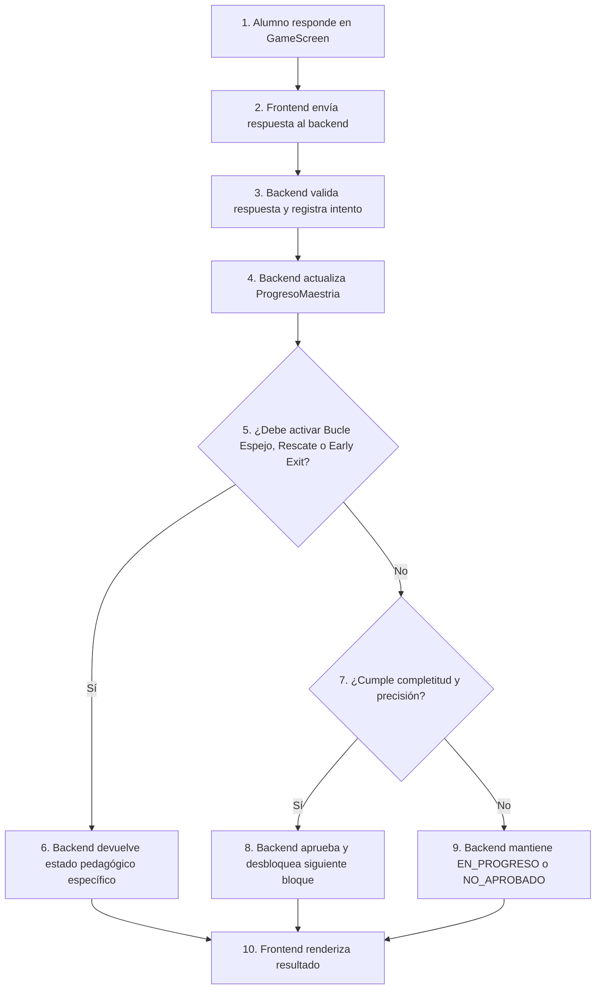

# Manual Técnico y de Arquitectura: Panel de Estadísticas y Resultados (Mi Progreso & Tutoría IA)

> **Versión:** 3.0 | **Última actualización:** 2026-06-08 | **Prioridad documental:** 5
>
> **Dependencia:** Las reglas de aprobación, desbloqueo y progresión están definidas en el [Documento Rector](criterios%20conceptuales.md) §7. Los Overrides administrativos están en el [Manual del Administrador](administrador.md) §6. Este documento se enfoca exclusivamente en la visualización del progreso y la pantalla de resultados.

> Nota de autoridad documental: Este documento define la visualización del progreso del alumno y la pantalla de resultados. No define reglas de aprobación ni desbloqueo. En caso de conflicto, prevalece primero el Documento Rector Conceptual, luego el Blueprint Técnico, luego el Manual del Administrador y finalmente este documento de estadísticas.

---

## 1. Propósito del Documento

Este documento detalla el diseño, la configuración de datos, la integración con PostgreSQL, la lógica de lectura de progreso y la implementación de la interfaz del **Panel de Estadísticas ("Mi Progreso")** y la **Pantalla de Resultados de Sesión** en la plataforma **LogicaKids Pro**.

El Panel de Estadísticas es una interfaz de lectura, análisis y motivación para el alumno. Su función es mostrar progreso, resultados, historial, recomendaciones y estados académicos ya resueltos por el backend.

> **Principios Fundamentales:** Ver [Documento Rector](criterios%20conceptuales.md) §1 para las reglas sobre la autoridad del backend (`Server-Authoritative`) y la fuente de verdad (`ProgresoMaestria`). El frontend del alumno no calcula aprobación ni modifica el progreso.

### 1.2. Representación Visual de las Vías de Avance

> **Vías de Avance:** Las reglas pedagógicas para avance automático (Práctica Libre vs Desafíos) y override administrativo están definidas en el [Documento Rector](criterios%20conceptuales.md) §7.4.

El Panel de Estadísticas ("Mi Progreso") debe reflejar ambas vías con absoluta claridad visual y transparencia. Los bloques superados por desempeño ordinario lucirán una aureola dorada, mientras que los bloques intervenidos por administración mostrarán marcos cromáticos cian, distintivos especiales e información detallada de la tutoría (motivo, fecha y firma del autorizador), garantizando la transparencia para los padres y tutores.

---

## 2. Stack Tecnológico, Estética y Sistema de Diseño (Glassmorphism Dark)

Los componentes de estadísticas y feedback ofrecen una experiencia premium, motivadora y visualmente inmersiva, combinando analíticas rigurosas con mecánicas de gamificación.

### 2.1. UI Stack

* **React (TypeScript):** Código fuertemente tipado para garantizar consistencia en registros e históricos.
* **Tailwind CSS:** Maquetación responsiva moderna, mobile-first.
* **Framer Motion:** Animaciones de acordeones, tarjetas KPI, trofeos, modales y transiciones.
* **Lucide React:** Iconografía vectorial limpia.
* **Zustand:** Estado local de sesión, usuario y datos de visualización.
* **FastAPI + PostgreSQL:** Backend autoritativo, lectura de progreso y analíticas persistidas.

### 2.2. Directrices Estéticas Premium

* **Profundidad de Fondo:** Capas translúcidas sobre gradientes oscuros (`bg-slate-950/40`) con `backdrop-blur-2xl`.
* **Resplandores Ambientales:** Luces difusas (`bg-blue-500/10`, `bg-purple-500/10`, `blur-[80px]`).
* **Bordes de Cristal:** Tarjetas y modales con `border-white/10`.
* **Éxito:** Esmeralda / Verde (`#10b981`, `text-emerald-400`).
* **Error:** Rojo / Rosa (`#ef4444`, `text-rose-500`).
* **Niveles y Estrellas:** Amarillo neón (`#facc15`, `text-yellow-400`).
* **Intervención Admin:** Azul / Cian (`text-cyan-300`) para distinguir liberaciones o aprobaciones manuales.

---

## 3. Componentes Frontend Principales

### 3.1. Panel "Mi Progreso" (`ProgressScreen.tsx`)

Este componente muestra la trayectoria histórica y académica del estudiante.

```text
┌──────────────────────────────────────────────────────────────────────────────┐
│ 👤 Mi Progreso                                      ✨ LogicaKids Pro         │
├──────────────────────────────────────────────────────────────────────────────┤
│ 🎮 Bloques trabajados   📈 Precisión promedio   ✅ Aciertos   🧭 Completitud │
│        12                      85%               142             78%         │
├──────────────────────────────────────────────────────────────────────────────┤
│ PROGRESO POR FASE, MÓDULO Y BLOQUE                                           │
│ ┌──────────────────────────────────────────────────────────────────────────┐ │
│ │ Fase 2 — Desarrollo Numérico                                             │ │
│ │   Módulo 1 — Gimnasio Numérico Mental                                    │ │
│ │   Nivel 2 — Jerarquía      Precisión 92% | Completitud 100% | APROBADO   │ │
│ │   Origen: Automático por desempeño                                       │ │
│ └──────────────────────────────────────────────────────────────────────────┘ │
│ ┌──────────────────────────────────────────────────────────────────────────┐ │
│ │ Fase 2 — Desarrollo Numérico                                             │ │
│ │   Módulo 3 — Tienda Matemática                                           │ │
│ │   Nivel 1 — Reconozco Dinero   Estado: EN PROGRESO                       │ │
│ │   Origen: Liberado por administrador                                     │ │
│ └──────────────────────────────────────────────────────────────────────────┘ │
└──────────────────────────────────────────────────────────────────────────────┘
```

### 3.2. KPIs principales

El panel debe mostrar métricas calculadas por el backend o agregadas desde datos confiables:

* **Bloques trabajados:** cantidad de bloques con intentos o progreso registrado.
* **Precisión promedio:** promedio ponderado de `porcentaje_actual` o histórico de intentos.
* **Respuestas correctas:** sumatoria de aciertos registrados.
* **Completitud promedio:** avance promedio por bloque.
* **Bloques aprobados:** total de estados `APROBADO`.
* **Bloques liberados por admin:** total de bloques con `desbloqueado_por_admin = true` y `aprobado_por_admin = false`.
* **Bloques aprobados por admin:** total de bloques con `aprobado_por_admin = true`.

### 3.3. Acordeón de progreso académico

El acordeón principal se organiza por:

1. Fase.
2. Módulo.
3. Bloque académico: nivel de práctica libre o desafío.

Cada bloque debe mostrar:

* título de fase;
* nombre de módulo;
* nombre de nivel o desafío;
* `fase_id`, `modulo_id`, `nivel_id`, `desafio_id` y `seccion` como metadatos técnicos internos;
* precisión (`porcentaje_actual`);
* completitud (`completitud_actual`);
* estado (`BLOQUEADO`, `EN_PROGRESO`, `APROBADO`): *Ver [Documento Rector](criterios%20conceptuales.md) §7.1 para las reglas de estado.*
* origen del estado: automático, liberado por admin, aprobado por admin, bloqueado por admin o restablecido por admin;
* fecha de última actividad;
* indicadores visuales de Bucle Espejo, Rescate o Early Exit si aplican.

### 3.4. Visualización de intervención manual

Cuando un bloque es intervenido de forma manual por un administrador, el Panel de Estadísticas del estudiante debe mostrar de forma transparente, explícita y motivacional los detalles de dicha intervención, evitando confusiones y dando visibilidad completa a los padres de familia sobre la personalización de la ruta de aprendizaje:

#### Estructura Visual del Acordeón para Bloques Intervenidos:
* **Brillo de Borde:** En lugar del brillo verde (en progreso) o dorado (aprobado ordinario), el bloque interactivo muestra un resplandor ambiental y borde **cian/azul neón** (`border-cyan-500/30 shadow-[0_0_15px_rgba(6,182,212,0.15)]`).
* **Badge de Estado:** Se renderiza una etiqueta en color cian con el texto:
  * *"APROBADO POR EL TUTOR"* (en caso de `approve` directo).
  * *"HABILITADO POR EL TUTOR"* (en caso de `unlock`).
  * *"APROBADO EN CASCADA RETRÓGRADA"* (para los niveles precedentes aprobados automáticamente por retro-aprobación).
* **Cuerpo de Detalle (Desplegable del Acordeón):**
  Al expandir la fila del bloque, se despliega una tarjeta de diseño esmerilado (`backdrop-blur-md bg-cyan-950/20 border-cyan-500/10`) que detalla los metadatos de auditoría:
  * **Origen / Autor: ** `Autorizado por: Dirección Académica LogicaKids (Superusuario)`
  * **Motivo Pedagógico: ** Se renderiza textualmente la justificación. Para niveles retro-aprobados, muestra: *"Aprobado de forma retrógrada en cascada debido a la liberación/aprobación del bloque superior [Nombre de Bloque Superior]."*
  * **Fecha de Registro: ** Se muestra la fecha y hora local formateada proveniente de `override_fecha`.

Esto evita confundir una aprobación manual con una aprobación obtenida por ejecución estándar dentro de la plataforma y celebra la flexibilidad curricular de la escuela o tutor.

### 3.5. Historial de intentos

El historial se alimenta de la tabla `intentos` y de resúmenes derivados del backend. Debe mostrar:

* fecha;
* fase;
* módulo;
* nivel o desafío;
* operación;
* respuesta dada, solo si la política de privacidad lo permite;
* resultado correcto/incorrecto sin exponer `es_correcta` en payloads de preguntas activas;
* tipo de error;
* feedback mostrado;
* tiempo de respuesta del estudiante;
* **Vía de Finalización de la Familia (Exclusivo Práctica Libre):** Indicación explícita de si la familia de preguntas se completó mediante éxito ordinario (resolución correcta de la original o de alguna variante espejo) o a través del `"Bypass de Explicación"` (activado tras la cuarta falla consecutiva de la misma familia, es decir, al errar la variante espejo 3). Registrar este metadato de manera precisa es indispensable para evitar sesgos en el análisis cognitivo y pedagógico realizado por el Tutor IA.
* **Sin Registro de Transcripción Anti-Spam:** Al haberse removido por completo el bloqueo de transcripción obligatoria para avanzar tras el rescate, no se registrarán ni computarán métricas de escritura o tipeado anti-spam en el historial de intentos ni en el panel analítico.
* **Metadatos de Calibración Activos:** Límite de tiempo configurado en la sesión (`tiempo_limite_activo`) y total de preguntas del bloque (`total_preguntas_activo`). Esto permite congelar en el historial las condiciones operativas de la prueba al momento de ser ejecutada por el alumno, evitando distorsiones si el superusuario edita los parámetros globales posteriormente.

El alumno no debe poder eliminar físicamente registros académicos. Si se permite ocultar un intento en la vista del alumno, debe usarse una marca visual como `oculto_para_alumno = true`, sin borrar `intentos` ni `ProgresoMaestria`.

---

## 4. Pantalla de Resultados de Sesión (`ResultsScreen.tsx`)

Muestra feedback inmediato al finalizar una sesión de práctica o desafío. Debe renderizar según el estado devuelto por el backend, no según cálculos locales del frontend.

### 4.1. Estados pedagógicos soportados

La pantalla debe contemplar:

* `APROBADO`: mostrar trofeo, resumen positivo y botón para continuar al bloque indicado por el backend.
* `NO_APROBADO`: mostrar refuerzo pedagógico, errores principales identificados y opción de reintentar el bloque.
* `EN_PROGRESO`: mostrar avance parcial y porcentaje de completitud. En Práctica Libre, si el alumno decidió pausar o salir voluntariamente de la sesión, se conserva el progreso parcial. Las finalizaciones de familias mediante `"Bypass de Explicación"` contribuyen con total fluidez al avance acumulado (completitud) y no se consideran fallas de sesión activas que bloqueen la progresión o impidan avanzar al siguiente bloque cuando se cumpla la completitud requerida.
* `EARLY_EXIT`: mostrar pantalla de interrupción por límite de errores acumulados y permitir un regreso seguro y motivacional al dashboard. (Exclusivo de la Zona de Desafíos, no aplicable en Práctica Libre).
* `RESCATE_COMPLETADO`: mostrar el resumen de finalización del entrenamiento del bloque de Práctica Libre donde se usaron explicaciones profundas, presentándolo como un logro de aprendizaje activo e informativo, y **bajo ninguna circunstancia** tratar los bypasses explicativos como una condición de bloqueo o de evaluación de error estricto. La pantalla celebrará el esfuerzo y la asimilación conceptual sin penalizaciones visuales, y **no debe exigir ni registrar métricas de transcripción anti-spam**.
* `BLOQUEADO`: mostrar que el bloque no está disponible para su ejecución.
* `ADMIN_UNLOCK`: mostrar que el bloque fue liberado por un administrador para libre exploración.
* `ADMIN_APPROVE`: mostrar que el bloque fue aprobado manualmente por decisión del tutor/administrador.

### 4.2. Métricas de sesión

* **Precisión:** porcentaje de aciertos.
* **Completitud:** porcentaje del bloque completado.
* **Aciertos vs fallos:** conteo de respuestas.
* **Tiempos:** promedio y total.
* **Tipos de error:** agrupación por `tipo_error`.
* **Modo de tutoría:** `normal`, `bucle_espejo` o `rescate`.
* **Resultado backend:** estado final calculado por el servidor.

### 4.3. Acciones de continuidad

Los botones no deben modificar progreso directamente. Solo navegan a rutas o sesiones indicadas por el backend.

* **Continuar:** navega al siguiente bloque disponible informado por el backend.
* **Reintentar:** solicita al backend iniciar una nueva sesión del mismo bloque.
* **Volver al mapa:** regresa al mapa de fases.
* **Ver explicación:** muestra Tutor IA o feedback del bloque.

No debe existir lógica como:

```typescript
if (score >= passingScore) {
  service.unlockLevel(category, nextLevel);
}
```

---

## 5. Modelo de Datos de Analíticas

La sincronización de datos de progreso se rige por estructuras tipadas de lectura. Estas estructuras representan datos ya procesados por el backend.

### 5.1. Interfaz `AcademicBlockProgress`

```typescript
export interface AcademicBlockProgress {
  fase_id: number;
  fase_titulo: string;
  modulo_id: number;
  modulo_titulo: string;
  nivel_id?: number | null;
  nivel_titulo?: string | null;
  desafio_id?: number | null;
  desafio_titulo?: string | null;
  seccion: number;
  operacion: 'suma' | 'resta' | 'multiplicacion' | 'division' | 'mixta';

  estado: 'BLOQUEADO' | 'EN_PROGRESO' | 'APROBADO';
  porcentaje_actual: number;
  completitud_actual: number;
  aciertos_acumulados: number;
  intentos_totales: number;

  desbloqueado_por_admin: boolean;
  aprobado_por_admin: boolean;
  override_tipo?: 'unlock' | 'approve' | 'lock' | 'reset' | null;
  override_motivo?: string | null;
  override_fecha?: string | null;

  ultimo_intento_at?: string | null;
  siguiente_bloque_disponible?: boolean;
}
```

### 5.2. Interfaz `StudentAttemptSummary`

```typescript
export interface StudentAttemptSummary {
  id: string;
  alumno_id: string;
  session_id: string;

  fase_id: number;
  modulo_id: number;
  nivel_id?: number | null;
  desafio_id?: number | null;
  seccion: number;
  operacion: 'suma' | 'resta' | 'multiplicacion' | 'division' | 'mixta';

  porcentaje: number;
  completitud: number;
  aciertos: number;
  errores: number;
  intentos_totales: number;
  tiempo_promedio_segundos: number;

  tipo_pool: 'practica' | 'desafio';
  estado_resultado:
    | 'APROBADO'
    | 'NO_APROBADO'
    | 'EN_PROGRESO'
    | 'EARLY_EXIT'
    | 'RESCATE_COMPLETADO'
    | 'ADMIN_UNLOCK'
    | 'ADMIN_APPROVE';

  tiempo_limite_configurado?: number | null;
  preguntas_configuradas?: number | null;

  fecha_inicio: string;
  fecha_fin: string;
}
```

### 5.3. Interfaz `ProgressSummary`

```typescript
export interface ProgressSummary {
  alumno_id: string;
  total_bloques_trabajados: number;
  total_bloques_aprobados: number;
  total_bloques_liberados_admin: number;
  total_bloques_aprobados_admin: number;
  precision_promedio: number;
  completitud_promedio: number;
  total_aciertos: number;
  total_errores: number;
  tiempo_total_segundos: number;
}
```

---

## 6. Endpoints de Sincronización

El frontend consume endpoints de alumno normalizados bajo `/api/me`. Estos endpoints son de lectura o de inicio/consulta de sesión; no desbloquean niveles directamente desde el cliente.

### 6.1. Progreso y resumen

```text
GET /api/me/progress/summary
GET /api/me/progress/blocks
GET /api/me/progress/history
GET /api/me/progress/history?fase_id={fase_id}&modulo_id={modulo_id}&nivel_id={nivel_id}
```

### 6.2. Resultados de sesión

```text
GET /api/me/results/{session_id}
```

Devuelve el resultado pedagógico ya resuelto por el backend.

### 6.3. Tutor IA

```text
GET /api/me/tutor-analysis/summary
GET /api/me/tutor-analysis?fase_id={fase_id}&modulo_id={modulo_id}&nivel_id={nivel_id}&desafio_id={desafio_id}
```

El análisis debe considerar fase, módulo, nivel, desafío, `tipo_error`, historial de intentos y estado del bloque.

### 6.4. Sesiones de juego

```text
POST /api/fases/{fase_id}/sessions/start
POST /api/fases/{fase_id}/responder
POST /api/fases/{fase_id}/cerrar-rescate
GET  /api/fases/{fase_id}/sessions/{session_id}/status
```

El backend usa estas rutas para evaluar respuestas, actualizar `intentos`, actualizar `ProgresoMaestria` y resolver avance académico.

### 6.5. Endpoints prohibidos en el frontend del alumno

El Panel de Estadísticas no debe usar endpoints legacy como:

```text
POST   /scores
GET    /scores?user={username}
DELETE /scores/{scoreId}
PATCH  /users/me/progress/level
GET    /ai/analyze/{category}
```

Tampoco debe existir una función tipo `unlockLevel()` disponible para el frontend del alumno.

---

## 7. Lógica Correcta de Flujo de Juego y Progresión

Cuando un estudiante finaliza una sesión, el frontend no decide si aprobó. El backend ya debe haber procesado cada respuesta o debe procesar el cierre de sesión.

### 7.1. Flujo correcto



### 7.2. Condiciones de aprobación automática

El backend debe evaluar al menos:

* `completitud_actual >= completitud_requerida`;
* `porcentaje_actual >= porcentaje_aprobacion`;
* ausencia de condición de `EARLY_EXIT`;
* estado válido de sesión;
* reglas del bloque según `modo_tutoria`;
* configuración resuelta por cascada.

### 7.3. Intervención manual ya aplicada

Si el alumno tiene un bloque liberado o aprobado por administrador, el panel debe mostrarlo, no recalcularlo.

Ejemplo:

```json
{
  "estado": "APROBADO",
  "porcentaje_actual": 90,
  "completitud_actual": 100,
  "aprobado_por_admin": true,
  "override_tipo": "approve",
  "override_motivo": "Alumno evaluado presencialmente."
}
```

---

## 8. Tutor IA LogicaKids

El Tutor IA no utiliza datos de configuración estáticos ni registros en `user.settings["scores"]`. En su lugar, el backend realiza un análisis pedagógico autoritativo consultando directamente los registros reales en la tabla `intentos` de PostgreSQL.

### 8.1. Arquitectura y Obtención de Datos

El backend (`ai_service.py`) y sus endpoints asociados implementan la siguiente lógica de análisis:
* **Entornos de Consulta:**
  * **Dashboard de Alumno (`/api/ai/performance`):** El backend recupera el perfil del alumno (`AlumnoModel`), busca sus últimos **15 intentos** en orden cronológico descendente y realiza el análisis en base a ellos.
  * **Panel de Administración (`/api/ai/admin/alumnos/{alumno_id}/insights`):** El backend recupera el perfil del estudiante seleccionado y busca sus últimos **20 intentos** para generar el reporte de auditoría docente.
* **Límite de Datos:** Si el alumno no registra al menos un intento válido en base de datos, el sistema retorna un mensaje invitándolo a jugar para poder recopilar datos analíticos.

### 8.2. Variables y Cómputo Analítico del Prompt

El backend calcula en caliente las siguientes métricas analíticas a partir del conjunto de intentos recuperados y las inyecta en el prompt enviado al LLM (Gemini):
* **Precisión Real:** Porcentaje calculado como `(correctos / total_intentos) * 100` sobre la muestra recuperada.
* **Tiempo Promedio de Respuesta:** Promedio aritmético en segundos de los tiempos de respuesta individuales (`tiempo_respuesta_segundos`) excluyendo nulos.
* **Frecuencia de Errores Comunes:** Agrupación y conteo de los intentos fallidos por su tipo de error heurístico (`tipo_error`), generando un reporte ordenado de fallas frecuentes (ej: `calculo (3 veces), problema_incompleto (1 vez)`).

### 8.3. Directrices de Respuesta del Tutor IA

El modelo (configurado por defecto con `gemini-1.5-flash` para optimizar latencia) debe responder con un informe de un **máximo de 3 párrafos** estructurado según el siguiente criterio de diseño pedagógico:
1. **Felicitación Motivadora:** Resaltar las fortalezas del alumno de forma empática basadas en sus aciertos o persistencia.
2. **Diagnóstico Cognitivo:** Analizar sus patrones de error (vinculándolos a la frecuencia de `tipo_error` registrada) y debilidades.
3. **Plan de Acción / Consejos Prácticos:** Brindar una recomendación y guía pedagógica clara para el estudio en las siguientes sesiones.

En caso de finalizaciones de familias de preguntas mediante `"Bypass de Explicación"`, el Tutor IA debe interpretar este evento como un indicador valioso de diagnóstico conceptual (identificando la necesidad de repasar el tema teórico específico en sesiones subsiguientes) y no como un error insalvable o una métrica de fracaso, adaptando sus recomendaciones pedagógicas de forma empática y constructiva, y manteniéndose totalmente libre de la computación de penalizaciones por transcripción.

Cuando el progreso proviene de intervención manual, el Tutor IA debe evitar decir que el alumno "jugó y aprobó". Debe comunicar que el bloque fue habilitado o aprobado por decisión pedagógica del administrador.

---

## 9. Reglas de Seguridad y Coherencia

* El frontend del alumno no calcula aprobación.
* El frontend del alumno no desbloquea niveles.
* El frontend del alumno no gradúa fases.
* El frontend del alumno no elimina físicamente registros académicos.
* El frontend solo muestra estados devueltos por el backend.
* `ProgresoMaestria` es la fuente de verdad del progreso global.
* `intentos` es la fuente de verdad del histórico de respuestas global.
* **Coherencia Relacional de Segmentación:** Aunque los pools de preguntas se encuentran físicamente segmentados en tablas por fase (`fase{X}_...`), las tablas de progreso (`progreso_maestria`) e histórico de intentos (`intentos`) se conservan globales a nivel de base de datos para garantizar agregación veloz de KPIs y analíticas del Tutor IA mediante claves foráneas sencillas.
* **Segmentación de Claves Legacy:** El objeto de compatibilidad `user.settings["unlockedLevels"]` debe consumirse y guardarse de forma segmentada por Phase ID (`"fase1"`, `"fase2"`, etc.) para evitar cruces o colisiones visuales entre diferentes fases en pantallas compartidas del cliente.
* Las intervenciones manuales del administrador deben mostrarse con origen, motivo y fecha.
* Los botones de continuidad solo navegan hacia rutas o bloques indicados por el backend.
* Las métricas visuales pueden calcularse localmente solo para animaciones, pero no para modificar progreso real.

---

## 10. Pruebas y Validación Manual del Panel

### 10.1. Flujo de lectura de progreso

* Entrar a "Mi Progreso".
* Verificar que se llame `GET /api/me/progress/summary`.
* Verificar que se llame `GET /api/me/progress/blocks`.
* Confirmar que los bloques se agrupen por fase, módulo y nivel/desafío.

### 10.2. Validación de no desbloqueo desde frontend

* Finalizar una sesión con score alto.
* Confirmar que no exista llamada a `PATCH /users/me/progress/level`.
* Confirmar que no exista función `unlockLevel()` ejecutada desde el frontend.
* Confirmar que el siguiente bloque aparece solo si el backend lo devolvió como disponible.

### 10.3. Validación de completitud y precisión

* Simular una sesión con 100% de precisión pero 60% de completitud.
* Confirmar que el frontend no apruebe el bloque localmente.
* Confirmar que se muestre `EN_PROGRESO` si así lo devuelve el backend.

### 10.4. Validación de intervención manual

* Desde el panel admin, liberar un bloque para un alumno.
* Entrar como alumno y verificar que el bloque aparezca como disponible con origen `Liberado por administrador`.
* Desde el panel admin, aprobar un bloque para un alumno.
* Entrar como alumno y verificar que aparezca como `APROBADO` con origen `Aprobado manualmente por administrador`.
* Confirmar que se muestre motivo y fecha si el backend los devuelve.

### 10.5. Validación de historial

* Confirmar que el alumno no pueda borrar físicamente intentos.
* Confirmar que cualquier opción de ocultar no elimine registros de `intentos` ni `ProgresoMaestria`.

---

## 11. Resumen de cambio respecto al modelo legacy

El modelo anterior basado en `ScoreRecord`, `CategoryProgress`, `/scores`, `category`, `difficulty` y `unlockLevel()` queda reemplazado por un modelo server-authoritative basado en:

* `ProgresoMaestria`;
* `intentos`;
* `AcademicBlockProgress`;
* `StudentAttemptSummary`;
* endpoints `/api/me/...`;
* estados pedagógicos resueltos por backend;
* visualización explícita de intervenciones administrativas.

### 11.1. Estandarización de la Fase 1
En la arquitectura legacy, la **Fase 1 (Aritmética Básica)** se trataba como una sección monolítica única (`seccion = 1`) y no admitía la flexibilidad de progresar a través de niveles de dificultad estructurados por operación. Con la actualización implementada:
* La Fase 1 ha sido migrada a la estructura modular dinámica, de modo que cada una de las 4 operaciones principales actúa como un módulo con múltiples niveles de dificultad (secciones `101..105` para Suma, `201..205` para Resta, `301..306` para Multiplicación y `401..405` para División).
* El Panel de Estadísticas consume estos bloques académicos de manera granular e individualizada.
* Se implementa un **mecanismo de migración automática de base de datos** para retrocompatibilidad, de modo que los alumnos antiguos con avances aprobados en la sección legacy `1` de una operación heredan automáticamente el estado `APROBADO` en todos los niveles dinámicos de esa operación.
