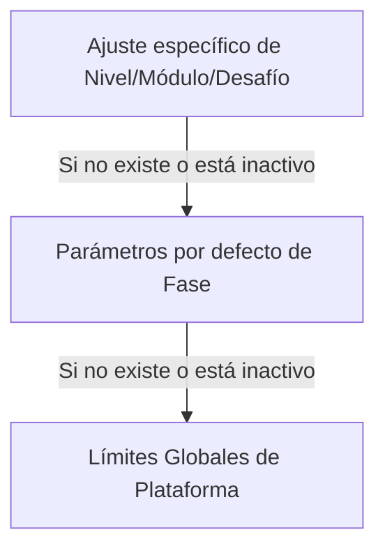

# Manual Técnico y de Arquitectura: Panel de Administrador (Superusuario)

> Nota de autoridad documental: Este documento define la implementación del Panel de Administrador. En caso de conflicto, prevalece primero el Documento Rector Conceptual, luego el Blueprint Técnico, luego este Manual del Administrador y finalmente la Guía UX/UI.

---

## 1. Propósito del Documento

Este documento detalla el diseño, configuración, modelo de datos relacionales, lógica de resolución en cascada e implementación de la interfaz del **Panel de Administrador** en la plataforma **LogicaKids Pro**.

El Panel de Administrador permite:

* gestionar usuarios;
* revisar desempeño estudiantil;
* intervenir manualmente el progreso;
* configurar reglas pedagógicas;
* editar teoría;
* administrar práctica libre;
* administrar desafíos;
* revisar analíticas de intentos;
* mantener coherencia entre contenido, progreso y reglas didácticas.

La fuente de verdad del progreso académico es `ProgresoMaestria`. El objeto `user.settings["unlockedLevels"]` existe únicamente como espejo de compatibilidad visual para componentes heredados del frontend. Ninguna decisión de aprobación, bloqueo, desbloqueo o avance debe depender exclusivamente de `user.settings`.

---

## 2. Stack Tecnológico, Estética y Ajustes del Panel

### 2.1. Stack Tecnológico de UI

* **React (TypeScript):** Componentes modularizados con tipado estricto.
* **Tailwind CSS:** Base de diseño responsivo y maquetación.
* **Framer Motion:** Micro-animaciones, hovers, sliders, transiciones y modales.
* **Lucide React:** Iconografía moderna y limpia.
* **Zustand:** Estado global de sesión, configuración y datos cargados.
* **FastAPI + PostgreSQL:** Backend autoritativo y persistencia relacional.

### 2.2. Estética High-End & Glassmorphism

El panel implementa una estética premium, oscura y gamificada:

* fondos profundos con gradientes radiales;
* resplandores ambientales semitransparentes;
* paneles esmerilados con `backdrop-blur`;
* bordes sutiles;
* micro-animaciones para acciones críticas;
* jerarquía visual clara para reducir carga cognitiva del administrador.

### 2.3. Ajustes de Interfaz Persistidos

El panel cuenta con un apartado de **Ajustes Visuales** controlado por el administrador y persistido en `localStorage`.

* **Escala de Interfaz (`adminScale`):** Rango de 80% a 150%.
* **Tipo de Fuente (`adminFontFamily`):** Outfit, Comic Sans, Monospace, Arial, Serif y Alta Legibilidad.
* **Persistencia Local:** Los cambios se aplican al documento mediante `document.documentElement.style.fontSize` y variables de fuente.

---

## 3. Estructura y Navegación del Panel de Administración

La interfaz se divide en un sidebar responsivo y plegable con 4 pestañas principales:

```text
TabType = 'general' | 'pedagogy' | 'performance' | 'content'
```

```text
┌────────────────────────────────────────────────────────────────────────┐
│                              ADMIN PRO                                 │
├───────────────┬────────────────────────────────────────────────────────┤
│ 📊 Vista      │  KPI, usuarios, cuentas, historial global               │
│    General    │                                                        │
├───────────────┼────────────────────────────────────────────────────────┤
│ ⚙️ Config.    │  Reglas pedagógicas, fases, módulos, cascada            │
│    Pedagógica │                                                        │
├───────────────┼────────────────────────────────────────────────────────┤
│ 🛡️ Rendimiento│  Progreso del alumno, liberar, aprobar, reset           │
│    Estudiantil│                                                        │
├───────────────┼────────────────────────────────────────────────────────┤
│ 📖 Banco      │  Teoría, práctica libre, desafíos, tokens, feedbacks    │
│    Preguntas  │                                                        │
└───────────────┴────────────────────────────────────────────────────────┘
```

---

## 4. Vista General (`GeneralTab.tsx`)

Punto de control inicial que ofrece análisis rápidos y gestión completa de usuarios.

### 4.1. KPI Cards

* **Usuarios:** Conteo total de registrados.
* **Partidas:** Total de juegos o bloques completados.
* **Activos:** Estudiantes no bloqueados (`ACTIVE`).
* **Storage:** Estado del almacenamiento.

### 4.2. Gestión de Usuarios

* Buscador por nombre y correo.
* Crear usuarios con rol `ADMIN` o `USER`.
* Editar datos básicos.
* Banear o desbanear.
* Cambiar contraseñas mediante modal seguro.
* Ver historial detallado de rendimiento.

### 4.3. Historial de Rendimiento

El modal de rendimiento debe mostrar:

* fecha;
* fase;
* módulo;
* nivel o desafío;
* operación;
* porcentaje;
* intentos;
* aciertos;
* errores;
* tipos de error;
* tiempo promedio de respuesta.

Reglas de desafío:

* Evalúa la respuesta sin Bucle Espejo.
* Si expira el tiempo, computa error.
* Si `errores_sesion >= max_errores`, retorna:

```json
{
  "early_exit": true
}
```

* Si `errores_sesion < max_errores`, actualiza `aciertos_acumulados`, calcula `porcentaje_actual` como `aciertos / cantidad_req * 100` (no familias), verifica si supera 90% de aprobación para `bloque_completado`, y retorna `Fase2ResultadoRespuesta` completo.

> **Regla crítica de completitud de `return`:** El endpoint `responder` debe garantizar que **los tres caminos de ejecución** retornen siempre un objeto de respuesta válido:
> 1. **Desafío + Early Exit:** retorna con `early_exit=True` y reseteo de progreso.
> 2. **Desafío + No Early Exit:** retorna con aciertos, porcentaje y bloque_completado.
> 3. **Práctica Libre:** retorna con porcentaje por familias intentadas y `es_espejo`.
>
> Si cualquier path termina sin `return`, FastAPI devuelve `None` y genera un `ResponseValidationError 500` antes de llegar al cliente. El frontend degradará silenciosamente al mock estático, causando contadores hardcodeados y Bucle Espejo inactivo.

---

## 5. Gestión Pedagógica Avanzada (`PedagogyTab.tsx`)

Esta pestaña permite definir el ritmo, volumen y comportamiento didáctico del alumno de forma dinámica. Utiliza un árbol de jerarquía y un sistema de herencia de configuración.

### 5.1. Niveles de Configuración

1. **Global:** Fallback general de la plataforma.
2. **Fase:** Parámetros por defecto de una fase.
3. **Módulo/Nivel/Desafío:** Override específico.

### 5.2. Principio de Cascada

La configuración más específica prevalece sobre la general. Si un override está inactivo, se hereda el nivel superior.



### 5.3. Calibración en Caliente de Tiempos y Volúmenes

Para facilitar las pruebas de campo, la investigación pedagógica y la calibración empírica durante el desarrollo, la interfaz de `PedagogyTab.tsx` expone controles deslizantes (sliders) y selectores numéricos para editar en caliente el estrés de tiempo y el volumen de trabajo del alumno:

* **Editor de Preguntas Requeridas (`cantidad_requerida`):**
  * **Control:** Campo de entrada numérico incremental (con límites lógicos de validación de 5 a 50 preguntas).
  * **Propósito:** Permite aumentar o disminuir el tamaño de la batería en base a la fatiga del alumno observada en pruebas grupales.
* **Habilitación de Cronómetro (`usa_cronometro`):**
  * **Control:** Switch Toggle interactivo.
  * **Propósito:** Permite desactivar por completo la presión del temporizador en fases iniciales de pruebas y activarla progresivamente para la preparación formal.
* **Límite de Tiempo por Pregunta (`tiempo_default_segundos`):**
  * **Control:** Deslizador (slider) con rango de 10 a 120 segundos.
  * **Propósito:** Calibración fina del estrés temporal del juego por pregunta (en desafíos).

Cualquier cambio guardado en la interfaz se asocia al nivel de jerarquía seleccionado (Fase, Módulo, o Nivel específico), actualiza la base de datos de manera inmediata y se propaga en cascada en las siguientes sesiones que inicien los alumnos.

---

## 6. Rendimiento Estudiantil Avanzado (`PerformanceTab.tsx`)

Herramienta de tutoría y control para intervenir el progreso académico de un estudiante. Dado que cada estudiante ingresa con una realidad cognitiva y de partida diferente, esta sección permite flexibilizar la ruta lineal del juego mediante intervenciones directas de un superusuario.

### 6.1. Funciones de Tutoría

* Buscar alumnos por nombre o email de forma responsiva.
* Visualizar la fase y módulo activo del estudiante.
* Inspeccionar de forma granular el progreso de cada nivel de práctica libre y cada bloque de desafío.
* Revisar el porcentaje de acierto real (`porcentaje_precision`), intentos acumulados y el estado actual (`BLOQUEADO`, `EN_PROGRESO`, `APROBADO`).
* Identificar claramente si el estado de maestría actual fue obtenido automáticamente por desempeño del alumno o mediante una intervención administrativa previa (mostrando el logo o indicador visual correspondiente).

### 6.2. Panel de Intervención (Acciones de Override)

La interfaz expone para cada bloque tres controles críticos de anulación pedagógica, agrupados en un submódulo de seguridad:

1. **Liberar (`unlock`):**
   * **Propósito:** Abrir el bloque seleccionado para que el estudiante pueda jugar e interactuar con la teoría y práctica directamente, sin haber aprobado los bloques anteriores.
   * **Efecto DB:** El backend establece el estado del bloque en `EN_PROGRESO` en `ProgresoMaestria` y coloca `desbloqueado_por_admin = true`.
   * **Espejo Legacy:** Sincroniza `user.settings["unlockedLevels"]` asignándole el valor `1` para el nivel correspondiente.
2. **Aprobar (`approve`):**
   * **Propósito:** Aprobar de forma directa y por decreto pedagógico el bloque seleccionado (por ejemplo, para alumnos con conocimientos avanzados previos).
   * **Efecto DB:** El backend establece el estado del bloque en `APROBADO` en `ProgresoMaestria`, coloca `aprobado_por_admin = true`, simula un `porcentaje_precision = 90` y `completado = true`.
   * **Regla de Aprobación Retrógada (Retro-Approval):** Al aplicar la aprobación manual, el motor del backend **actualizará y aprobará automáticamente todos los niveles y módulos anteriores de esa fase** para ese estudiante, resguardando la integridad lineal del avance y eliminando colisiones al habilitar los desafíos.
   * **Cascada Automática:** El motor del backend calcula inmediatamente el bloque siguiente lineal y lo cambia al estado `EN_PROGRESO` (`desbloqueado = true`), abriendo la cascada estándar de avance.
   * **Espejo Legacy:** Sincroniza `user.settings["unlockedLevels"]` asignándole el valor `6` para el nivel correspondiente (e integrando en reversa el valor `6` para todas las claves namespaced de los niveles anteriores de esa fase).
3. **Restablecer / Bloquear (`reset` / `lock`):**
   * **Propósito:** Limpiar todo el progreso de un alumno en un nivel o bloquear su acceso para obligarlo a reevaluarse o repetir la práctica.
   * **Efecto DB:** El backend reinicia todos los contadores de progreso (`aciertos_acumulados = 0`, `intentos_totales = 0`, `fallas_consecutivas_bucle = 0`, `completado = false`), establece el estado a `BLOQUEADO` y limpia las banderas `aprobado_por_admin` y `desbloqueado_por_admin`.
   * **Espejo Legacy:** Sincroniza `user.settings["unlockedLevels"]` asignándole el valor `0` para el nivel correspondiente.

### 6.2.b Acciones en Lote (Bulk Overrides por Módulo/Fase)
Para facilitar la gestión administrativa, la plataforma soporta acciones en lote a nivel de Módulo o Fase completa:
* **Endpoint Específico:** El backend dispone de `POST /api/admin/alumnos/{alumno_id}/progress/override-bulk`.
* **Interfaz Inteligente:** En las cabeceras de cada Fase o Módulo se despliegan botones de "Aprobar", "Liberar" y "Restablecer". 
* **Lógica Recursiva:** El endpoint busca todos los niveles que pertenecen a esa fase o módulo (incluyendo desafíos) y aplica la acción (`approve`, `unlock` o `reset`) en una sola transacción unificada de base de datos, recalculando al final el objeto agregado `user.settings["unlockedLevels"]`.

### 6.3. Protocolo de Auditoría y Flujo de Trabajo del Administrador

Para evitar intervenciones accidentales y mantener un registro riguroso de las decisiones de tutoría, se define el siguiente flujo de usuario obligatorio en la UI de Overrides:

1. **Selección del Bloque e Intervención:** El administrador hace clic en el botón de la acción deseada (`unlock`, `approve`, o `reset`).
2. **Modal de Confirmación e Ingreso de Motivo:**
   * La UI despliega un modal esmerilado (`glassmorphic`) con advertencias sobre el impacto pedagógico y la cascada de desbloqueos.
   * **Advertencia de Aprobación Retrógada:** Si la acción es `approve`, el modal debe advertir de forma explícita y resaltada: *"¡IMPORTANTE! Esta acción declarará como aprobados automáticamente todos los niveles y módulos anteriores de esta fase para mantener la consistencia lineal"*.
   * **Registro Obligatorio de Motivo:** El modal contiene un área de texto obligatoria donde el administrador debe detallar el motivo didáctico (ej. *"Estudiante avanzado de 5º grado, demuestra dominio inicial"*, *"Nivelación acelerada por retraso en currículo"*). El botón "Confirmar" permanece deshabilitado hasta que se ingrese un texto descriptivo de mínimo 10 caracteres.
3. **Petición Segura a la API (`POST /api/admin/alumnos/{alumno_id}/progress/override`):**
   * El cliente envía la solicitud estructurada al backend con los siguientes parámetros:
     ```json
     {
       "fase_id": 2,
       "modulo_id": 1,
       "nivel_id": 3,
       "desafio_id": null,
       "accion": "approve",
       "motivo": "Estudiante avanzado de 5º grado, demuestra dominio inicial"
     }
     ```
   * El backend procesa la petición de forma server-authoritative: valida los permisos del superusuario, altera las tablas correspondientes, genera la marca de tiempo UTC automática para `override_fecha`, ejecuta la cascada para el siguiente nivel, actualiza el espejo `user.settings` y registra la transacción.
4. **Respuesta y Refresco Visual:** El servidor retorna el árbol de progreso actualizado. La UI se refresca suavemente (utilizando Framer Motion) y muestra un indicador de estado con brillo cian distintivo en el nivel intervenido, permitiendo al administrador auditar visualmente los overrides activos.

---

## 7. Banco de Preguntas y Teoría (`ContentTab.tsx`)

Consola de administración de contenidos pedagógicos dividida en subpestañas. Para mantener el aislamiento y escalabilidad de la base de datos, cada fase cuenta con sus propias tablas segmentadas (`fase{X}_...`). El panel del administrador gestiona este contenido mediante consultas dinámicas: al seleccionar la Fase activa en la UI, el backend mapea dinámicamente el modelo ORM correspondiente a la tabla relacional de esa fase específica (`fase{fase_id}_teoria_pool`, `fase{fase_id}_practica_pool`, etc.). Esto permite que la consola de administración mantenga una interfaz uniforme, fluida y unificada sin importar la separación física de los datos.

### 7.1. Contenido Teórico (`theory`)

Editor para:

* título;
* bienvenida y superpoder;
* cuerpo teórico;
* tips pedagógicos;
* glosario o diccionario del nivel;
* ejemplos guiados;
* interactivos de desbloqueo;
* feedbacks de acierto y error.

### 7.2. Banco de Preguntas (`questions`)

Editor para:

* práctica libre;
* familias del Bucle Espejo (1 original + 3 variantes espejo);
* desafíos (evaluación formal sin asistencia espejo);
* alternativas;
* feedback del Tutor Invisible;
* explicación profunda (recurso educativo explicativo de la resolución y el porqué, mostrado al fallar la Variante Espejo 3 para habilitar el bypass fluido del alumno);
* modo de interacción;
* tokenización de textos.

### 7.3. Campos de Subrayado y Tokenización

El toggle de requerimiento de subrayado debe estar asociado a:

* `modo_interaccion`;
* `requiere_subrayado`;
* `tokens_texto`;
* `tokens_correctos`.

El frontend debe enviar `tokens_seleccionados`, no texto crudo.

---

## 8. Modelo de Datos de Configuración y Progreso

La base de datos relacional se implementa en PostgreSQL y se mapea con SQLAlchemy.

### 8.1. Tabla `configuraciones_progreso`

Almacena reglas pedagógicas personalizadas por el administrador.

Campos:

* `id`: Identificador.
* `fase_id`: ID de la fase. El mapa global está planificado con Fases 1 a 9.
* `modulo_id`: Identifica el módulo pedagógico dentro de la fase.
* `nivel_id`: Identifica el nivel de práctica libre. Nullable en desafíos o defaults de fase.
* `desafio_id`: Identifica el desafío virtual (`1`, `2`, `3`). Nullable en práctica.
* `seccion`: Código derivado para compatibilidad y consultas rápidas.
  * En práctica libre: `modulo_id * 100 + nivel_id`.
  * En desafíos: `modulo_id * 1000 + nivel_virtual`, donde `nivel_virtual` es `11`, `12` o `13`.
  * En defaults de fase puede usarse `0`.
* `operacion`: Enum (`suma`, `resta`, `multiplicacion`, `division`, `mixta`).
* `cantidad_requerida`: Número de preguntas que componen el bloque.
* `completitud_requerida`: Porcentaje de avance requerido para terminar el bloque. Valor estándar: `100`.
* `porcentaje_aprobacion`: Precisión mínima de aprobación. Valor estándar: `90`.
  * **Comportamiento en Práctica Libre:** Funciona exclusivamente como un umbral estadístico y de diagnóstico pedagógico sugerido para reportes y recomendaciones del Tutor IA. **No actúa como un bloqueo de software**, permitiendo que el alumno apruebe de forma fluida el bloque con solo alcanzar el 100% de completitud.
  * **Comportamiento en Desafíos:** Es una regla estricta de base de datos. El alumno debe alcanzar este porcentaje real de precisión en sus aciertos para superar y aprobar el desafío.
* `orden_desbloqueo`: Secuencia de desbloqueo.
* `tipo_feedback`: `"simple"` o `"detallado"`.
* `modo_tutoria`: `"normal"`, `"bucle_espejo"` o `"rescate"`.
* `usa_cronometro`: Habilita/deshabilita tiempo.
* `tiempo_default_segundos`: Tiempo límite por pregunta o bloque.
* `activo`: Estado del override.

### 8.2. Tabla `progreso_maestria`

Registra el progreso académico individual por bloque.

Campos:

* `alumno_id`;
* `fase_id`;
* `modulo_id`;
* `nivel_id`;
* `desafio_id`;
* `seccion`;
* `operacion`;
* `estado`: `BLOQUEADO`, `EN_PROGRESO` o `APROBADO`;
* `aciertos_acumulados`;
* `intentos_totales`;
* `porcentaje_actual`;
* `completitud_actual`;
* `aprobado_por_admin`.

### 8.3. Tabla `pool_asignado_alumno`

Permite generar una experiencia personalizada para el estudiante a partir de `practica_libre_pool` y `desafios_pool`.

Campos:

* `alumno_id`;
* `pregunta_id`;
* `tipo_pool`: `practica` o `desafio`;
* `respondida_correctamente`;
* `respondida_alguna_vez`;
* `numero_intentos`;
* `estructura_padre_id`;
* `fallas_consecutivas_bucle`.

### 8.4. Tabla `intentos`

Bitácora de analítica de tutoría invisible.

Campos:

* `alumno_id`;
* `fase_id`;
* `modulo_id`;
* `nivel_id`;
* `desafio_id`;
* `pregunta_id`;
* `respuesta_dada`;
* `es_correcta`;
* `tiempo_respuesta_segundos`;
* `tipo_error`;
* `feedback_mostrado`;
* `explicacion_mostrada`.

---

## 9. Modelo de Datos de Contenido Pedagógico (Tablas Segmentadas `fase{X}_...`)

Además de configuración y progreso, el panel administra contenido pedagógico en tablas físicas independientes y aisladas para cada Fase `X`.

### 9.1. Tabla `fase{X}_teoria_pool`

Almacena contenido teórico pre-renderizado e interactivos de evocación para la Fase `X`.

Campos:

* `fase_id`;
* `modulo_id`;
* `nivel_id`;
* `titulo`;
* `bienvenida_superpoder`;
* `cuerpo_teoria`;
* `trampa_advertencia`;
* `diccionario_nivel`;
* `ejemplo_guiado`;
* `interactivos_desbloqueo`.

### 9.2. Tabla `fase{X}_practica_pool`

Almacena preguntas de entrenamiento con Bucle Espejo y Tutor Invisible para la Fase `X`.

Campos:

* `fase_id`;
* `modulo_id`;
* `nivel_id`;
* `seccion`;
* `estructura_padre_id`;
* `operacion`;
* `enunciado_visual`;
* `respuesta_correcta`;
* `explicacion_profunda`;
* `datos_numericos`;
* `modo_interaccion`;
* `requiere_subrayado`;
* `tokens_texto`;
* `tokens_correctos`.

### 9.3. Tabla `fase{X}_desafios_pool`

Almacena preguntas de evaluación cronometrada para la Fase `X`.

Campos:

* `fase_id`;
* `modulo_id`;
* `desafio_id`;
* `seccion`;
* `tipo_segmento`;
* `tipo_pregunta`;
* `enunciado_visual`;
* `respuesta_correcta`;
* `datos_numericos`;
* `modo_interaccion`;
* `requiere_subrayado`;
* `tokens_texto`;
* `tokens_correctos`.

### 9.4. Tabla `fase{X}_alternativas_desafios_pool`

Almacena alternativas de opción múltiple para desafíos, vinculada a `fase{X}_desafios_pool`.

Campos:

* `desafio_id`;
* `texto`;
* `texto_opcion`;
* `es_correcta`;
* `orden`;
* `tipo_error`.

### 9.5. Tabla `fase{X}_respuestas_erroneas`

Almacena mapeos heurísticos para el Tutor Invisible, vinculada a `fase{X}_practica_pool`.

Campos:

* `pregunta_id`;
* `mapeo_errores`.

---

## 10. Mapeo del Árbol de Jerarquía Actual

### 10.1. Fase 1: Aritmética Básica

* **Módulo:** Operaciones Directas.
* Contenido: suma, resta, multiplicación y división directa.

### 10.2. Fase 2: Desarrollo Numérico

* **Módulo 1:** Gimnasio Numérico Mental.
* **Módulo 2:** Tablas en Acción.
* **Módulo 3:** Tienda Matemática.
* **Módulo 4:** Constructor de Soluciones.

### 10.3. Fase 3: Problemas de Texto

* **Módulo 1:** El Escáner de la Verdad.
* **Módulo 2:** La Máquina del Tiempo.
* **Módulo 3:** El Ojo del Comerciante.
* **Módulo 4:** El Maestro del Empaque.

### 10.4. Fases 4 a 9

El mapa global del alumno está planificado con 9 fases. En la versión actual, las Fases 1 a 3 son las áreas completamente construidas y configurables a nivel relacional. Las Fases 4 a 9 pueden aparecer como bloqueadas, futuras o parcialmente visibles hasta que su contenido esté implementado.

---

## 11. Implementación Técnica de la Cascada de Resolución

Cuando un estudiante inicia una partida, el backend debe resolver dinámicamente los parámetros didácticos mediante cascada:

1. Configuración específica de nivel, módulo o desafío.
2. Configuración por defecto de fase.
3. Configuración global de plataforma.

Ejemplo conceptual:

```typescript
const resolveActiveParams = () => {
  let resolvedQuestions = adminConfig?.questionsPerPhase || FALLBACK_TOTAL_QUESTIONS;
  let resolvedCompletion = adminConfig?.completionRequired || 100;
  let resolvedPassing = adminConfig?.passingScore || 90;
  let resolvedUseTimer = adminConfig?.useTimer !== false;
  let resolvedTimer = adminConfig?.defaultTimerSeconds || 25;
  let resolvedFeedback = 'simple';
  let resolvedTutoringMode = 'normal';

  const phaseDefault = modularConfigs.find(
    c => c.fase_id === faseId && c.seccion === 0 && c.activo !== false
  );

  if (phaseDefault) {
    resolvedQuestions = phaseDefault.cantidad_requerida;
    resolvedCompletion = phaseDefault.completitud_requerida;
    resolvedPassing = phaseDefault.porcentaje_aprobacion;
    resolvedUseTimer = phaseDefault.usa_cronometro;
    resolvedTimer = phaseDefault.tiempo_default_segundos || resolvedTimer;
    resolvedFeedback = phaseDefault.tipo_feedback;
    resolvedTutoringMode = phaseDefault.modo_tutoria;
  }

  const specificConfig = modularConfigs.find(
    c =>
      c.fase_id === faseId &&
      c.seccion === seccion &&
      c.operacion === operacion &&
      c.activo !== false
  );

  if (specificConfig) {
    resolvedQuestions = specificConfig.cantidad_requerida;
    resolvedCompletion = specificConfig.completitud_requerida;
    resolvedPassing = specificConfig.porcentaje_aprobacion;
    resolvedUseTimer = specificConfig.usa_cronometro;
    resolvedTimer = specificConfig.tiempo_default_segundos || resolvedTimer;
    resolvedFeedback = specificConfig.tipo_feedback;
    resolvedTutoringMode = specificConfig.modo_tutoria;
  }

  if (!resolvedUseTimer) {
    resolvedTimer = 0;
  }

  return {
    questionsCount: resolvedQuestions,
    completionRequired: resolvedCompletion,
    passingScore: resolvedPassing,
    useTimer: resolvedUseTimer,
    timeLimitSeconds: resolvedTimer,
    feedbackType: resolvedFeedback,
    tutoringMode: resolvedTutoringMode
  };
};
```

---

## 12. Endpoints de API en Backend

Todos los endpoints administrativos deben estar normalizados con prefijo `/api/admin`.

### 12.1. Configuración Pedagógica

```text
GET   /api/admin/settings
PUT   /api/admin/settings
GET   /api/admin/configuracion
GET   /api/admin/configuracion?fase_id={fase_id}
POST  /api/admin/configuracion
PATCH /api/admin/configuracion/{id}
```

### 12.2. Gestión Académica de Alumnos

```text
GET  /api/admin/alumnos/search?query={texto}
GET  /api/admin/alumnos/{alumno_id}/progress
POST /api/admin/alumnos/{alumno_id}/progress/override
POST /api/admin/alumnos/{alumno_id}/progress/override-bulk
```

### 12.3. Práctica Libre

```text
GET    /api/admin/practica?fase_id={fase_id}&seccion={seccion}
POST   /api/admin/practica
PATCH  /api/admin/practica/{id}
DELETE /api/admin/practica/{id}
```

### 12.4. Desafíos

```text
GET    /api/admin/desafios?fase_id={fase_id}&seccion={seccion}
POST   /api/admin/desafios
PATCH  /api/admin/desafios/{id}
DELETE /api/admin/desafios/{id}
```

### 12.5. Teoría

```text
GET /api/admin/teoria?fase_id={fase_id}&modulo_id={modulo_id}&nivel_id={nivel_id}
PUT /api/admin/teoria
```

---

## 13. Reglas de Seguridad y Coherencia

* El panel puede mostrar respuestas correctas porque es una herramienta de administrador.
* El frontend del alumno jamás debe recibir `es_correcta`.
* El frontend del alumno jamás debe calcular aprobación.
* Los overrides manuales siempre deben registrarse.
* Toda intervención de administrador debe impactar `ProgresoMaestria`.
* Las configuraciones deben consumirse desde base de datos en cada sesión.
* El campo `seccion` debe calcularse de forma determinística.
* **Dinero y Sanitización en Base de Datos:** Las preguntas con dinero deben usar centavos, no float. Cualquier entrada decimal de moneda ingresada por el administrador en la consola de edición (ej. `"2.50"`, `"5,00"`) se convertirá y guardará automáticamente como enteros en centavos (`250`, `500`) en la base de datos para preservar la precisión matemática exacta en el motor de juego.
* **Explicación Sin Bloqueo:** La explicación profunda en Práctica Libre se concibe como un recurso pedagógico de desbloqueo, no de evaluación; por lo tanto, no debe condicionarse a un campo anti-spam de transcripción forzada en el cliente, asegurando la fluidez y continuidad del aprendizaje.
* **UX de Feedback de Respuestas (Práctica Libre):**
  * Respuesta **correcta** → checkmark verde inline + auto-advance automático en **500ms**.
  * Respuesta **incorrecta** → cruz roja + `Era: X` inline indefinidamente. El alumno debe pulsar **Enter / botón `→`** para avanzar. Esto garantiza que analice el error antes de continuar al Bucle Espejo.
  * El botón `→` del teclado numérico y `Enter` están mapeados como `handleSubmit → handleFeedbackClose → loadPregunta` cuando `feedback.visible = true`.
