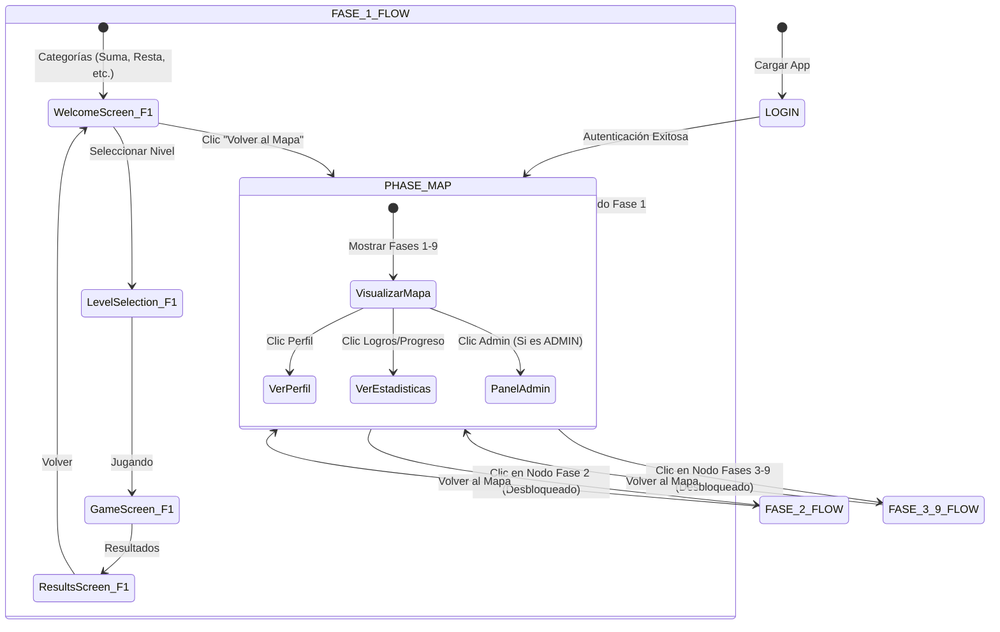

# Plan de Acción y Arquitectura: Mapa General de Fases (Fases 1 - 9)

Este documento detalla la planificación técnica, la modularización del frontend y el diseño estético de la nueva interfaz principal para **LogicaKids Pro**. El objetivo es encapsular la aplicación de matemáticas actual como la **Fase 1** e introducir un **Mapa de Progreso General** que guíe al alumno a través de las 9 fases del plan pedagógico del Viaje Matemático (Fase 1 a Fase 9).

---

## 1. Objetivos del Proyecto

1. **Nueva Interfaz Principal (Dashboard Modular)**: Crear una pantalla de entrada post-login (`PhaseMapScreen`) alojada dentro de su propia estructura modular, la cual mostrará un mapa visual del camino de aprendizaje con las 9 fases en zig-zag (estilo Duolingo/Candy Crush, desde la Fase 1 a la Fase 9).
2. **Encapsulamiento de la Fase 1**: Convertir todo el flujo y diseño actual de la aplicación de matemáticas (selección de categorías, niveles y juego interactivo con teclado numérico) en el contenido exclusivo de la **Fase 1**.
3. **Navegación Basada en Progreso**:
   - **Fase 1**: Disponible para todos. Al dar clic, se abre el sub-menú de matemáticas actual de calentamiento aritmético.
   - **Fases 2 a 9**: Bloqueadas o desbloqueadas según el progreso del alumno obtenido desde el backend (`fase_actual_id` o `unlockedLevel`). Al dar clic en una fase desbloqueada, el usuario accede a sus pantallas específicas. Al dar clic en una fase bloqueada, se muestra un modal dinámico premium con un candado interactivo y los requisitos de desbloqueo.
4. **Modularización del Frontend**: Reorganizar el directorio de componentes del frontend en carpetas por fases (`fase1` a `fase9`) y crear un módulo independiente para el mapa principal (`components/map/`) para garantizar una arquitectura escalable y limpia.
5. **Modularización del Panel de Administrador**: Consolidar el panel administrativo en su propio directorio `components/admin/` separando las vistas de gestión del flujo principal de los alumnos.

---

## 2. Arquitectura de Navegación y Flujo de Pantallas

Para integrar el Mapa General sin alterar la estabilidad del flujo actual, expandiremos la máquina de estados de navegación en `App.tsx` agregando un estado central: `PHASE_MAP`.

### Nueva Máquina de Estados (`GameScreenState`)



### Modificación de Estados en `types.ts`
Agregaremos `PHASE_MAP` a la navegación:
```typescript
export enum GameScreenState {
  LOGIN,
  PHASE_MAP,        // Nuevo estado principal post-login
  WELCOME,          // Se convertirá en el menú de categorías de la Fase 1
  PLAYING,          // Fase 1
  RESULTS,          // Fase 1
  LEVEL_SELECTION,  // Fase 1
  STUDY_TABLES,     // Auxiliar
  PROFILE,          // Acceso global
  ADMIN_PANEL,      // Acceso global
  MY_PROGRESS       // Acceso global
}
```

---

## 3. Modularización del Frontend (Propuesta de Archivos)

Para separar correctamente las responsabilidades, reestructuraremos el directorio `frontend/components` de la siguiente forma. En particular, la vista principal del mapa estará estructurada en su propia carpeta modular `components/map/` y el panel de administración en `components/admin/` para mantener desacoplados sus sub-componentes:

```
frontend/
├── components/
│   ├── admin/                 # MODULO DEL PANEL DE ADMINISTRACIÓN
│   │   ├── AdminPanel.tsx     # Pantalla controladora principal de Administración
│   │   └── components/        # Sub-componentes específicos (Configuraciones, Tablas de alumnos, logs)
│   │
│   ├── map/                   # MODULO DE LA VISTA PRINCIPAL (MAPA GENERAL)
│   │   ├── PhaseMapScreen.tsx # Pantalla principal del mapa en Zig-Zag (Fases 1 - 9)
│   │   └── components/        # Componentes exclusivos del mapa (Burbujas de Nodos, Líneas de Conexión, Candados y Tooltips)
│   │
│   ├── fase1/                 # Encapsulamiento del flujo actual de matemáticas (Calentamiento)
│   │   ├── WelcomeScreen.tsx
│   │   ├── LevelSelectionScreen.tsx
│   │   ├── GameScreen.tsx
│   │   ├── ResultsScreen.tsx
│   │   └── StudyTablesScreen.tsx
│   ├── fase2/                 # Desarrollo Numérico y Razonamiento
│   ├── fase3/                 # Problemas de Texto
│   ├── fase4/                 # Fracciones, Porcentajes y Gráficos
│   ├── fase5/                 # Geometría Plana
│   ├── fase6/                 # Geometría Espacial
│   ├── fase7/                 # Coordenadas y Desplazamientos
│   ├── fase8/                 # Probabilidad, Combinatoria y Lógica
│   ├── fase9/                 # Simulados Pedro II (Examen de Admisión)
│   │
│   ├── common/                # Componentes reutilizables (Botones, Modales, Cards)
│   ├── ProfileScreen.tsx      # Perfil de usuario (globalizado)
│   ├── ProgressScreen.tsx     # Dashboard de estadísticas (globalizado)
│   └── LoginScreen.tsx        # Login inicial (globalizado)
```

### Ventajas de Modularizar el Panel de Administrador

Modularizar por completo el panel administrativo trayendo el componente principal `AdminPanel.tsx` a su propio módulo aislado `/admin/` aporta los siguientes beneficios técnicos:

1. **Seguridad y Carga Perezosa (Lazy Loading)**: Al aislar físicamente el código de administración del código que consumen los alumnos, en fases de optimización se puede configurar el enrutamiento para que el JavaScript administrativo se cargue de manera perezosa (`React.lazy`). Esto evita que un alumno normal descargue el código de administración en su navegador, reduciendo el tamaño de la carga y aumentando la seguridad.
2. **Escalabilidad frente a Nuevas Fases**: Con 9 fases de aprendizaje complejas, el panel administrativo requerirá pantallas para gestionar bancos de preguntas de bases de datos, ver reportes de tutoría IA de cada nivel, configurar timers específicos y gestionar alumnos. Dividir estas herramientas en componentes más pequeños dentro de `/admin/components/` (ej. `PedagogySettings.tsx`, `StudentTable.tsx`, `AuditLogs.tsx`) previene el crecimiento desmedido de un único archivo monolítico.
3. **Desacoplamiento de Tipos y Servicios**: Centraliza las peticiones del servicio administrativo en componentes aislados, permitiendo refactorizar o actualizar las llamadas del panel de administrador sin tocar los componentes de los juegos que consumen los niños.

---

## 4. Diseño Estético y Visual del Mapa General (`PhaseMapScreen.tsx`)

El Mapa de Progreso debe sentirse **vivo, interactivo y sumamente premium**. Utilizaremos una paleta de colores vibrante con estética cyberpunk/glassmorphism (fondos oscuros profundos, gradientes de neón y transparencias con desenfoque).

### Elementos Clave del Mapa en Zig-Zag (Estilo Duolingo):

1. **El Camino Central**:
   - Una línea curva o en zig-zag que conecta los 9 nodos (Fase 1 a Fase 9).
   - Utilizaremos un gradiente brillante de color cian a púrpura (`from-cyan-400 to-fuchsia-500`) que fluye a lo largo del camino.
   - El tramo del camino ya superado por el alumno estará encendido y animado con un efecto de flujo brillante, mientras que el tramo bloqueado estará en gris oscuro semitransparente.

2. **Nodos de Fases Interactivos**:
   - Cada fase se representará como una burbuja flotante tridimensional (circular con sombras y bordes brillantes).
   - **Nodo Completado**: Color verde esmeralda/oro con una marca de verificación animada (check) y estrellas flotantes.
   - **Nodo Fase Actual**: Animación de pulso concéntrico (`ping`), gradiente de color sumamente vibrante y flotación sutil mediante CSS.
   - **Nodo Bloqueado**: Color grisáceo semitransparente con efecto de cristal esmerilado (glassmorphism) y un icono de candado dorado/bronce centrado.

3. **Ficha de Información Flotante (Hover / Tooltip)**:
   - Al pasar el cursor sobre un nodo de fase, se desplegará un tooltip flotante premium que muestra:
     - Nombre de la Fase y su descripción pedagógica.
     - Progreso porcentual o estrellas obtenidas.
     - Operaciones o dinámicas que abarca (ej. *Fase 1: Calentamiento Aritmético*).

4. **Efecto de Fondo**:
   - Gradiente de fondo radial profundo (`from-slate-800 via-slate-950 to-black`) decorado con constelaciones o nodos matemáticos sutiles flotando en el fondo con animaciones de paralaje.

---

## 5. Mapeo de Fases y su Contenido Técnico (Viaje Matemático)

De acuerdo al backend y a la lógica establecida, estructuramos el mapa con la siguiente información para cada nodo del Viaje Matemático Pedro II:

| Fase | Título de la Fase | Descripción Pedagógica (Objetivos) | Tipo de Preguntas y Lógica | Estado de Desarrollo |
| :---: | :--- | :--- | :--- | :--- |
| **1** | **Calentamiento Aritmético** | Calentamiento y evaluación de Aritmética Básica: sumas, restas, multiplicaciones y divisiones. | Generación Dinámica en Frontend | **Completado (Actual)** |
| **2** | **Desarrollo Numérico y Razonamiento** | Seguridad numérica, cálculo mental, comprensión del sistema monetario y lectura y estructuración de problemas matemáticos. | Modelo Híbrido (Generación controlada / BD) | *Listo para Conectar* |
| **3** | **Problemas de Texto** | Enseñar al niño a leer, interpretar y resolver problemas (identificar datos, elegir la operación correcta, resolver en varios pasos). | Banco de Ejercicios en BD / Plantillas | *Oculto / Bloqueado* |
| **4** | **Fracciones, Porcentajes y Gráficos** | Trabajar la relación entre la parte y el todo mediante fracciones simples, porcentajes estructurados, gráficos de barras/circulares y lectura de tablas. | Banco de Ejercicios en BD / Visuales | *Oculto / Bloqueado* |
| **5** | **Geometría Plana** | Preparar para ejercicios espaciales utilizando figuras bidimensionales (cuadrados, rectángulos, triángulos), incluyendo el cálculo de su área y perímetro (ej. Tangram). | Banco de Ejercicios en BD / Tangram interactivo | *Oculto / Bloqueado* |
| **6** | **Geometría Espacial** | Desarrollar la visualización 3D experimentando e interactuando con sólidos geométricos, calculando bloques y aprendiendo el volumen en prismas y cilindros. | Banco de Ejercicios en BD / Bloques 3D | *Oculto / Bloqueado* |
| **7** | **Coordenadas y Desplazamientos** | Trabajar temas de ubicación y trayectos de puntos en el plano cartesiano, usando pares ordenados y nociones de lateralidad / direcciones cardinales. | Banco de Ejercicios en BD / Plano Cartesiano | *Oculto / Bloqueado* |
| **8** | **Probabilidad, Combinatoria y Lógica** | Fomentar un razonamiento más estructurado y abstracto para identificar casos favorables, combinaciones, secuencias y uso de divisores/múltiplos. | Banco de Ejercicios en BD / Lógica | *Oculto / Bloqueado* |
| **9** | **Simulados Pedro II** | Preparación decisiva para el formato real del examen mediante simulacros (cortos, por tema, o completos) con revisión dirigida y análisis de errores o debilidades. | Simulacros con Temporizador y Review | *Oculto / Bloqueado* |

---

## 6. Plan de Acción Detallado para la Implementación (Completado)
 
 ### Paso 1: Reorganización de Archivos y Modularización Básica
 - [x] Crear el directorio `frontend/components/fase1/`.
 - [x] Mover los componentes de juego existentes a esta carpeta (`WelcomeScreen.tsx`, `LevelSelectionScreen.tsx`, `GameScreen.tsx`, `ResultsScreen.tsx`, `StudyTablesScreen.tsx`).
 - [x] Actualizar los imports en estos archivos movidos para asegurar que las referencias a `types.ts` y los servicios en `../services/` sigan funcionando perfectamente.
 - [x] Actualizar los imports principales en `App.tsx` para cargar los componentes de la Fase 1 desde su nueva subcarpeta.
 - [x] Resolver los bugs de tipado en `types.ts` y `ProgressScreen.tsx` para asegurar que el proyecto compile con 0 errores.
 - [x] Mover el panel de administrador principal `AdminPanel.tsx` dentro de `frontend/components/admin/` para consolidar el **Módulo Admin**.
 - [x] Ajustar las importaciones relativas dentro de `AdminPanel.tsx` e integrarlo adecuadamente en `App.tsx`.
 
 ### Paso 2: Creación de la Interfaz del Mapa (`PhaseMapScreen.tsx` en `components/map/`)
 - [x] Diseñar el componente React para el mapa en zig-zag vertical (conectando los 9 nodos, Fase 1 a Fase 9) con estilos en `index.css` o inline TailwindCSS.
 - [x] Implementar un array de configuración para las 9 fases (ID, título, descripción, operacion, desbloqueado).
 - [x] Diseñar los estados visuales del nodo (Aprobado, En Curso, Bloqueado) con animaciones CSS (pulso, hover, float).
 - [x] Integrar el modal interactivo de candado para las fases bloqueadas.
 
 ### Paso 3: Integración y Ruteo en `App.tsx`
 - [x] Importar `PhaseMapScreen` desde `./components/map/PhaseMapScreen` en `App.tsx`.
 - [x] Modificar el estado inicial tras el inicio de sesión exitoso en `handleLoginSuccess` y en el `useEffect` de restauración para que redirija a `GameScreenState.PHASE_MAP` en lugar de `GameScreenState.WELCOME`.
 - [x] Añadir la condición de renderizado para `GameScreenState.PHASE_MAP`.
 - [x] Configurar el callback de navegación: al hacer clic en el nodo Fase 1, cambiar el estado a `GameScreenState.WELCOME` (que ahora inicia el flujo de la Fase 1).
 - [x] Vincular los botones globales de Perfil, Estadísticas y Panel de Admin desde el Mapa para asegurar una navegación fluida en toda la aplicación.
 
 ### Paso 4: Pruebas y Pulido Visual
 - [x] Validar que la transición del login al mapa general sea inmediata y sin parpadeos.
 - [x] Comprobar que al entrar a la Fase 1 el juego funcione exactamente igual que antes (completamente intacto).
 - [x] Asegurar la adaptabilidad móvil del mapa en zig-zag para que se visualice perfecto en tablets y smartphones.
 - [x] Integrar el micro-guardado de la fase en la base de datos (conectar con `fase_actual_id` del usuario para que refleje dinámicamente qué nodos están abiertos o cerrados).
 
 ---
 
 ## 7. Refinamientos de UI/UX y Funcionalidades Premium Integradas
 
 Durante las fases de pruebas de integración y pulido, se implementaron las siguientes mejoras ultra-premium que superan las expectativas iniciales del diseño:
 
 1. **🎨 Estética de Fondo Cósmico Continuo**:
    - Reemplazo del color plano por un degradado profundo `bg-gradient-to-b from-[#0B0F19] via-[#0F172A] to-[#070A13]`.
    - Distribución dinámica de **4 grandes esferas de resplandor ambiental (Glow)** (`blur-[150px]`) ubicadas estratégicamente a lo largo de la altura vertical de scroll, eliminando cortes de color abruptos.
 2. **✨ Iconos Bloqueados Totalmente Vívidos**:
    - Para mantener la motivación del alumno, las fases y módulos bloqueados ahora se muestran con sus iconos en **colores vivos y resplandores neon originales**, mientras que el bloqueo se representa mediante elegantes candados en los conectores y cabeceras.
 3. **🏆 Insignia Premium de Dominio (Dominado ✅)**:
    - Integración de una cápsula en verde menta `bg-emerald-50` con borde `border-emerald-200` y texto extra-negrita que muestra `✓ Dominado ✅` cuando un módulo de la Fase 1 o una Fase completa se ha superado al 100%.
    - El botón inferior de las fases dominadas cambia dinámicamente a `✓ Repasar Fase (Dominada) ✅`.
 4. **👑 Bypass Total para Administradores**:
    - Las cuentas con rol `ADMIN` (como `amilcar_admin`) omiten instantáneamente cualquier restricción, desbloqueando todas las fases, módulos y niveles para facilitar la auditoría y tests rápidos.
 5. **↩️ Retorno Intuitivo en la Fase 1 (No-Logout)**:
    - Configuración del botón cuadrado superior para retornar al Mapa Principal con el icono `ArrowLeft` (flecha interactiva) en lugar de cerrar la sesión, evitando deslogueos accidentales.
 6. **👤 Widget de Perfil Limpio y Ampliado**:
    - Rediseño premium del widget del alumno en ambas cabeceras, eliminando la etiqueta de "VER PERFIL" para expandir a `w-12 h-12` (48px) el tamaño del avatar y colocando el nombre en un formato de texto extra-negrita de gran elegancia.
