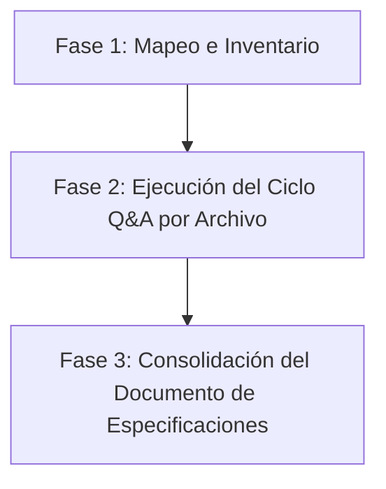

# Metodología de Auditoría Interactiva Q&A de Software

Esta metodología define un proceso estructurado para analizar el código fuente de la aplicación **LogicaMath** (ubicada en `LogicaMath/frontend` y `LogicaMath/backend`) con el objetivo de identificar fallos lógicos, vulnerabilidades, inconsistencias de tipos y problemas de rendimiento.

En lugar de implementar cambios de código de inmediato, utilizaremos un enfoque de **auditoría pasiva basada en diálogo (Q&A)** para documentar el estado exacto de cada archivo y construir un **Documento de Especificaciones de Depuración**.

---

## 1. Estructura de la Auditoría

El proceso se dividirá en tres etapas:

### Fase 1: Mapeo e Inventario
1. Listar los directorios y archivos de la aplicación real (`LogicaMath/frontend` y `LogicaMath/backend`).
2. Agrupar los archivos por dominios funcionales (ej. *Autenticación*, *Configuración Pedagógica*, *Fases de Juego*, *Gestión de Base de Datos*).
3. Priorizar el análisis de los archivos de mayor complejidad o criticidad.

### Fase 2: Ejecución del Ciclo Q&A por Archivo
Para cada archivo analizado, se formulará una **pregunta estructurada al LLM** y se generará una **respuesta detallada de la app (analizada por el LLM)** siguiendo una plantilla estándar.

### Fase 3: Consolidación del Documento de Especificaciones
Se mantendrá un único documento vivo llamado `Especificaciones_Auditoria_Bugs.md` que recopilará el análisis de todos los archivos y presentará un **Bug Tracker & Action Plan** consolidado.

---

## 2. Plantilla Estándar del Ciclo Q&A

Cada archivo auditado debe registrarse con el siguiente formato de sección en el documento de especificaciones:

### 📄 Archivo: `[Ruta/Relativa/Del/Archivo]`

> **❓ Pregunta al LLM (Q&A de Auditoría)**
> 1. ¿Cuál es el rol de este archivo dentro de la aplicación?
> 2. ¿Qué dependencias críticas tiene y con cuáles archivos interactúa?
> 3. ¿Cómo es el flujo de entrada, procesamiento y salida de datos?
> 4. ¿Qué bugs lógicos, problemas de tipado, inconsistencias de lógica, fallos de rendimiento o edge cases no controlados existen en el código?

#### 💡 Respuesta de la App (Análisis Técnico)

#### 1. Rol e Integración en la Arquitectura
*Explicación corta del rol del archivo.*

#### 2. Dependencias y Relaciones
*   **Importaciones clave**: `[Módulos importados]`
*   **Archivos dependientes**: `[Archivos que consumen este archivo]`

#### 3. Flujo de Datos
*   **Entrada**: `[Formatos/Objetos recibidos]`
*   **Procesamiento**: `[Cálculos, validaciones o transformaciones principales]`
*   **Salida**: `[Formatos/Objetos devueltos o guardados]`

#### 4. Registro de Inconsistencias y Bugs Detectados
*   ❌ **BUG-XX: [Título corto del bug]** (Severidad: **Crítica** | **Media** | **Baja**)
    *   *Descripción*: Explicación clara de por qué ocurre el error.
    *   *Ubicación*: [RutaArchivo.tsx#L123-L130](file:///absolute/path/to/file#L123-L130)
    *   *Efecto*: Impacto en la app o experiencia de usuario.
*   ⚠️ **SMELL-XX: [Mejora o Code Smell]** (Severidad: **Baja**)
    *   *Descripción*: Detalle de la recomendación de diseño o limpieza.

#### 5. Plan de Mitigación Recomendado
*   Paso 1: *Acción recomendada 1*
*   Paso 2: *Acción recomendada 2*

---

## 3. Ejemplo de Uso Práctico

Si estuviéramos auditando un servicio de la Fase 3, el registro se vería así:

### 📄 Archivo: `LogicaMath/frontend/components/fase3/Fase3Service.ts`

> **❓ Pregunta al LLM (Q&A de Auditoría)**
> 1. ¿Cuál es el rol de este archivo? ...

#### 💡 Respuesta de la App (Análisis Técnico)
1. **Rol**: Administra las llamadas a API y cálculos de puntaje de la Fase 3.
2. **Dependencias**: Consume `apiService.ts` y exporta `Fase3Controller`.
3. **Flujo de Datos**: Recibe el payload de la respuesta del usuario, calcula si superó el umbral y devuelve un JSON al backend.
4. **Bugs**:
   * ❌ **BUG-01: División por cero en promedio de tiempo** (Severidad: **Media**)
     * *Descripción*: Si el usuario responde 0 preguntas correctas, el cálculo de tiempo promedio divide la sumatoria entre `correctas_count`.
     * *Ubicación*: `Fase3Service.ts#L84`
5. **Mitigación**: Añadir validación `if (correctas_count === 0) return 0;`.
