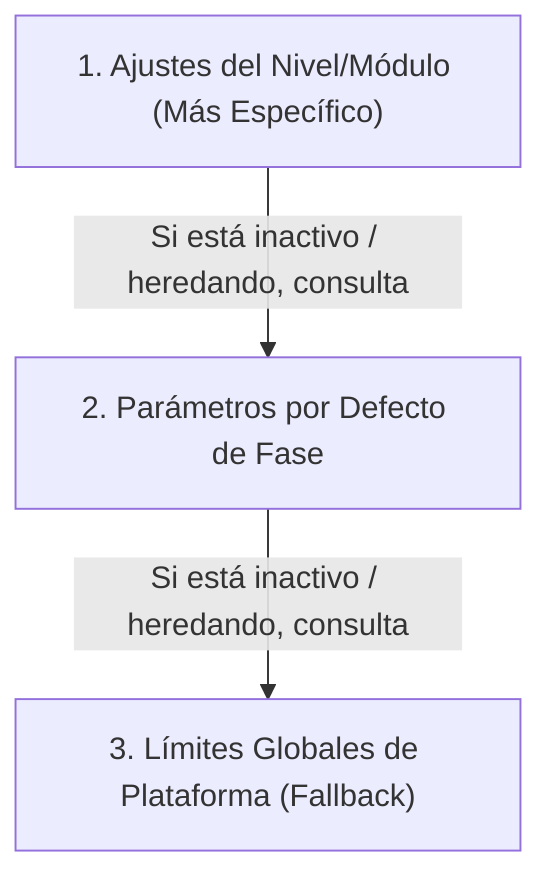

# Manual Técnico y de Arquitectura: Panel de Administrador (Superusuario)

Este documento detalla de forma definitiva el diseño, configuración, modelo de datos relacionales, lógica de resolución en cascada e implementación actual de la interfaz del **Panel de Administrador (Dashboard)** en la plataforma **LogicaKids Pro**. 

---

## 1. Stack Tecnológico, Estética y Ajustes del Panel de Administración

El Panel de Administración (Superusuario) de LogicaKids Pro ha sido desarrollado bajo un enfoque centrado en la productividad del educador, incorporando una identidad visual premium y gamificada pero accesible y altamente configurable.

### 1.1. Stack Tecnológico de UI
*   **React (TypeScript):** Componentes altamente modularizados con tipado estricto.
*   **Tailwind CSS:** Para toda la base de diseño responsivo y maquetación de componentes.
*   **Framer Motion:** Implementación de micro-animaciones (hovers, sliders fluidos, transiciones suaves y aperturas de modales en `AnimatePresence`).
*   **Lucide React:** Set de iconos limpios y modernos.

### 1.2. Estética High-End & Glassmorphism
El panel implementa las siguientes directrices estéticas premium:
*   **Esquema de Color Profundo:** Fondos oscuros fluidos con `bg-[radial-gradient(ellipse_at_top,_var(--tw-gradient-stops))] from-slate-900 via-gray-950 to-black`.
*   **Resplandores Ambientales:** Luces de fondo dinámicas semitransparentes (`bg-blue-600/10` y `bg-purple-600/10`) con `blur-[120px]` y bordes difusos.
*   **Capa Esmerilada de Cristal:** Paneles y modales con `backdrop-blur-2xl`, `bg-white/5`, y bordes sutiles de `border-white/10`.

### 1.3. Ajustes de Interfaz Persistidos (Accesibilidad)
El panel cuenta con un apartado en el Sidebar de "Ajustes Visuales" controlados por el Administrador que se guardan en el `localStorage` de forma automática:
*   **Escala de Interfaz (`adminScale`):** Deslizador en rango del `80%` al `150%` que ajusta dinámicamente el tamaño de fuente global de la página (`document.documentElement.style.fontSize`), facilitando la lectura.
*   **Tipo de Fuente (`adminFontFamily`):** Menú desplegable para cambiar la fuente tipográfica de todo el panel. Incluye opciones estándar como Outfit, Comic Sans, Monospace, Arial, Serif y **Alta Legibilidad (OpenDyslexic)** para personas con dificultades de lectura.

---

## 2. Estructura y Navegación del Panel de Administración

La interfaz se divide en un *Sidebar* responsivo y plegable que gestiona la navegación de **4 pestañas unificadas** (`TabType = 'general' | 'pedagogy' | 'performance' | 'content'`):

```
┌────────────────────────────────────────────────────────────────────────┐
│                              ADMIN PRO                                 │
├───────────────┬────────────────────────────────────────────────────────┤
│ 📊 Vista      │  📈 Tarjetas KPI (Usuarios, Partidas, Activos, Storage) │
│    General    │  🔍 Buscador y Tabla de Gestión de Cuentas de Usuario   │
├───────────────┼────────────────────────────────────────────────────────┤
│ ⚙️ Config.    │  🌲 Árbol de Jerarquía (Globales vs Fases vs Módulos)   │
│    Pedagógica │  🎛️ Formulario de Edición Contextual y Override Velo    │
├───────────────┼────────────────────────────────────────────────────────┤
│ 🛡️ Rendimiento│  🔍 Buscador de Alumnos y Estado de Fase Actual        │
│    Estudiantil│  🗝️ Control de Maestría ("Liberar", "Aprobar", "Reset") │
├───────────────┼────────────────────────────────────────────────────────┤
│ 📖 Banco      │  📂 Selector de Fase/Módulo/Nivel                      │
│    Preguntas  │  📝 Editor de Material Teórico vs CRUD de Preguntas     │
└───────────────┴────────────────────────────────────────────────────────┘
```

### 2.1. Vista General (`GeneralTab.tsx`)
Punto de control inicial que ofrece análisis rápidos y gestión completa de usuarios.
*   **KPI Cards de Desempeño:**
    *   **Usuarios:** Conteo total de registrados en la plataforma.
    *   **Partidas:** Total de juegos/bloques completados. Al hacer clic, abre el modal de registros globales para auditar y borrar individualmente puntuaciones históricas.
    *   **Activos:** Cantidad de estudiantes no bloqueados (`ACTIVE`).
    *   **Storage:** Estado del almacenamiento (mostrado como `Cloud` o peso local).
*   **Gestión de Usuarios (CRUD Completo):**
    *   Buscador interactivo por nombre y correo.
    *   Formulario para crear nuevos usuarios con roles (`ADMIN` o `USER`) y estados iniciales.
    *   Edición de credenciales y datos básicos.
    *   Baneo/Desbaneo instantáneo mediante interruptor de estado.
    *   Cambio seguro de contraseñas mediante modal de clave mínima alfanumérica.
    *   **Historial de Rendimiento Detallado por Alumno:** Modal que analiza la actividad de un estudiante en un listado ordenable por fecha o puntuación, mostrando la categoría, nivel de dificultad, aciertos (%) y el conteo de errores específicos.

### 2.2. Gestión Pedagógica Avanzada (`PedagogyTab.tsx`)
Configurador relacional donde el educador define el ritmo, volumen y comportamiento didáctico del alumno en la plataforma. Utiliza un menú de acordeón lateral (`ConfigTreeNav`) y un velo esmerilado de bloqueo para control de herencias.

### 2.3. Rendimiento Estudiantil Avanzado (`PerformanceTab.tsx`)
Herramienta de tutoría y control que permite a los administradores intervenir quirúrgicamente en el progreso académico de un estudiante:
*   **Buscador Rápido:** Encuentra perfiles de alumnos y muestra su estado de fase actual.
*   **Control de Maestría por Bloque:** Permite visualizar los niveles y desafíos por módulo agrupados por Fases 1 a 3. Para cada nivel, el administrador puede realizar overrides en tiempo real:
    *   `Liberar` (Unlock): Desbloquea manualmente un nivel en estado `BLOQUEADO` para que el alumno pueda jugarlo.
    *   `Aprobar` (Approve): Establece el estado del nivel a `APROBADO` con un 90% automático de aciertos, marcándolo con la bandera `aprobado_por_admin = True`.
    *   `Restablecer` (Reset/Lock): Borra el progreso del alumno para ese bloque específico, bloqueándolo de nuevo.

### 2.4. Banco de Preguntas y Teoría (`ContentTab.tsx`)
Consola de administración de contenidos pedagógicos dividida en dos sub-pestañas operadas a través de selectores de Fase, Módulo y Nivel:
1.  **Contenido Teórico (`theory`):** Editor WYSIWYG/Formulario reactivo para:
    *   Título e introducción conceptual.
    *   Texto de descubrimiento y tips pedagógicos/advertencias.
    *   **Glosario:** Diccionario de vocabulario interactivo con claves y definiciones editables.
    *   **Ejemplos Didácticos:** Flujos explicativos guiados paso a paso.
    *   **Ejercicios Interactivos:** Definición de enunciados, pasos y respuestas exactas con feedbacks específicos de acierto y error.
2.  **Banco de Preguntas (`questions`):** Buscador, paginador y CRUD de preguntas del bloque:
    *   Edición de enunciados de pregunta y su tipo (numérico u opción múltiple).
    *   Toggle de requerimiento de subrayado para tutorías.
    *   Gestión de alternativas: Declaración de hasta 4 opciones, asignación de orden y marcado de la respuesta correcta.

---

## 3. Modelo de Datos de Configuración y Progreso

La base de datos relacional (implementada en PostgreSQL y mapeada en SQLAlchemy en `backend/app/models/progreso.py`) estructura el backend de administración a través de cuatro modelos críticos:

### 3.1. Tabla `configuracion_progreso`
Almacena las reglas pedagógicas personalizadas por el administrador.
*   `fase_id` (ForeignKey) $\rightarrow$ ID de la fase (1 a 9).
*   `seccion` (Integer) $\rightarrow$ Mapea el módulo o nivel (se usa `0` para los valores por defecto de la Fase completa).
*   `operacion` (Enum) $\rightarrow$ Operación matemática (`suma`, `resta`, `multiplicacion`, `division`, `mixta`).
*   `cantidad_requerida` (Integer) $\rightarrow$ Número de preguntas que componen el bloque de juego.
*   `porcentaje_aprobacion` (Integer) $\rightarrow$ Puntuación mínima (%) requerida para pasar de nivel (comúnmente 80% o 90%).
*   `orden_desbloqueo` (Integer) $\rightarrow$ Secuencia de desbloqueo dentro de la sección.
*   `tipo_feedback` (String) $\rightarrow$ `"simple"` (acierto/error) o `"detallado"` (tutoría explicativa con IA).
*   `usa_cronometro` (Boolean) $\rightarrow$ Habilita o deshabilita el límite de tiempo.
*   `tiempo_default_segundos` (Integer, Nullable) $\rightarrow$ Tiempo límite por pregunta o bloque global.
*   `activo` (Boolean) $\rightarrow$ Estado de activación del override.

### 3.2. Tabla `progreso_maestria`
Registra el progreso académico individual de cada estudiante por bloque.
*   `alumno_id` (ForeignKey) $\rightarrow$ Referencia al perfil del alumno.
*   `fase_id` (ForeignKey) $\rightarrow$ Fase académica.
*   `seccion` (Integer) & `operacion` (Enum) $\rightarrow$ Coordenadas del bloque.
*   `estado` (Enum) $\rightarrow$ Estado actual (`BLOQUEADO`, `EN_PROGRESO` o `APROBADO`).
*   `aciertos_acumulados` (Integer) & `intentos_totales` (Integer) $\rightarrow$ Desempeño métrico del bloque.
*   `porcentaje_actual` (Integer) $\rightarrow$ Puntuación máxima obtenida.
*   `aprobado_por_admin` (Boolean) $\rightarrow$ Registra si el bloque fue liberado manualmente por un profesor.

### 3.3. Tabla `pool_asignado_alumno`
Permite generar una experiencia de evaluación personalizada para el estudiante a partir de las preguntas cargadas por el administrador en la tabla `preguntas`.
*   `respondida_correctamente` (Boolean) & `respondida_alguna_vez` (Boolean) $\rightarrow$ Seguimiento de la pregunta en el intento actual.
*   `numero_intentos` (Integer) $\rightarrow$ Contador de repetición.

### 3.4. Tabla `intentos`
Bitácora de analítica de tutoría invisible que registra cada respuesta individual de los alumnos.
*   `respuesta_dada` (String) & `es_correcta` (Boolean).
*   `tiempo_respuesta_segundos` (Float) $\rightarrow$ Precisión en milisegundos para análisis de velocidad mental.
*   `tipo_error` (Enum) $\rightarrow$ Categorización automática del fallo para activar feedbacks inteligentes.
*   `feedback_mostrado` (Text) & `explicacion_mostrada` (JSONB) $\rightarrow$ Historial del soporte cognitivo entregado.

---

## 4. Estrategia de Configuración Pedagógica Jerárquica (Cascada)

Para personalizar el comportamiento didáctico de cada bloque del mapa de progreso sin abrumar a los educadores con cientos de configuraciones individuales, LogicaKids Pro adopta una **arquitectura de herencia de configuraciones (Config Inheritance System)**.

### 4.1. Árbol de Herencia (Cascada)



### 4.2. Mapeo del Árbol de Jerarquía Actual (Selectores)
El backend del juego y el panel de administración estructuran el mapa de progreso en base a la configuración actual implementada:
*   **Fase 1: Aritmética Básica**
    *   *Módulo:* Operaciones Directas (Suma Directa, Resta Directa, Multiplicación Directa, División Directa).
*   **Fase 2: Desarrollo Numérico**
    *   *Módulo 1: Gimnasio Numérico Mental* (Nivel 1: Multiplicadores, Nivel 2: Jerarquía, Nivel 3: Traducción, Desafíos 11-13).
    *   *Módulo 2: Tablas en Acción* (Nivel 1: Suma e Inversa, Nivel 2: Mult. e Inversa, Nivel 3: Número Faltante, Nivel 4: Gran Integración, Desafíos 11-13).
    *   *Módulo 3: Tienda Matemática* (Nivel 1: Reconozco Dinero, Nivel 2: Pago y Cambio, Nivel 3: Carrito, Nivel 4: Comprador Inteligente, Desafíos 11-13).
    *   *Módulo 4: Constructor de Soluciones* (Nivel 1: Dos Pasos, Nivel 2: Encadenamiento, Nivel 3: Error de Arrastre, Desafíos 11-13).
*   **Fase 3: Problemas de Texto**
    *   *Módulo 1: El Escáner de la Verdad* (Nivel 1: Lápiz Mágico, Nivel 2: Escudo Anti-Basura, Nivel 3: Laberinto Numérico, Desafíos 11-13).
    *   *Módulo 2: La Máquina del Tiempo* (Nivel 1: Reloj Adelante, Nivel 2: Reloj Reversa, Nivel 3: Tiempo Multiplicado, Nivel 4: Laberinto del Tiempo, Desafíos 11-13).
    *   *Módulo 3: El Ojo del Comerciante* (Nivel 1: Enigma Carritos, Nivel 2: Cruce de Datos, Nivel 3: Código Oculto, Desafíos 11-13).
    *   *Módulo 4: El Maestro del Empaque* (Nivel 1: Reparto Perfecto, Nivel 2: Piezas Sobrantes, Nivel 3: Ciclo Infinito, Desafíos 11-13).

*Nota: Para las Fases 4 a 9, aunque el alumno las visualiza en su mapa global, el panel de control pedagógico de administración expone y gestiona la configuración de las Fases 1 a 3 que representan las áreas pedagógicas completamente construidas y configurables a nivel relacional.*

---

## 5. Implementación Técnica de la Cascada de Resolución

Cuando un estudiante inicia una partida en `GameScreen.tsx`, la interfaz resuelve dinámicamente los parámetros didácticos del juego mediante la siguiente lógica de cascada nativa:

```typescript
const resolveActiveParams = () => {
  const levelKeys = ['easy', 'easy_medium', 'medium', 'medium_hard', 'hard'];
  const activeLevelKey = levelKeys.includes(difficulty) ? difficulty : 'medium';

  // Paso 1: Configuración base por defecto desde los límites globales de plataforma
  let resolvedQuestions = adminConfig?.questionsPerPhase || FALLBACK_TOTAL_QUESTIONS;
  let resolvedUseTimer = adminConfig?.useTimer !== false;
  let resolvedTimer = adminConfig?.timers?.[activeLevelKey as keyof typeof adminConfig.timers] || 12;
  let resolvedPassing = adminConfig?.passingScore || 90;
  let resolvedFeedback = 'simple';

  const fId = faseId || 1;
  const sec = seccion || 1;
  const oper = category === 'addition' ? 'suma' : 
               category === 'subtraction' ? 'resta' : 
               category === 'multiplication' ? 'multiplicacion' : 
               category === 'division' ? 'division' : 'mixta';

  if (modularConfigs) {
    // Paso 2: Sobrescribir con los valores por defecto de la Fase (si sección es 0 y el override está activo)
    const phaseDefault = modularConfigs.find(
      c => c.fase_id === fId && c.seccion === 0 && c.activo !== false
    );
    if (phaseDefault) {
      resolvedQuestions = phaseDefault.cantidad_requerida;
      resolvedUseTimer = phaseDefault.usa_cronometro;
      resolvedTimer = phaseDefault.tiempo_default_segundos || resolvedTimer;
      resolvedPassing = phaseDefault.porcentaje_aprobacion;
      resolvedFeedback = phaseDefault.tipo_feedback;
    }

    // Paso 3: Sobrescribir con los valores específicos de Módulo (si existe un override activo)
    const moduleConfig = modularConfigs.find(
      c => c.fase_id === fId && c.seccion === sec && c.operacion === oper && c.activo !== false
    );
    if (moduleConfig) {
      resolvedQuestions = moduleConfig.cantidad_requerida;
      resolvedUseTimer = moduleConfig.usa_cronometro;
      resolvedTimer = moduleConfig.tiempo_default_segundos || resolvedTimer;
      resolvedPassing = moduleConfig.porcentaje_aprobacion;
      resolvedFeedback = moduleConfig.tipo_feedback;
    }
  }

  // Desactivación forzada del límite de tiempo si usa_cronometro se resuelve como falso
  if (!resolvedUseTimer) {
    resolvedTimer = 999;
  }

  return {
    questionsCount: resolvedQuestions,
    useTimer: resolvedUseTimer,
    timeLimitSeconds: resolvedTimer,
    passingScore: resolvedPassing,
    feedbackType: resolvedFeedback
  };
};
```

---

## 6. Endpoints de la API en el Backend (Administración)

La sincronización entre el cliente Frontend y la Base de Datos PostgreSQL se realiza a través de los siguientes endpoints seguros de la API (conectados en `storageService.ts`):

*   **Configuración Pedagógica:**
    *   `GET /admin/settings` $\rightarrow$ Recupera los límites globales de plataforma (`PedagogyConfig`).
    *   `PUT /admin/settings` $\rightarrow$ Guarda los límites globales actualizados.
    *   `GET /admin/configuracion` o `GET /admin/configuracion?fase_id={fase_id}` $\rightarrow$ Colección de overrides de progreso.
    *   `POST /admin/configuracion` $\rightarrow$ Crea un nuevo override para una fase o módulo.
    *   `PATCH /admin/configuracion/{id}` $\rightarrow$ Modifica un override de progreso existente.
*   **Gestión Académica de Alumnos:**
    *   `GET /admin/alumnos/search?query={texto}` $\rightarrow$ Busca estudiantes por nombre o email.
    *   `GET /admin/alumnos/{alumno_id}/progress` $\rightarrow$ Progreso de maestría por bloque del estudiante.
    *   `POST /admin/alumnos/{alumno_id}/progress/override` $\rightarrow$ Ejecuta acciones de maestría (`approve`, `unlock`, `lock`).
*   **Banco de Preguntas y Teoría:**
    *   `GET /admin/preguntas?fase_id={fase_id}&seccion={seccion}&operacion={operacion}` $\rightarrow$ Listado de preguntas del nivel.
    *   `POST /admin/preguntas` $\rightarrow$ Registra una nueva pregunta en el banco de datos.
    *   `PATCH /admin/preguntas/{id}` $\rightarrow$ Actualiza una pregunta y sus alternativas.
    *   `DELETE /admin/preguntas/{id}` $\rightarrow$ Elimina físicamente una pregunta.
    *   `GET /admin/teoria?fase_id={fase_id}&modulo_id={modulo_id}&nivel_id={nivel_id}` $\rightarrow$ Teoría, ejemplos y glosario del nivel.
    *   `PUT /admin/teoria` $\rightarrow$ Guarda el contenido didáctico teórico completo.
