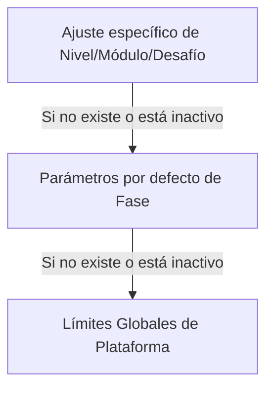

# Manual Técnico y de Arquitectura: Panel de Administrador (Superusuario)

> Nota de autoridad documental: Este documento define la implementación del Panel de Administrador. En caso de conflicto, prevalece primero el Documento Rector Conceptual, luego el Blueprint Técnico, luego este Manual del Administrador y finalmente la Guía UX/UI.

---

## 1. Propósito del Documento

Este documento detalla el diseño, configuración, modelo de datos relacionales, lógica de resolución en cascada e implementación de la interfaz del **Panel de Administrador** en la plataforma **LogicaKids Pro**.

El Panel de Administrador permite:

* gestionar usuarios;
* revisar desempeño estudiantil;
* intervenir manualmente el progreso;
* configurar reglas pedagógicas;
* editar teoría;
* administrar práctica libre;
* administrar desafíos;
* revisar analíticas de intentos;
* mantener coherencia entre contenido, progreso y reglas didácticas.

La fuente de verdad del progreso académico es `ProgresoMaestria`. El objeto `user.settings["unlockedLevels"]` existe únicamente como espejo de compatibilidad visual para componentes heredados del frontend. Ninguna decisión de aprobación, bloqueo, desbloqueo o avance debe depender exclusivamente de `user.settings`.

---

## 2. Stack Tecnológico, Estética y Ajustes del Panel

### 2.1. Stack Tecnológico de UI

* **React (TypeScript):** Componentes modularizados con tipado estricto.
* **Tailwind CSS:** Base de diseño responsivo y maquetación.
* **Framer Motion:** Micro-animaciones, hovers, sliders, transiciones y modales.
* **Lucide React:** Iconografía moderna y limpia.
* **Zustand:** Estado global de sesión, configuración y datos cargados.
* **FastAPI + PostgreSQL:** Backend autoritativo y persistencia relacional.

### 2.2. Estética High-End & Glassmorphism

El panel implementa una estética premium, oscura y gamificada:

* fondos profundos con gradientes radiales;
* resplandores ambientales semitransparentes;
* paneles esmerilados con `backdrop-blur`;
* bordes sutiles;
* micro-animaciones para acciones críticas;
* jerarquía visual clara para reducir carga cognitiva del administrador.

### 2.3. Ajustes de Interfaz Persistidos

El panel cuenta con un apartado de **Ajustes Visuales** controlado por el administrador y persistido en `localStorage`.

* **Escala de Interfaz (`adminScale`):** Rango de 80% a 150%.
* **Tipo de Fuente (`adminFontFamily`):** Outfit, Comic Sans, Monospace, Arial, Serif y Alta Legibilidad.
* **Persistencia Local:** Los cambios se aplican al documento mediante `document.documentElement.style.fontSize` y variables de fuente.

---

## 3. Estructura y Navegación del Panel de Administración

La interfaz se divide en un sidebar responsivo y plegable con 4 pestañas principales:

```text
TabType = 'general' | 'pedagogy' | 'performance' | 'content'
```

```text
┌────────────────────────────────────────────────────────────────────────┐
│                              ADMIN PRO                                 │
├───────────────┬────────────────────────────────────────────────────────┤
│ 📊 Vista      │  KPI, usuarios, cuentas, historial global               │
│    General    │                                                        │
├───────────────┼────────────────────────────────────────────────────────┤
│ ⚙️ Config.    │  Reglas pedagógicas, fases, módulos, cascada            │
│    Pedagógica │                                                        │
├───────────────┼────────────────────────────────────────────────────────┤
│ 🛡️ Rendimiento│  Progreso del alumno, liberar, aprobar, reset           │
│    Estudiantil│                                                        │
├───────────────┼────────────────────────────────────────────────────────┤
│ 📖 Banco      │  Teoría, práctica libre, desafíos, tokens, feedbacks    │
│    Preguntas  │                                                        │
└───────────────┴────────────────────────────────────────────────────────┘
```

---

## 4. Vista General (`GeneralTab.tsx`)

Punto de control inicial que ofrece análisis rápidos y gestión completa de usuarios.

### 4.1. KPI Cards

* **Usuarios:** Conteo total de registrados.
* **Partidas:** Total de juegos o bloques completados.
* **Activos:** Estudiantes no bloqueados (`ACTIVE`).
* **Storage:** Estado del almacenamiento.

### 4.2. Gestión de Usuarios

* Buscador por nombre y correo.
* Crear usuarios con rol `ADMIN` o `USER`.
* Editar datos básicos.
* Banear o desbanear.
* Cambiar contraseñas mediante modal seguro.
* Ver historial detallado de rendimiento.

### 4.3. Historial de Rendimiento

El modal de rendimiento debe mostrar:

* fecha;
* fase;
* módulo;
* nivel o desafío;
* operación;
* porcentaje;
* intentos;
* aciertos;
* errores;
* tipos de error;
* tiempo promedio de respuesta.

---

## 5. Gestión Pedagógica Avanzada (`PedagogyTab.tsx`)

Esta pestaña permite definir el ritmo, volumen y comportamiento didáctico del alumno. Utiliza un árbol de jerarquía y un sistema de herencia de configuración.

### 5.1. Niveles de Configuración

1. **Global:** Fallback general de la plataforma.
2. **Fase:** Parámetros por defecto de una fase.
3. **Módulo/Nivel/Desafío:** Override específico.

### 5.2. Principio de Cascada

La configuración más específica prevalece sobre la general. Si un override está inactivo, se hereda el nivel superior.



---

## 6. Rendimiento Estudiantil Avanzado (`PerformanceTab.tsx`)

Herramienta de tutoría y control para intervenir el progreso académico de un estudiante.

### 6.1. Funciones

* Buscar alumnos por nombre o email.
* Ver fase actual.
* Ver progreso por módulo, nivel y desafío.
* Revisar porcentaje actual.
* Revisar si fue aprobado por admin.
* Ejecutar acciones manuales.

### 6.2. Acciones de Maestría

* **Liberar (`unlock`):** Desbloquea manualmente un bloque.
* **Aprobar (`approve`):** Marca un bloque como aprobado con 90% automático y `aprobado_por_admin = true`.
* **Restablecer (`lock` / `reset`):** Borra el progreso del bloque y lo bloquea nuevamente.

Toda acción debe actualizar `ProgresoMaestria`. Si existen componentes heredados que dependen de `user.settings["unlockedLevels"]`, el backend sincroniza ese espejo visual después de modificar la fuente relacional.

---

## 7. Banco de Preguntas y Teoría (`ContentTab.tsx`)

Consola de administración de contenidos pedagógicos dividida en subpestañas.

### 7.1. Contenido Teórico (`theory`)

Editor para:

* título;
* bienvenida y superpoder;
* cuerpo teórico;
* tips pedagógicos;
* glosario o diccionario del nivel;
* ejemplos guiados;
* interactivos de desbloqueo;
* feedbacks de acierto y error.

### 7.2. Banco de Preguntas (`questions`)

Editor para:

* práctica libre;
* familias del Bucle Espejo;
* desafíos;
* alternativas;
* feedback del Tutor Invisible;
* explicación profunda;
* modo de interacción;
* tokenización de textos.

### 7.3. Campos de Subrayado y Tokenización

El toggle de requerimiento de subrayado debe estar asociado a:

* `modo_interaccion`;
* `requiere_subrayado`;
* `tokens_texto`;
* `tokens_correctos`.

El frontend debe enviar `tokens_seleccionados`, no texto crudo.

---

## 8. Modelo de Datos de Configuración y Progreso

La base de datos relacional se implementa en PostgreSQL y se mapea con SQLAlchemy.

### 8.1. Tabla `configuraciones_progreso`

Almacena reglas pedagógicas personalizadas por el administrador.

Campos:

* `id`: Identificador.
* `fase_id`: ID de la fase. El mapa global está planificado con Fases 1 a 9.
* `modulo_id`: Identifica el módulo pedagógico dentro de la fase.
* `nivel_id`: Identifica el nivel de práctica libre. Nullable en desafíos o defaults de fase.
* `desafio_id`: Identifica el desafío virtual (`1`, `2`, `3`). Nullable en práctica.
* `seccion`: Código derivado para compatibilidad y consultas rápidas.
  * En práctica libre: `modulo_id * 100 + nivel_id`.
  * En desafíos: `modulo_id * 1000 + nivel_virtual`, donde `nivel_virtual` es `11`, `12` o `13`.
  * En defaults de fase puede usarse `0`.
* `operacion`: Enum (`suma`, `resta`, `multiplicacion`, `division`, `mixta`).
* `cantidad_requerida`: Número de preguntas que componen el bloque.
* `completitud_requerida`: Porcentaje de avance requerido para terminar el bloque. Valor estándar: `100`.
* `porcentaje_aprobacion`: Precisión mínima requerida. Valor estándar: `90`.
* `orden_desbloqueo`: Secuencia de desbloqueo.
* `tipo_feedback`: `"simple"` o `"detallado"`.
* `modo_tutoria`: `"normal"`, `"bucle_espejo"` o `"rescate"`.
* `usa_cronometro`: Habilita/deshabilita tiempo.
* `tiempo_default_segundos`: Tiempo límite por pregunta o bloque.
* `activo`: Estado del override.

### 8.2. Tabla `progreso_maestria`

Registra el progreso académico individual por bloque.

Campos:

* `alumno_id`;
* `fase_id`;
* `modulo_id`;
* `nivel_id`;
* `desafio_id`;
* `seccion`;
* `operacion`;
* `estado`: `BLOQUEADO`, `EN_PROGRESO` o `APROBADO`;
* `aciertos_acumulados`;
* `intentos_totales`;
* `porcentaje_actual`;
* `completitud_actual`;
* `aprobado_por_admin`.

### 8.3. Tabla `pool_asignado_alumno`

Permite generar una experiencia personalizada para el estudiante a partir de `practica_libre_pool` y `desafios_pool`.

Campos:

* `alumno_id`;
* `pregunta_id`;
* `tipo_pool`: `practica` o `desafio`;
* `respondida_correctamente`;
* `respondida_alguna_vez`;
* `numero_intentos`;
* `estructura_padre_id`;
* `fallas_consecutivas_bucle`.

### 8.4. Tabla `intentos`

Bitácora de analítica de tutoría invisible.

Campos:

* `alumno_id`;
* `fase_id`;
* `modulo_id`;
* `nivel_id`;
* `desafio_id`;
* `pregunta_id`;
* `respuesta_dada`;
* `es_correcta`;
* `tiempo_respuesta_segundos`;
* `tipo_error`;
* `feedback_mostrado`;
* `explicacion_mostrada`.

---

## 9. Modelo de Datos de Contenido Pedagógico

Además de configuración y progreso, el panel administra contenido pedagógico en tablas especializadas.

### 9.1. Tabla `niveles_teoria_pool`

Almacena contenido teórico pre-renderizado.

Campos:

* `fase_id`;
* `modulo_id`;
* `nivel_id`;
* `titulo`;
* `bienvenida_superpoder`;
* `cuerpo_teoria`;
* `trampa_advertencia`;
* `diccionario_nivel`;
* `ejemplo_guiado`;
* `interactivos_desbloqueo`.

### 9.2. Tabla `practica_libre_pool`

Almacena preguntas de entrenamiento con Bucle Espejo.

Campos:

* `fase_id`;
* `modulo_id`;
* `nivel_id`;
* `seccion`;
* `estructura_padre_id`;
* `operacion`;
* `enunciado_visual`;
* `respuesta_correcta`;
* `explicacion_profunda`;
* `datos_numericos`;
* `modo_interaccion`;
* `requiere_subrayado`;
* `tokens_texto`;
* `tokens_correctos`.

### 9.3. Tabla `desafios_pool`

Almacena preguntas de evaluación.

Campos:

* `fase_id`;
* `modulo_id`;
* `desafio_id`;
* `seccion`;
* `tipo_segmento`;
* `tipo_pregunta`;
* `enunciado_visual`;
* `respuesta_correcta`;
* `datos_numericos`;
* `modo_interaccion`;
* `requiere_subrayado`;
* `tokens_texto`;
* `tokens_correctos`.

### 9.4. Tabla `alternativas_desafios_pool`

Almacena alternativas de opción múltiple.

Campos:

* `desafio_id`;
* `texto`;
* `texto_opcion`;
* `es_correcta`;
* `orden`;
* `tipo_error`.

### 9.5. Tabla `respuestas_erroneas`

Almacena mapeos heurísticos para Tutor Invisible.

Campos:

* `pregunta_id`;
* `mapeo_errores`.

---

## 10. Mapeo del Árbol de Jerarquía Actual

### 10.1. Fase 1: Aritmética Básica

* **Módulo:** Operaciones Directas.
* Contenido: suma, resta, multiplicación y división directa.

### 10.2. Fase 2: Desarrollo Numérico

* **Módulo 1:** Gimnasio Numérico Mental.
* **Módulo 2:** Tablas en Acción.
* **Módulo 3:** Tienda Matemática.
* **Módulo 4:** Constructor de Soluciones.

### 10.3. Fase 3: Problemas de Texto

* **Módulo 1:** El Escáner de la Verdad.
* **Módulo 2:** La Máquina del Tiempo.
* **Módulo 3:** El Ojo del Comerciante.
* **Módulo 4:** El Maestro del Empaque.

### 10.4. Fases 4 a 9

El mapa global del alumno está planificado con 9 fases. En la versión actual, las Fases 1 a 3 son las áreas completamente construidas y configurables a nivel relacional. Las Fases 4 a 9 pueden aparecer como bloqueadas, futuras o parcialmente visibles hasta que su contenido esté implementado.

---

## 11. Implementación Técnica de la Cascada de Resolución

Cuando un estudiante inicia una partida, el backend debe resolver dinámicamente los parámetros didácticos mediante cascada:

1. Configuración específica de nivel, módulo o desafío.
2. Configuración por defecto de fase.
3. Configuración global de plataforma.

Ejemplo conceptual:

```typescript
const resolveActiveParams = () => {
  let resolvedQuestions = adminConfig?.questionsPerPhase || FALLBACK_TOTAL_QUESTIONS;
  let resolvedCompletion = adminConfig?.completionRequired || 100;
  let resolvedPassing = adminConfig?.passingScore || 90;
  let resolvedUseTimer = adminConfig?.useTimer !== false;
  let resolvedTimer = adminConfig?.defaultTimerSeconds || 25;
  let resolvedFeedback = 'simple';
  let resolvedTutoringMode = 'normal';

  const phaseDefault = modularConfigs.find(
    c => c.fase_id === faseId && c.seccion === 0 && c.activo !== false
  );

  if (phaseDefault) {
    resolvedQuestions = phaseDefault.cantidad_requerida;
    resolvedCompletion = phaseDefault.completitud_requerida;
    resolvedPassing = phaseDefault.porcentaje_aprobacion;
    resolvedUseTimer = phaseDefault.usa_cronometro;
    resolvedTimer = phaseDefault.tiempo_default_segundos || resolvedTimer;
    resolvedFeedback = phaseDefault.tipo_feedback;
    resolvedTutoringMode = phaseDefault.modo_tutoria;
  }

  const specificConfig = modularConfigs.find(
    c =>
      c.fase_id === faseId &&
      c.seccion === seccion &&
      c.operacion === operacion &&
      c.activo !== false
  );

  if (specificConfig) {
    resolvedQuestions = specificConfig.cantidad_requerida;
    resolvedCompletion = specificConfig.completitud_requerida;
    resolvedPassing = specificConfig.porcentaje_aprobacion;
    resolvedUseTimer = specificConfig.usa_cronometro;
    resolvedTimer = specificConfig.tiempo_default_segundos || resolvedTimer;
    resolvedFeedback = specificConfig.tipo_feedback;
    resolvedTutoringMode = specificConfig.modo_tutoria;
  }

  if (!resolvedUseTimer) {
    resolvedTimer = 0;
  }

  return {
    questionsCount: resolvedQuestions,
    completionRequired: resolvedCompletion,
    passingScore: resolvedPassing,
    useTimer: resolvedUseTimer,
    timeLimitSeconds: resolvedTimer,
    feedbackType: resolvedFeedback,
    tutoringMode: resolvedTutoringMode
  };
};
```

---

## 12. Endpoints de API en Backend

Todos los endpoints administrativos deben estar normalizados con prefijo `/api/admin`.

### 12.1. Configuración Pedagógica

```text
GET   /api/admin/settings
PUT   /api/admin/settings
GET   /api/admin/configuracion
GET   /api/admin/configuracion?fase_id={fase_id}
POST  /api/admin/configuracion
PATCH /api/admin/configuracion/{id}
```

### 12.2. Gestión Académica de Alumnos

```text
GET  /api/admin/alumnos/search?query={texto}
GET  /api/admin/alumnos/{alumno_id}/progress
POST /api/admin/alumnos/{alumno_id}/progress/override
```

### 12.3. Práctica Libre

```text
GET    /api/admin/practica?fase_id={fase_id}&seccion={seccion}
POST   /api/admin/practica
PATCH  /api/admin/practica/{id}
DELETE /api/admin/practica/{id}
```

### 12.4. Desafíos

```text
GET    /api/admin/desafios?fase_id={fase_id}&seccion={seccion}
POST   /api/admin/desafios
PATCH  /api/admin/desafios/{id}
DELETE /api/admin/desafios/{id}
```

### 12.5. Teoría

```text
GET /api/admin/teoria?fase_id={fase_id}&modulo_id={modulo_id}&nivel_id={nivel_id}
PUT /api/admin/teoria
```

---

## 13. Reglas de Seguridad y Coherencia

* El panel puede mostrar respuestas correctas porque es una herramienta de administrador.
* El frontend del alumno jamás debe recibir `es_correcta`.
* El frontend del alumno jamás debe calcular aprobación.
* Los overrides manuales siempre deben registrarse.
* Toda intervención de administrador debe impactar `ProgresoMaestria`.
* Las configuraciones deben consumirse desde base de datos en cada sesión.
* El campo `seccion` debe calcularse de forma determinística.
* Las preguntas con dinero deben usar centavos, no float.
