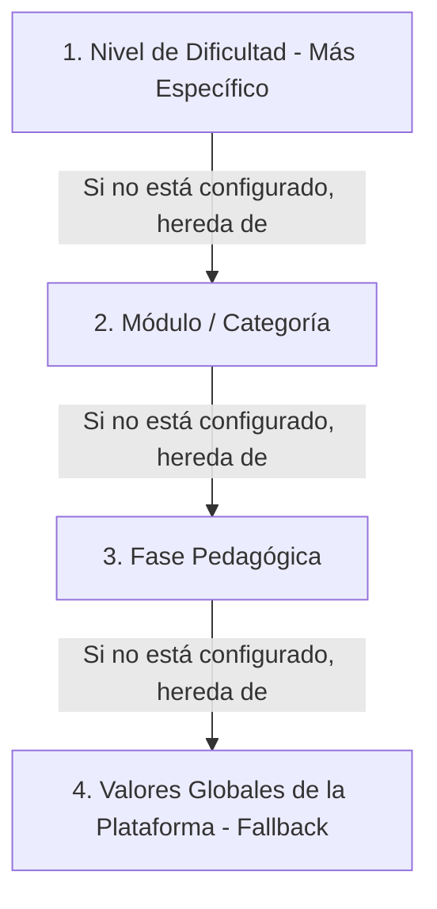

# Plan Maestro de Implementación: Panel de Administrador (Superusuario)

Este documento centraliza de forma definitiva la planificación, requerimientos, diseño de UI/UX, arquitectura de datos y el prompt maestro para el desarrollo del **Panel de Administrador (Dashboard)** en la plataforma **LogicaKids Pro**.

---

## 1. PROMPT MAESTRO PARA GENERACIÓN DE UI GLOBAL

Actúa como un desarrollador experto en React, Frontend y diseño UX/UI avanzado. Necesito que estructures, diseñes e implementes el Panel de Administración (Dashboard) para "LogicaKids Pro", una plataforma educativa de matemáticas para niños.

Tu objetivo principal es desarrollar una interfaz administrativa de alta gama que permita a los educadores (superusuarios) gestionar el contenido pedagógico y monitorear la plataforma.

### 1.1. Funciones y Privilegios del Administrador
El administrador es el educador o gestor de la plataforma. El panel debe incluir las siguientes funcionalidades clave:

*   **Gestión Pedagógica y Parámetros del Juego:** Ajustar el número de preguntas por fase, habilitar o deshabilitar cronómetros y modificar los tiempos límite exactos por nivel/bloque según el plan detallado en la Sección 2.
*   **Monitoreo y Progreso (Estadísticas):** Dashboard analítico con métricas de desempeño de los estudiantes (progreso, aciertos, y las operaciones donde más fallan gracias al sistema de "tutoría invisible").
*   **Control de Acceso (Privilegios):** Toda la interfaz administrativa debe ser de acceso restringido, comprobando que el usuario tenga el rol de `admin` o `superuser` antes de renderizar la vista.

### 1.2. Configuración de la Interfaz y Estética (UX/UI)
El panel debe mantener la identidad visual atractiva y gamificada de LogicaKids Pro, pero enfocada en la productividad del educador.

*   **Estilo de Diseño (High-End & Glassmorphism):** El diseño debe sentirse premium. Utiliza técnicas de *Glassmorphism* (paneles semitransparentes, `backdrop-blur`, bordes sutiles y sombras suaves con fondos oscuros profundos y resplandores neón).
*   **Stack Tecnológico:**
    *   **Tailwind CSS v4:** Para todo el estilado, aprovechando la paleta de colores vibrantes pero armoniosa.
    *   **Framer Motion:** Implementa micro-animaciones para interacciones (hovers en botones, apertura de modales, transiciones fluidas entre secciones).
*   **Estructura y Navegación:**
    *   Un *Sidebar* (menú lateral) plegable y responsivo con navegación fluida entre: **"Vista General"**, **"Configuración Pedagógica"**, y **"Rendimiento Estudiantil"**.
    *   Tarjetas de estadísticas (*Cards*) para datos rápidos y formularios intuitivos para modificar los tiempos/preguntas.
*   **Responsividad Total:** Debe adaptarse perfectamente tanto a computadoras de escritorio como a tablets (que suelen usar los educadores).

---

## 2. ESTRATEGIA DE CONFIGURACIÓN PEDAGÓGICA AVANZADA (Fases, Módulos y Niveles)

Dado que el frontend se ha modularizado y consta de un **Viaje Matemático de 9 Fases**, la configuración pedagógica requiere un sistema granular que permita a los educadores personalizar el comportamiento de cada sección de forma independiente.

### 2.1. El Desafío y el Modelo de Herencia (Cascada)
Para evitar la incompatibilidad entre las dinámicas de las fases (ej. el calentamiento aritmético de la Fase 1 vs. los simulacros de examen de la Fase 9), se adopta una **arquitectura de herencia de configuraciones (Config Inheritance System)**. El juego resolverá los parámetros activos consultando la jerarquía de más específica a más general:



### 2.2. Modelo de Datos e Integración con Postgres
La lógica de negocio y los overrides se mapean de forma nativa en la tabla relacional `configuracion_progreso` (definida en `backend/app/models/progreso.py`), la cual está perfectamente equipada para este propósito:
*   `fase_id` (ForeignKey) $\rightarrow$ Identifica la Fase (1 a 9).
*   `seccion` (Integer) $\rightarrow$ Identifica el Módulo/Sección dentro de esa fase.
*   `operacion` (Enum: SUMA, RESTA...) $\rightarrow$ Identifica la disciplina o categoría.
*   `cantidad_requerida` $\rightarrow$ Cantidad de preguntas por bloque/sesión.
*   `porcentaje_aprobacion` $\rightarrow$ Score mínimo de aprobación para desbloquear.
*   `usa_cronometro` $\rightarrow$ Toggle para habilitar/deshabilitar la presión de tiempo.
*   `tiempo_default_segundos` $\rightarrow$ Duración en segundos (por pregunta o global).
*   `tipo_feedback` $\rightarrow$ Tipo de respuesta ("simple" o "detallada con IA").

### 2.3. Mapeo Pedagógico del Viaje de Aprendizaje

Cada fase del mapa de progreso cuenta con dinámicas distintas que el panel de administración gestiona bajo reglas flexibles:

| Fase | Nombre de la Fase | Módulos (Secciones) | Tipo de Temporizador | Parámetros Clave a Configurar |
| :---: | :--- | :--- | :--- | :--- |
| **1** | **Calentamiento Aritmético** | Sumas, Restas, Multiplicaciones, Divisiones, Desafío Mixto | **Por Pregunta** (3s - 60s) | Preguntas por bloque (10-100), Tiempo por Nivel (1-5), Porcentaje Aprobación (50-100%). |
| **2** | **Desarrollo Numérico** | Cálculo mental, Sistema monetario, Lectura de problemas | **Por Pregunta** (5s - 90s) | Rango de números generados, Preguntas por bloque, Tiempo por dificultad. |
| **3** | **Problemas de Texto** | Selección de datos, Elección de operación, Resolución multietapa | **Sin Tiempo / Libre** o **Por Pregunta Largo** | Tipo de feedback (IA Tutoría activada/desactivada), Intentos permitidos por ejercicio (1-3). |
| **4** | **Fracciones y Gráficos** | Fracciones visuales, Porcentajes estructurados, Lectura de tablas | **Por Pregunta Medio** (10s - 60s) | Preguntas por bloque, Tolerancia de aproximación en gráficos. |
| **5** | **Geometría Plana** | Figuras 2D, Área y Perímetro, Tangram interactivo | **Por Bloque Completo** (ej. 5 min total) | Número de piezas Tangram requeridas, Cronómetro total del rompecabezas, Porcentaje mínimo de coincidencia. |
| **6** | **Geometría Espacial** | Visualización 3D, Conteo de bloques, Volumen de prismas | **Por Bloque Completo** | Número de figuras tridimensionales, Ayuda visual (rotación 360° libre o limitada). |
| **7** | **Coordenadas** | Plano cartesiano, Pares ordenados, Direcciones | **Por Pregunta** (10s - 45s) | Tamaño del grid (5x5 a 20x20), Modo de juego (dar coordenadas vs. hacer clic en punto). |
| **8** | **Probabilidad y Lógica** | Casos favorables/posibles, Combinatoria, Secuencias | **Por Pregunta Largo** (15s - 90s) | Complejidad de la secuencia, Número de opciones en combinatoria. |
| **9** | **Simulados Pedro II** | Simulacros cortos por tema, Simulacro completo real | **Global por Examen** (30m - 120m) | Cantidad de preguntas del examen (10-30), Tiempo total en minutos, Bloqueo de navegación entre preguntas. |

### 2.4. Comportamiento de Interfaz de Usuario de Alta Gama (UX/UI)
Para evitar abrumar al administrador con cientos de controles individuales, la vista de configuración adoptará un **diseño de taladro (Drilldown Concept)** en una sola pantalla unificada:

1.  **Navegador de Jerarquía Lateral (Panel Izquierdo):**
    *   Un menú en árbol interactivo (`TreeView` / `Accordion`) que muestra el mapa de progreso colapsable de las Fases 1 a 9 y sus sub-módulos.
    *   Al seleccionar una Fase o un Módulo, el panel derecho se actualiza instantáneamente con animaciones de *Framer Motion*.
2.  **Panel de Configuración Contextual (Panel Derecho):**
    *   **A) Vista Fase:** Permite configurar los parámetros por defecto de toda la fase (que heredarán todos sus módulos a menos que se sobrescriban).
    *   **B) Vista Módulo (Sobrescritura "Override Parent"):** Cuenta con un interruptor toggle premium. Si está desactivado, el módulo heredará de forma transparente los parámetros de la Fase (con un velo de cristal esmerilado blur y lectura únicamente). Si se activa, se habilitan los controles y el administrador puede definir un volumen de preguntas, score de aprobación o tiempos exclusivos para este módulo.

---

## 3. LÓGICA DE RESOLUCIÓN EN CÓDIGO (Helper de Cascadas)

El cliente del juego (`GameScreen.tsx`) consumirá el siguiente selector para calcular en tiempo real los parámetros resueltos del nivel activo de forma eficiente:

```typescript
interface ActiveGameConfig {
  questionsCount: number;
  useTimer: boolean;
  timeLimitSeconds: number;
  passingScore: number;
  feedbackType: 'simple' | 'detailed';
}

export function resolveGameConfig(
  globalConfig: PedagogyConfig,             // PlatformSettings (Global)
  phaseConfigs: ConfiguracionProgreso[],    // Listado de configuraciones de la BD
  phaseId: number,
  moduleId: number,
  levelIndex: number                        // 0 a 4 (Nivel 1 a 5)
): ActiveGameConfig {
  
  // 1. Buscar configuración específica para esta Fase y Módulo
  const specificConfig = phaseConfigs.find(c => 
    c.fase_id === phaseId && 
    c.seccion === moduleId
  );

  // 2. Extraer tiempos específicos del nivel (si aplica)
  const levelKeys: (keyof PedagogyConfig['timers'])[] = ['easy', 'easy_medium', 'medium', 'medium_hard', 'hard'];
  const activeLevelKey = levelKeys[levelIndex] || 'medium';
  
  const globalTimerForLevel = globalConfig.timers[activeLevelKey];

  return {
    questionsCount: specificConfig?.cantidad_requerida ?? globalConfig.questionsPerPhase,
    useTimer: specificConfig?.usa_cronometro ?? globalConfig.useTimer,
    timeLimitSeconds: specificConfig?.tiempo_default_segundos ?? globalTimerForLevel,
    passingScore: specificConfig?.porcentaje_aprobacion ?? globalConfig.passingScore,
    feedbackType: (specificConfig?.tipo_feedback as 'simple' | 'detailed') ?? 'simple'
  };
}
```

---

## 4. QUÉ SE DEBE GENERAR EN LA IMPLEMENTACIÓN

Basado en estas instrucciones unificadas, el código fuente definitivo de administración debe incluir:

1.  **Layout principal del Dashboard:** Con Sidebar plegable y Header responsivo con soporte para rol de superusuario.
2.  **Navegador Jerárquico en Árbol (`ConfigTreeNav`):** Panel lateral en acordeón para navegar entre Fases 1-9 y sus sub-módulos.
3.  **Panel de Ajustes Contextual (`PedagogyTab` / `ModuleConfig`):** Con controles para volumen de preguntas, score de aprobación y tipo de feedback (Simple vs. Tutoría IA).
4.  **Velo de Bloqueo Esmerilado (`OverrideWrapper`):** Capa de glassmorphism que restringe la edición de módulos si la opción de sobrescribir el padre está desactivada, indicando visualmente de dónde proceden los valores heredados.
5.  **Sliders con Tooltips Flotantes (`SliderWithTooltip`):** Deslizadores con tooltips flotantes en tiempo real para configurar límites de tiempo y puntajes.
6.  **Código Limpio e Integrado:** Todo perfectamente tipado en TypeScript, modularizado en `/components/admin/components/`, y conectado a los endpoints de la API en `storageService.ts` y al flujo de navegación de `App.tsx`.

---

## 5. CRONOGRAMA DE IMPLEMENTACIÓN FUTURO

El desarrollo se ejecutará bajo un enfoque secuencial y seguro en 4 etapas:

*   **Fase A (API & Backend):** Optimizar los endpoints `GET /admin/configuracion` y `PUT /admin/configuracion/save-all` para permitir persistencia ágil de colecciones de overrides de una sola vez.
*   **Fase B (Componentes de UI):** Construir en el frontend los componentes visuales de cristal (`ConfigTreeNav`, `OverrideWrapper` y sliders interactivos).
*   **Fase C (Manejo de Estado):** Implementar la lógica del estado local "draft" para marcar visualmente en el árbol los nodos con cambios pendientes y habilitar el banner flotante de guardado.
*   **Fase D (Migración e Integración):** Integrar el resolvedor de cascada en `mathService.ts` y en las pantallas del alumno para que consuman dinámicamente los parámetros de la base de datos.
